# MOBILE CONTACTLESS FACE & PALM VERIFICATION SYSTEM

**Computer Science Project Documentation — 2025 / 2026**

Kwame Nkrumah University of Science and Technology
Department of Computer Science

---

**Submitted by**

|                    | Name                        | Student ID | Index Number |
| ------------------ | --------------------------- | ---------- | ------------ |
| First team member  | Caleb Kwabena Kyere Boateng | 20993061   | 9025623      |
| Second team member | Edwina Frances Kate Mensah  | 20997763   | 9027623      |

**Live system:** https://verify.kyere.me
**Demonstrator application:** https://attendance-verify-api-fd04b68b7941.herokuapp.com
**Source repositories:** https://github.com/cLLeB/verification-system · https://github.com/cLLeB/attendance-verify

---

## DECLARATION

We hereby declare that this submission is our own work and that, to the best of our
knowledge, it contains no material previously published by another person,
except where due acknowledgement has been made in the text.

The recognition engine, the multi-tenant service layer, the native Android
application, the demonstrator attendance application and the benchmark harness
described in this report were designed and implemented by the authors. Third-party
components used are named explicitly in Sec.3.11 and Sec.4.2, and consist of
openly-licensed model weights and libraries (InsightFace/ArcFace, MediaPipe Hands,
a CCNet-family palm encoder, ONNX Runtime, Flask, FastAPI, React Native) integrated
into a system architecture of our own design.

| Name                                   | Signature |
| -------------------------------------- | --------- |
| Caleb Kwabena Kyere Boateng (20993061) | Signed    |
| Edwina Frances Kate Mensah (20997763)  | Signed    |

---

## DEDICATION

To the schools, clinics, employers and programmes that must know who is standing in
front of them, and to the people standing there.

Identity should serve both, and exclude neither.

---

## ACKNOWLEDGEMENT

We thank our project supervisor for direction and honest criticism.
We thank the Department of Computer Science, KNUST, for the facilities
and academic environment in which this work was carried out.

We acknowledge the volunteers who allowed us to enrol their faces and palms, who
stood in bad light and good, indoors and outdoors, and whose captures form the
pilot dataset behind every measured number in Chapter 4. Their informed consent was
obtained before each capture and is recorded in the system's own consent register.

We acknowledge the open-source community whose work we build upon: the InsightFace
project (ArcFace recognition), Google's MediaPipe (hand landmark detection), the
authors of the CCNet palm-print architecture, the ONNX Runtime team, and the Flask,
FastAPI, React Native and Jetpack Compose maintainers.

---

## ABSTRACT

Biometric identity systems in the developing world are dominated by fingerprint
scanners, and fingerprint scanners fail the people who need identity most. India's
Aadhaar programme has held a biometric authentication failure rate of roughly 6.5%
for a decade — about 20.3 million failed authentications every month — and those
failures cluster at 6–12% among agricultural workers, construction workers and
domestic workers whose ridges are worn away by manual labour, and among the
elderly. Each scanner is also hardware that must be bought, installed, cleaned and
maintained, and cloud alternatives require constant connectivity and export
citizens' biometric data to foreign infrastructure.

This project designs, implements, deploys and evaluates the **Mobile Contactless
Face & Palm Verification System**: a camera-only biometric identity platform that
verifies a person by their **face or the palm of their hand**, on the commodity
smartphones people already own, with **no specialised hardware** **and** **no contact**

The system contributes five things beyond the state of practice. (1) A
**modality-agnostic recognition core** in which face (ArcFace, 512-d) and palm
(MediaPipe-Hands ROI → CCNet ONNX, 2048-d) are two profiles over one set of
machinery, with a server-side and on-device **auto-router** so that callers never
declare a modality: a person presents whichever biometric works, and a match is a
match. (2) **Protected, cancelable templates** — a seeded orthogonal projection
that renders a stolen template unmatchable anywhere else and allows an
organisation-wide cryptographic "password reset" (reissue) **without anyone
re-enrolling** — measured at 0.0 absolute TAR delta, i.e. zero accuracy cost.
(3) **On-device
1:N identification ("Glance")** at ~50 MB per 100,000 identities, running in
airplane mode. (4) A **published evidence layer** (`/trust`) in which every
performance claim is produced by a benchmark suite exercising the real serving code
path, and suites without data are reported as skipped rather than estimated.

The platform is exposed as a documented, multi-tenant REST API (`/v1`) with
API-key authentication, role scoping, per-tenant encrypted stores, HMAC-signed
verdicts, rate limiting and a full audit trail, together with an operator console,
a tenant self-service portal, Python and JavaScript SDKs, and four native Android
build flavours.

To prove the platform is genuinely consumable by third-party software rather than
only by its own front ends, a complete second product — **Attendance-Verify** — was
built end to end against the public API by treating the platform as an external
vendor. Attendance-Verify is a close functional clone of the KNUST Attendance
application (student-ID sign-in, 70 m geofence, two check-ins per class), with
exactly one substitution: where the original marks a student present via a
lecturer-generated PIN, this system requires a **live face or palm capture whose
HMAC-signed verdict the attendance backend independently validates** before writing
an attendance record. This removes the PIN's entire attack surface , a code that
can be screenshotted, forwarded to an absent friend, or read aloud in a lecture
hall and replaces it with a token that cannot be transferred, because it is the
student's own face.

Evaluation is by measurement, not assertion. On a 5,000-identity encrypted and
protected store, 1:N search runs at a p50 of **0.66 ms** with **100/100 top-1
accuracy**; template protection costs **0.0** absolute TAR delta at the gate's
1% false-accept operating point; credentials verify in **~1 ms**; and on the live
2-vCPU deployment a full active-liveness verification burst costs ~5.0 s, of which
recognition is 72%. Correctness is defended by **1,549 automated tests across 231
test files** in the platform and **196 passing tests** in the demonstrator
application, including concurrency, replay, signature-forgery, one-biometric-one-
identity and query-cost regression tests. Palm input normalisation was recalibrated
against 191 real pilot frames, moving acceptance of hard cross-session genuine
pairs from 25.5% to 52.4% at a 1% false-accept operating point — and the report
states plainly that the same dataset confounds elapsed time with capture device, so
the result is *not* evidence that palms age.

The system is deployed and running: the verification platform on Azure Container
Apps behind `verify.kyere.me`, the attendance backend on Heroku with a Supabase
PostgreSQL database, an installable PWA, and a signed Android APK. Privacy is
structural rather than promised: no photograph is ever stored, templates and search
indexes are both encrypted at rest with per-tenant keys, consent is recorded
against the SHA-256 of the exact statement agreed, withdrawal blocks verification
and revokes issued credentials immediately, and offboarding an organisation
destroys its encryption keys so that leftover copies — backups included — become
permanently unreadable. Compliance with Ghana's Data Protection Act (Act 843) and
the GDPR is mapped obligation-by-obligation to the enforcing code path.

**Keywords:** contactless biometrics, face recognition, palm-print recognition,
ArcFace, active liveness detection, cancelable biometrics, template protection,
verifiable credentials, offline identity, biometric inclusion, multi-tenant API,
geofenced attendance.

---

## TABLE OF CONTENTS

**[Chapter 1 — Introduction](#chapter-1--introduction)**
1.1 Background of project · 1.2 Problem statement · 1.3 Aim of the project ·
1.4 Novelty of the project · 1.5 Specific project objectives · 1.6 Scope of the
project · 1.7 Project limitations · 1.8 Academic and practical relevance ·
1.9 Beneficiaries of the project · 1.10 Project activity planning ·
1.11 Definitions and explanations of terms · 1.12 Structure of report

**[Chapter 2 — Review of Related Systems](#chapter-2--review-of-related-systems)**
2.1 Aadhaar (UIDAI) · 2.2 Amazon One · 2.3 AWS Rekognition · 2.4 Truein ·
2.5 KNUST Attendance · 2.6 Comparative summary · 2.7 Conceptual design of the
proposed project

**[Chapter 3 — Methodology](#chapter-3--methodology)**
3.1 Introduction · 3.2 Architecture · 3.3 Requirements elicitation ·
3.4 Functional requirements · 3.5 Non-functional requirements · 3.6 UML diagrams ·
3.7 Users and user characteristics · 3.8 Security concepts · 3.9 Project method ·
3.10 Software process model and justification · 3.11 Logical design ·
3.12 UI design (wireframes) · 3.13 Database design (schemas)

**[Chapter 4 — Implementation, Testing and Results](#chapter-4--implementation-testing-and-results)**
4.1 Introduction · 4.2 Mapping logical design onto physical platform ·
4.3 System modules implementation · 4.4 System modules integration · 4.5 Testing ·
4.6 Recommendations from testers and responses · 4.7 Results

**[Chapter 5 — Findings, Conclusions and Recommendations](#chapter-5--findings-conclusions-and-recommendations)**
5.1 Introduction · 5.2 Findings · 5.3 Conclusions · 5.4 Challenges ·
5.5 Lessons learnt · 5.6 Recommendations for future works · 5.7 References

---

---

# CHAPTER 1 — INTRODUCTION

## 1.1 Background of Project

Identity is a precondition for participation. To receive a wage, collect a welfare
payment, register a SIM card, sit an examination, open a bank account or be marked
present in a lecture hall, a person must first be able to prove that they are who
they say they are. Across sub-Saharan Africa and South Asia, the dominant technical
answer to that requirement over the past fifteen years has been the **fingerprint
scanner**, deployed at national scale in programmes such as India's Aadhaar,
Nigeria's NIMC, and Ghana's own Ghana Card and biometric voter register.

The appeal is obvious. Fingerprints are unique, the sensors are small, the matching
algorithms are mature, and the standards (ISO/IEC 19794-2 minutiae templates) are
settled. For most of the population, most of the time, the technology works.

The difficulty is that "most of the population" is not the population, and identity
systems fail asymmetrically: they fail hardest on the people with the least ability
to appeal. Fingerprint ridges are a surface feature of the skin, and surfaces wear.
Agricultural labour, construction work, domestic cleaning, textile work, and simple
ageing all degrade the ridge structure a sensor depends on. A national identity
programme built on fingerprints therefore encodes an exclusion gradient that runs
precisely along the axis of manual labour and age.

This is not a theoretical concern. India's Unique Identification Authority (UIDAI)
processes roughly **312 million biometric authentications per month** against
Aadhaar for access to welfare, banking and public services. The success rate has
sat between 93.5% and 95% for a decade, meaning approximately **20.3 million
failures every month**, and the failures are not evenly distributed: reported
authentication failure rates run at **6–12% among construction workers, farmers and
domestic workers**, and estimates of the population structurally excluded by
biometric failure — through worn ridges, scarring, corneal blindness, or
malnutrition-induced cataracts affecting iris capture — range from **2% to 5% of
the country**. In welfare contexts, a failed authentication is not an inconvenience;
it is a denial of food rations or of guaranteed employment wages.

Three further developments frame this project.

**First, hardware is a recurring cost and a recurring failure point.** Every
enrolment station and every verification point in a fingerprint programme needs a
physical sensor that must be procured, distributed, powered, cleaned, calibrated,
repaired and eventually replaced. In rural clinics, remote work sites and
under-resourced schools, that supply chain is the binding constraint — not the
algorithm.

**Second, contact became a liability.** The COVID-19 pandemic made shared-surface
biometrics — a sensor platen touched by hundreds of people a day — operationally
and reputationally untenable, and accelerated interest in contactless modalities
across the industry. Amazon's palm-payment product, launched in 2020, was explicitly
positioned on hygiene as much as convenience.

**Third, the camera won.** The smartphone is now the most widely distributed sensor
platform in human history, and even entry-level Android devices sold in Ghana ship
with front and rear cameras capable of resolving facial landmarks and palm-print
creases at working distance. Meanwhile, deep metric learning — ArcFace and its
descendants for faces, and competitive-coding convolutional networks such as CCNet
for palm-prints — reduced high-accuracy biometric recognition to a few hundred
megabytes of model weights and a single forward pass that a mid-range CPU can
execute in under two seconds. The hardware requirement for accurate biometrics
quietly disappeared; most deployed systems have not noticed.

At the same time, the state of practice for camera-based biometrics developed in a
direction unsuited to these environments. Commercial face services — AWS
Rekognition, Azure Face, Face++ — are **cloud-first**: they require constant
connectivity, they bill per call, they offer no palm option, and they place
citizens' biometric data in infrastructure outside the deploying country's
jurisdiction. Palm-payment systems such as Amazon One achieve extraordinary accuracy
but do so with **dedicated near-infrared vein-imaging hardware**, reintroducing
exactly the hardware dependency that camera-based biometrics should remove. Digital
onboarding vendors (Smile ID, Onfido, Jumio) solve one-time remote KYC, not
repeated, offline, in-the-field verification.

And across nearly all of them sits an unsolved structural problem: **biometrics
cannot normally be revoked**. A password that leaks is changed in seconds. A
fingerprint or face template that leaks is compromised for the lifetime of the
person it belongs to. Systems that store raw or lightly-transformed templates are
therefore accumulating a permanent liability on behalf of the people they enrol.

This project sits at the intersection of those four observations: that fingerprint
biometrics exclude the people who most need identity; that the hardware requirement
is now optional; that connectivity cannot be assumed; and that a biometric which
cannot be cancelled is a liability rather than an asset.

The project began, in fact, as a contactless *fingerprint* system — capturing
finger ridges from a phone camera rather than a sensor. The backend matcher was
built and proven, but camera-based finger capture turned out to be a dead end under
realistic field conditions: ridge contrast at phone-camera resolution and uncontrolled
lighting is insufficient for reliable minutiae extraction. That negative result,
recorded in the repository's first two commits (21 June 2026) and preserved in the
archived `fingerprint/` package, is what motivated the pivot to **face and palm** —
two modalities that a commodity camera *can* resolve, and which between them leave
almost nobody unenrollable.

## 1.2 Problem Statement

Organisations that must repeatedly answer the question *"is this the right person?"*
— employers, welfare programmes, examination boards, clinics, financial
institutions and universities — currently have no option that is simultaneously
**inclusive, hardware-free, offline-capable, privacy-preserving and revocable**.

Concretely, the following problems remain unsolved by the available alternatives:

**P1 — Biometric exclusion.** Fingerprint-based systems structurally exclude
manual workers, the elderly and the disabled, at documented rates of 6–12% in the
affected groups. A system offering only one modality inherits that modality's
failure population; a person whose only enrolled biometric cannot be read has no
recourse.

**P2 — Hardware dependency.** Both fingerprint scanners and infra-red palm-vein
readers require dedicated hardware at every verification point, imposing capital
cost, maintenance burden and a supply chain that fails first in exactly the rural
and low-resource settings where identity verification matters most.

**P3 — Connectivity dependency.** Cloud biometric APIs are unusable in rural
clinics, remote work sites, examination halls with jammed or absent signal, and
during network outages. Verification is precisely the operation that must not fail
when the network does.

**P4 — Data sovereignty and privacy exposure.** Sending citizens' facial images to
third-party cloud infrastructure transfers both control and legal risk offshore.
Systems that retain photographs, or store templates in a form that can be matched
against any other database, create a permanent and growing breach liability.

**P5 — Irrevocability.** In conventional biometric systems a leaked template is
compromised forever, and there is no equivalent of a password reset. Neither can a
person's biometric enrolment be cryptographically isolated from other deployments.

**P6 — No portable proof.** A person who is enrolled in an organisation's database
cannot prove their identity anywhere that database is unreachable, and cannot carry
their own credential in a form that a third party can check independently.

**P7 — Proxy fraud in presence systems.** Presence and attendance systems that use
a shared secret — a PIN, a code, a password — are defeated by the trivial act of
sharing that secret. The mechanism does not bind the record to the person; it binds
it to knowledge of a number, which can be screenshotted, relayed by message, or
read aloud to a room. A university lecture with an attendance PIN has, in practice,
no attendance control at all.

**P8 — Integration difficulty.** Even where a capable biometric engine exists,
application teams cannot use it without biometric expertise of their own: threshold
tuning, liveness protocol design, template lifecycle management and verdict
trust are all left to the integrator, who is not equipped to get them right.

## 1.3 Aim of the Project

**To design, implement, deploy and empirically evaluate a mobile, contactless
biometric verification system that establishes a person's identity from their face
or the palm of their hand using only a commodity smartphone camera — working
offline, storing no photographs, protecting templates in a cancelable form, and
exposed as a documented API that third-party applications can integrate without
biometric expertise — thereby providing accurate identity verification to the
populations that fingerprint-based systems exclude.**

The aim is validated in two directions. Downward, into the engine: the system must
recognise people accurately, resist presentation attacks, and do so on hardware
that is already in the field. Upward, into the ecosystem: the system must be
genuinely consumable by software written by people who are not biometrics
engineers — a claim that is only credible if a complete, non-trivial application
has actually been built against the public API by treating the platform as an
external vendor. That application is Attendance-Verify (Sec.1.6, Sec.4.4).

## 1.4 Novelty of the Project

Individual components of this work exist elsewhere. The combination does not, and
five specific contributions are novel in the context of camera-only biometrics for
low-resource environments.

**N1 — Dual-modality, auto-routed, camera-only recognition over one core.**
The recognition machinery — store, index, matcher, crypto — is
**modality-agnostic**, operating on `(user_id, embedding)` pairs plus cosine
similarity and parameterised by a `Profile` (embedding dimension, thresholds,
storage directory, liveness policy). Face (ArcFace, 512-d) and palm
(MediaPipe-Hands ROI → CCNet ONNX, 2048-d) are two profiles over that single
implementation. A **router** inspects each submitted image, determines whether it
contains a face, a palm, or both, and dispatches accordingly, so that **callers
never declare a modality**. One identity may hold a face template, a palm template,
or both, kept in separate per-tenant vector spaces that are never cross-matched;
presenting either verifies the person, subject to a configurable combination policy
(`or` / `fallback` / `and`). This is what makes the inclusion claim operational
rather than rhetorical: *if the palm will not read, the face will*. No reviewed
system offers face and palm from an ordinary camera under one auto-routing API.

**N2 — Protected (cancelable) templates with reissue and no re-enrolment.**
Everything used for matching or export is held in a scrambled, revocable form: a
seeded orthogonal projection whose seed derives from a per-store secret. A template
copied from the database, from a device sync, or from an export bundle **cannot be
matched anywhere else**, and an operator can move every template to a new
protection domain — cancelling every leaked copy instantly — with a single action,
**without any enrolled person recapturing their biometric**. Measured accuracy cost
is **0.0 absolute TAR delta** at the benchmark gate's 1% false-accept operating
point. The report is deliberately honest about the residual: raw embeddings still
exist, encrypted at rest on the server only, solely so that reissue never requires
re-enrolment; the behaviour can be disabled entirely.

**N3 — Portable offline credentials verifiable with no database and no network.**
An enrolled person can be issued a signed QR credential — printable on paper or
saved to a phone — that any authorised party can verify **completely offline**, with
no access to the issuing database. The credential is **1,202 characters**, fits QR
version 25, and verifies in **~1 ms**. It is safe to lose: a stolen or photographed
QR is useless to anyone else because verification also requires a live capture that
matches inside the credential's own protection domain. It expires automatically and
can be revoked. Crucially, it works for people with **no phone at all** — a printed
card suffices — and it supports **cross-organisation trust**: one organisation can
accept another's credentials by adding its issuer identity to a trust list, with no
data sharing and no integration work.

**N4 — On-device 1:N identification in airplane mode ("Glance").** Continuous
identification of people in view, face-first with palm fallback, executed entirely
on the phone against an int8 per-modality index of approximately **50 MB per
100,000 identities**, with no network permission required. The operating point is
calibrated on the server and clamped on-device per modality; it is deliberately
scoped as an identification *aid* rather than an access gate, because it runs
without liveness.

**N5 — An evidence layer, with published negative results.** Performance claims
are generated by a versioned benchmark harness (`python -m bench run --suite ...`)
that exercises the **real serving code paths**, writes JSON reports with a
manifest, and renders them on a public Trust Center page. Suites lacking a dataset
or model **SKIP with a stated reason rather than producing an estimate** — the
presentation-attack-detection suite is published as honestly skipped, pending a
physical attack set. The project also publishes results that weaken its own
narrative: the palm calibration study (Sec.4.7.4) reports that its long-gap genuine
pairs confound elapsed time with capture device, and states explicitly that the
data must **not** be described as evidence that palm-prints decay over time.

A sixth contribution is methodological rather than technical: the platform's
API design was **revised in response to a real integration**. Building
Attendance-Verify surfaced eight concrete defects in the public contract — most
seriously, an enrolment refusal that must never be retried ("this face already
belongs to another identity") was indistinguishable from one that should be
retried ("unusable photo"), and the demonstrator shipped a bug because of it. Each
was fixed at the source rather than documented as a gotcha (Sec.4.6).

## 1.5 Specific Project Objectives

| #             | Objective                                                                                                                                                                                                                                                    | Verification                                   |
| ------------- | ------------------------------------------------------------------------------------------------------------------------------------------------------------------------------------------------------------------------------------------------------------ | ---------------------------------------------- |
| **O1**  | Implement a modality-agnostic recognition core performing 1:1 verification and 1:N identification on L2-normalised embeddings with cosine similarity, encrypted at rest.                                                                                     | Sec.3.2.2, Sec.4.3.1;`tests/test_matcher.py` |
| **O2**  | Implement face recognition from a commodity camera using an ArcFace embedding with detection, 5-point alignment and capture-quality gating.                                                                                                                  | Sec.4.3.1; face suite                          |
| **O3**  | Implement palm-print recognition from the same camera using MediaPipe-Hands ROI extraction and a CCNet-family ONNX encoder, calibrated against real field captures.                                                                                          | Sec.4.3.2, Sec.4.7.4                           |
| **O4**  | Implement an automatic modality router so callers never declare whether a capture is a face or a palm, server-side and on-device.                                                                                                                            | Sec.4.3.3                                      |
| **O5**  | Implement active-liveness presentation-attack detection via a head-turn challenge that defeats printed photographs and screen replays, including an anti-splice identity check across the frame burst.                                                       | Sec.3.8.3, Sec.4.3.4                           |
| **O6**  | Implement adaptive enrolment that tracks a person's appearance over time while provably resisting template drift towards another identity.                                                                                                                   | Sec.4.3.5;`tests/test_adaptive_drift.py`     |
| **O7**  | Implement protected (cancelable) templates with organisation-wide and per-person reissue, at a measured accuracy cost of < 0.01 absolute TAR delta.                                                                                                          | Sec.4.7.2                                      |
| **O8**  | Implement portable, signed, offline-verifiable QR credentials with expiry, revocation and cross-organisation trust.                                                                                                                                          | Sec.4.3.7, Sec.4.7.3                           |
| **O9**  | Expose the platform as a documented, versioned, multi-tenant REST API with API-key authentication, role scoping, per-tenant encrypted isolation, HMAC-signed verdicts, idempotency, rate limiting and audit.                                                 | Sec.3.2.3, Sec.4.3.8                           |
| **O10** | Implement an operator admin console and a tenant self-service portal covering the full identity lifecycle.                                                                                                                                                   | Sec.4.3.9                                      |
| **O11** | Implement a native Android application running the complete pipeline on-device, in a flavour holding**no INTERNET permission**, including offline credential checking and on-device 1:N identification.                                                | Sec.4.3.10                                     |
| **O12** | Implement privacy and data-protection controls: no image retention, encrypted templates and index, versioned consent with withdrawal, subject access export, erasure, and crypto-erase offboarding, mapped to Ghana Act 843 and the GDPR.                    | Sec.3.8.5, Sec.4.3.11                          |
| **O13** | Build a complete third-party application (Attendance-Verify) end to end against the public API, proving the platform is integrable without biometric expertise, and demonstrating biometric presence-proof as a strict improvement on shared-PIN attendance. | Sec.4.4                                        |
| **O14** | Deploy both systems to publicly reachable, always-on HTTPS infrastructure and produce an installable Android artefact.                                                                                                                                       | Sec.4.2                                        |
| **O15** | Evaluate the system by measurement — accuracy, latency, scale, protection cost, credential size — through a reproducible benchmark harness, and publish the results including honest skips.                                                                | Sec.4.7                                        |

## 1.6 Scope of the Project

### 1.6.1 In scope

**A. The verification platform (primary deliverable).**

- Recognition core: detection, alignment, embedding, cosine matching, quality gates,
  adaptive enrolment with permanent anchors, encrypted template store, cached
  encrypted search index with incremental replay on restart.
- Two modalities — face and palm — with automatic routing and a per-tenant
  combination policy.
- Active-liveness head-turn challenge; optional passive single-shot anti-spoofing.
- Multi-tenant REST API (`/v1`) with hashed API keys, `admin`/`verify` roles,
  per-tenant encrypted stores and indexes, entitlements, quotas, per-caller rate
  limiting, idempotency keys, request IDs, signed webhooks and an audit trail.
- Enrolment paths: operator-supervised, from existing photographs, from an ID
  document, bulk import (synchronous and queued/asynchronous), and self-enrolment
  from a single-use invite link.
- Post-match service gates applied strictly *after* the biometric decision: guest
  pass expiry, consent standing, and time-scheduled access policies.
- Portable credentials: issuance, printable card, offline verification, revocation,
  expiry, cross-organisation trust lists.
- Protected templates and reissue; KEK-wrapped per-tenant data keys; Ed25519
  per-tenant issuer signing keys.
- Web surfaces: phone client (installable PWA), admin console, tenant portal,
  self-enrol page, credential card, offline credential checker, Glance page, public
  Trust Center, embeddable `<face-verify>` web component.
- Native Android application in four flavours (offline/hybrid × fp32/fp16) with
  on-device verify, enrol, credential check and Glance; hybrid sync with the server.
- Python and JavaScript SDKs; OpenAPI specification.
- Benchmark harness and published Trust Center evidence; Ghana DPA + GDPR
  compliance dossier.

**B. The demonstrator application (Attendance-Verify).**

A geofenced course-attendance system that is a close functional clone of the KNUST
Attendance application, with **exactly one substitution**: presence is proved by
live biometric verification instead of a lecturer-generated PIN. In scope:
student-ID sign-in with a programme-shared password; device binding at enrolment;
discovery of courses whose session is live within a **70 m** geofence;
server-authoritative geofence evaluation with a GPS-accuracy floor; a two-phase
(START and END) check-in requiring both windows for a *present* verdict;
in-app biometric enrolment (face compulsory, palm optional); a shared-device
**kiosk** mode using 1:N identification so no credential is spoken aloud; consent
capture and withdrawal; attendance history; an admin console covering sessions,
courses, students, bulk biometric import, live attendance and a full end-of-semester
record as JSON and CSV; an installable PWA; and a signed Android APK.

### 1.6.2 Out of scope

- **Fingerprint capture from a phone camera** — attempted, measured as unworkable,
  and archived (Sec.1.1). The sensor-based minutiae matcher remains in the repository
  as an artefact but is not part of the delivered system.
- **Scale beyond ~100,000 identities per tenant.** The exact-search index is tuned
  and measured for that target. The path beyond (FAISS/ANN backend) is designed and
  documented but not implemented, because no requirement demanded it.
- **Tuned passive liveness.** The single-shot anti-spoof model is integrated but
  ships disabled by default because it is untuned; the active head-turn challenge is
  the shipped defence.
- **A physical presentation-attack evaluation.** No printed-mask/replay-device attack
  set was assembled, so the PAD benchmark suite is published as skipped rather than
  estimated.
- **Iris, voice and gait modalities.**
- **Billing and payment processing.** Entitlements provide the paywall hook
  (`enabled`, `plan`, `max_keys`, `allowed_roles`); no biller is integrated.
- **iOS native application.** The PWA covers iOS; the native app is Android only.
- **Formal accreditation** (NIST FRVT submission, ISO/IEC 30107 PAD certification).

## 1.7 Project Limitations

Stated plainly, because a system's honest limits are part of its specification.

**L1 — Host trust in managed deployments.** Matching requires the encryption key in
memory, so in a hosted deployment the operator is inherently trusted and could mint
a key for any tenant. Application-level isolation is strong (per-tenant stores,
per-tenant keys, two-plane administration, full audit, crypto-erase), but it is not
zero-host-trust. The genuine zero-trust configuration is the offline Android
flavour, which holds no INTERNET permission.

**L2 — Raw embeddings persist server-side.** Protected templates guarantee that
exported, synced or stolen copies are unmatchable elsewhere; they do not eliminate
the raw embedding on the server, which is retained (encrypted) so that reissue never
forces re-enrolment. This is a deliberate trade and is disclosed rather than
obscured.

**L3 — Palm accuracy trails face accuracy.** On the pilot data, face separates far
more cleanly than palm: the highest cross-identity face score observed was 0.263
against a loosest genuine score of 0.693, whereas palm requires a considerably
tighter threshold (0.625) and a more demanding capture-quality gate. Palm is
positioned as the inclusion fallback and second factor, not as the primary
modality.

**L4 — The palm calibration dataset is small and confounded.** The input-normalisation
study rests on 191 real pilot frames in which every long-gap genuine pair is also a
different-device pair, so elapsed time and capture device cannot be separated. The
recalibrated mode is therefore available but **not** the default, because switching
it invalidates every stored palm template and its calibrated threshold.

**L5 — Presentation-attack resistance is argued, not certified.** Active liveness
demonstrably defeats printed photographs and screen replays and includes an
anti-splice identity check, but without a physical attack set no APCER/BPCER figures
can be reported, and no claim is made against sophisticated 3D masks or injected
deepfake video streams.

**L6 — Latency on commodity cloud CPU.** On the deployed 2-vCPU container, one
ArcFace recognition pass costs ~1,799 ms, detection ~198 ms and 3D-landmark
extraction ~75 ms, so a default five-frame liveness burst costs approximately
**5.0 s**, of which recognition is 72%. This is acceptable for attendance and
welfare queues and unacceptable for a turnstile. GPU or batched inference is the
documented remedy.

**L7 — Geofence trust in the demonstrator.** The attendance geofence is evaluated
server-side against the device's reported GPS fix, with an accuracy floor
(±120 m on the live deployment). A determined attacker with a rooted device and a
mock-location provider can still falsify position. Mitigation is layered — the
biometric bound to the specific student, the two-window START/END requirement, the
device binding, and an audited record — but GPS itself remains advisory.

**L8 — Small evaluation population.** The live pilot involves a small number of
enrolled identities. Scale figures (5,000 and 100,000 identities) are measured on
synthetic embeddings that exercise the real store, index and matcher code paths;
they are honest measurements of the *system*, not of population-level biometric
accuracy, and are labelled as such.

**L9 — Model licensing and provenance.** The system depends on openly available
pre-trained weights (InsightFace `buffalo_l`/`buffalo_s`, MediaPipe hand landmarker,
a CCNet-family palm encoder). Their training-set demographics are not fully
documented upstream, so demographic differential performance cannot be characterised
from first principles.

**L10 — Free-tier deployment constraints.** The Hugging Face Spaces deployment path
is memory-constrained (512 MB), which forced a smaller face model and the removal of
passive-liveness binaries. The production deployment on Azure Container Apps
(2 vCPU / 4 GB) removes this, but scale-to-zero introduces a ~15 s cold-start wake
covered by a loading screen.

## 1.8 Academic and Practical Relevance of the Project

### 1.8.1 Academic relevance

The project is a substantial exercise in applied computer science that draws
together, in a single working artefact, material from at least six areas of the
curriculum.

- **Machine learning and computer vision.** Deep metric learning for biometric
  embedding (ArcFace's additive angular margin objective; competitive-coding
  convolutional architectures for palm-print), geometric normalisation by Umeyama
  similarity transform on five landmarks, and the practical consequences of input
  distribution mismatch — the palm study in Sec.4.7.4 is a textbook demonstration that
  feeding a network an input distribution its weights never saw silently degrades
  the embedding space.
- **Information security and applied cryptography.** Authenticated encryption at
  rest (Fernet: AES-128-CBC + HMAC-SHA256; AES-256-GCM with hardware-backed
  Keystore on Android), key derivation (PBKDF2, 200,000 iterations, per-database
  salt), key-encryption-key wrapping, Ed25519 digital signatures for issued
  credentials, HMAC-SHA256 verdict signing with challenge binding, and
  **cancelable biometrics** via seeded orthogonal projection — a research topic
  rarely implemented in student work and here implemented, measured and shipped.
- **Distributed systems and software architecture.** Multi-tenant isolation, an
  incrementally-maintained encrypted search index with sequence-watermark replay on
  restart, idempotency keys, signed outbound webhooks, rate limiting, health and
  readiness probes, Prometheus metrics, and durable state on ephemeral hosts.
- **Database systems.** Schema design in which invariants are expressed as database
  constraints rather than application conventions — the demonstrator's replay guard
  is a unique index on the signature nonce precisely because a check-then-insert
  loses the race — plus query-cost regression testing to prevent N+1 patterns.
- **Software engineering.** Incremental delivery across 379 commits in the platform
  and 65 in the demonstrator, 1,549 automated tests over 231 test files, continuous
  integration, and an explicit API-versioning and deprecation posture.
- **Law, ethics and computing.** An obligation-by-obligation mapping of Ghana's Data
  Protection Act, 2012 (Act 843) and the EU GDPR onto the enforcing code path, with
  a working data-subject self-service page.

Methodologically, the project contributes a defensible stance on **evidence**: no
performance claim appears in the report or on the public Trust Center unless a
versioned benchmark produced it from the real serving path, and suites without data
are published as skipped. That the project also publishes a finding which
*undercuts* an appealing narrative (Sec.4.7.4) is itself the academic point.

### 1.8.2 Practical relevance

The system addresses a live, quantified failure in deployed national infrastructure
— roughly 20.3 million monthly authentication failures in one programme alone,
concentrated among the poorest — with an intervention whose marginal hardware cost
is **zero**, because the sensor is a phone that is already in the user's hand.

- **Immediate deployability.** Both systems are running on public HTTPS
  infrastructure today. An organisation can create an API key and integrate in
  minutes using the published SDKs.
- **Cost.** No scanners to buy, install, clean, repair or replace. The pilot runs
  within a student cloud credit.
- **Works where the network does not.** The offline Android flavour and the offline
  credential verifier function in airplane mode, addressing rural clinics, remote
  sites, examination halls and outage conditions.
- **Data sovereignty.** The deployment can be run entirely within national
  infrastructure, or fully on-device, keeping biometric data inside the
  jurisdiction that regulates it.
- **A real, complete second product.** Attendance-Verify shows the platform being
  consumed by an independent application, and in doing so demonstrates a concrete
  institutional improvement: attendance that a student cannot delegate to a friend.
- **Reusable in four sectors out of the box.** Ready-made example integrations for
  attendance, examinations, welfare disbursement and clinic patient lookup ship in
  the repository.

## 1.9 Beneficiaries of the Project

| Beneficiary                                                                                                                          | Benefit delivered                                                                                                                                                                                                          |
| ------------------------------------------------------------------------------------------------------------------------------------ | -------------------------------------------------------------------------------------------------------------------------------------------------------------------------------------------------------------------------- |
| **People with worn, damaged or unreadable fingerprints** — farmers, builders, cleaners, traders, textile workers, the elderly | Enrolment and verification succeed where fingerprint systems fail. If one modality cannot be read, the other is used. This is the project's central beneficiary group.                                                     |
| **Students and lecturers**                                                                                                     | Attendance that cannot be delegated; a verifiable record; an end-of-semester register produced automatically; and for students without a phone, a shared classroom kiosk that requires no credential to be spoken aloud.   |
| **Employers with manual workforces** (factories, farms, facility management)                                                   | Contactless, hardware-free time and attendance that eliminates buddy-punching, in exactly the workforces where fingerprint clocks fail most.                                                                               |
| **Governments and NGOs running cash transfers and welfare**                                                                    | Duplicate and ghost-beneficiary elimination via one-biometric-one-identity,**without** excluding worn-fingerprint citizens; offline operation for rural disbursement; cryptographic erasure on programme closure.    |
| **Examination boards and universities**                                                                                        | Candidate verification against impersonation, with a portable credential a proctor can check offline in a hall with no signal.                                                                                             |
| **Clinics and hospitals**                                                                                                      | Instant patient record retrieval when the card is lost; duplicate-record avoidance; operation during outages; guardian proxy verification for children, the elderly and incapacitated patients.                            |
| **Banks, microfinance institutions and mobile-money agents**                                                                   | Member verification and multi-branch fraud prevention in villages with no connectivity.                                                                                                                                    |
| **Events, sites and checkpoints**                                                                                              | Printed or on-phone passes that any staff member can verify on the spot, offline, including passes issued by a partner organisation.                                                                                       |
| **Software teams and integrators**                                                                                             | Trustworthy identity added to their own product through a documented API and SDKs, with no biometric expertise required — the platform absorbs threshold tuning, liveness protocol, template lifecycle and verdict trust. |
| **Data subjects generally**                                                                                                    | No photograph retained; templates encrypted and cancelable; consent recorded against the exact text agreed; a self-service page to view, export and withdraw; erasure that destroys keys rather than merely deleting rows. |
| **The academic community**                                                                                                     | An open, documented, measured implementation of cancelable biometric templates and offline verifiable biometric credentials — including a published negative result and a published honest skip.                          |

## 1.10 Project Activity Planning

The project ran from **June 2026 to August 2026**, delivered incrementally. Each
increment ended in a deployable system; scope was chosen at the start of each
increment against what the previous one had revealed. Evidence of the schedule is
the version-control history: **379 commits** in the platform repository (62 in June,
301 in July, 16 in August) and **65 commits** in the demonstrator (all August).

### 1.10.1 Work breakdown and schedule

| #  | Phase                                     | Period          | Key activities                                                                                                                                                                     | Deliverable                                                                   |
| -- | ----------------------------------------- | --------------- | ---------------------------------------------------------------------------------------------------------------------------------------------------------------------------------- | ----------------------------------------------------------------------------- |
| 1  | Contactless fingerprint feasibility       | 21 Jun 2026     | Sensor-based minutiae matcher; camera-based finger capture trials                                                                                                                  | **Negative result**: camera finger capture unworkable; matcher archived |
| 2  | Pivot & face core                         | 21–30 Jun 2026 | ArcFace engine, detection/alignment, cosine matcher, quality gates, encrypted store, passive liveness, Flask host, mobile web client                                               | Working 1:1 / 1:N face verification                                           |
| 3  | Active liveness & hardening               | late Jun 2026   | Head-turn challenge protocol, token issuance, burst analysis, anti-splice identity check                                                                                           | Presentation-attack resistance                                                |
| 4  | Service layer & multi-tenancy             | Jul 2026        | `/v1` API, hashed API keys, roles, per-tenant stores/indexes, audit, usage, quotas, rate limiting, idempotency, webhooks, admin console, tenant portal                           | Integrable multi-tenant platform                                              |
| 5  | Search index & scale                      | Jul 2026        | Cached encrypted index, incremental`seq` replay, exact numpy backend, scale benchmark                                                                                            | ~100k identities/tenant, ~40 ms search                                        |
| 6  | Native Android                            | Jul 2026        | Kotlin/Compose port: CameraX, ML Kit, Umeyama align, ONNX embed, Room + Keystore, four flavours, hybrid sync                                                                       | On-device offline application                                                 |
| 7  | Palm modality                             | Jul–Aug 2026   | `biometric/` generic core extraction, palm profile, MediaPipe ROI, CCNet ONNX, auto-router, on-device palm                                                                       | Dual-modality, auto-routed                                                    |
| 8  | Trust platform                            | Jul–Aug 2026   | Protected templates + reissue, Ed25519 issuer keys, template envelopes, QR credentials, offline verifier, trust lists, Glance, benchmark harness, Trust Center, compliance dossier | Cancelable biometrics + portable offline identity + evidence                  |
| 9  | Service gates & data rights               | Aug 2026        | Access policies, guest passes, device registry, guardianship, consent +`/my-data`                                                                                                | Post-match authorisation and data-subject rights                              |
| 10 | Production deployment                     | Aug 2026        | Azure Container Apps, GHCR, persistent volume, custom domain`verify.kyere.me`, snapshot persistence                                                                              | Always-on public HTTPS service                                                |
| 11 | **Demonstrator: Attendance-Verify** | 18–31 Aug 2026 | FastAPI backend, geofence, signed-verdict validation, two-phase attendance, enrolment, kiosk, admin console, PWA, React Native app, Heroku + Supabase deploy, APK                  | Third-party integration proof                                                 |
| 12 | Integration feedback into the platform    | Aug 2026        | Eight API contract fixes arising from the integration (Sec.4.6)                                                                                                                    | Improved public contract                                                      |
| 13 | Evaluation & documentation                | Aug 2026        | Benchmark runs, palm recalibration study, test suite completion, this report                                                                                                       | Measured results + documentation                                              |

### 1.10.2 Gantt overview

```
                                   JUN 2026      JULY 2026            AUG 2026
                                  21 ─── 30 │ 01 ──────────── 31 │ 01 ──────── 31
 1  Fingerprint feasibility        ██        │                    │
 2  Pivot & face core              ████████  │                    │
 3  Active liveness                    ████  │                    │
 4  Service layer & multi-tenancy         ███│█████████           │
 5  Search index & scale                     │  ██████            │
 6  Native Android                           │     ██████████     │
 7  Palm modality                            │          █████████ │███
 8  Trust platform                           │              █████ │██████
 9  Service gates & data rights              │                    │████
10  Production deployment                    │                    │  ███
11  Demonstrator (Attendance-Verify)         │                    │    ████████
12  Integration feedback                     │                    │       █████
13  Evaluation & documentation               │                    │        █████
```

### 1.10.3 Risk register and mitigations applied

| Risk                                                                 | Likelihood | Impact | Mitigation actually applied                                                                                                                                                                                  |
| -------------------------------------------------------------------- | ---------- | ------ | ------------------------------------------------------------------------------------------------------------------------------------------------------------------------------------------------------------ |
| Chosen modality proves technically unworkable                        | Realised   | High   | Measured early, published the negative result, pivoted within one day (Phase 1 → 2)                                                                                                                         |
| Model weights too large for the deployment target                    | Realised   | Medium | Per-host model selection (`buffalo_l` locally / `buffalo_s` on the constrained host); deploy script strips binaries the host rejects; migrated to Azure Container Apps for full accuracy                 |
| Ephemeral cloud disk destroys enrolments and issuer keys on restart  | Realised   | High   | Persistence layer syncing state to durable storage; issuer/credential directories relocated onto the persisted volume; documented as a production checklist item                                             |
| Biometric template breach                                            | Low        | Severe | Encryption at rest for store*and* index; per-tenant keys; protected templates; reissue; crypto-erase offboarding                                                                                           |
| Adaptive enrolment drifts a template toward another person           | Medium     | High   | Permanent anchors, confidence and margin thresholds, novelty gating, and a dedicated anti-drift regression test                                                                                              |
| Integrator misuses the API and ships a bug                           | Realised   | Medium | Discovered through the real integration; eight contract fixes applied at source (Sec.4.6); sandbox key twin issued on key creation                                                                           |
| Palm modality silently disappears on a host missing its model assets | Realised   | Medium | Explicit`available()` check, per-architecture dependency pinning, optional model download, and documented troubleshooting                                                                                  |
| Camera freeze on iOS Safari corrupts enrolment samples               | Realised   | High   | Root-caused to a paused`<video>` re-drawing its last decoded frame; resume watchdog plus fresh-frame gate; service-worker cache version bumped so the fix reaches returning devices; regression test added |

## 1.11 Definitions and Explanations of Terms

**Active liveness.** A presentation-attack countermeasure that requires the subject
to perform a challenged action — here, a head turn — proving a real, three-dimensional
person is present. Contrast with *passive liveness*.

**Adaptive enrolment.** Folding confidently-matched live captures into a person's
stored template so recognition tracks their changing appearance, constrained by
permanent *anchors* to prevent drift.

**Anchors.** The original enrolment captures, retained permanently as the anti-drift
safety rail; adaptive samples are added around them and may be evicted, anchors are
not.

**ArcFace.** A face-recognition training objective (additive angular margin loss)
producing embeddings in which cosine similarity separates identities well. Used here
via the InsightFace `buffalo_l` / `buffalo_s` model packs.

**Biometric template.** The stored mathematical representation of a biometric — here
an embedding vector — never a photograph.

**Buddy punching / proxy attendance.** One person recording presence on behalf of an
absent other.

**Cancelable biometrics.** Techniques that store a transformed biometric such that
the transform can be changed (a "reset"), invalidating every previously issued copy
without re-capturing the biometric. Realised here as protected templates plus reissue.

**CCNet.** A competitive-coding convolutional network family for palm-print
recognition; the exported ONNX encoder produces the 2048-dimensional palm embedding.

**Cosine similarity.** The inner product of two L2-normalised vectors; the matching
score throughout this system. Higher means more similar; the accept threshold is 0.40
for face and 0.625 for palm.

**Credential (FV1 QR).** A signed, portable, offline-verifiable identity card
encoding a protected template plus issuer signature, expiry and revocation reference.

**Crypto-erase.** Rendering data permanently unreadable by destroying the key rather
than the ciphertext — used when offboarding a tenant, so that leftover copies and
backups become unrecoverable.

**Embedding.** A fixed-length vector encoding a biometric's identity-bearing
features; 512-d for face, 2048-d for palm. Irreversible in practice: the image cannot
be reconstructed from it.

**Enrolment.** Registering a person by capturing their biometric and storing the
resulting template under a `user_id`.

**Entitlement.** Per-tenant commercial limits — enabled/disabled, plan, maximum keys,
permitted roles — that gate API access.

**Fernet.** An authenticated symmetric encryption construction (AES-128-CBC with
HMAC-SHA256) used for encryption at rest on the server.

**Geofence.** A circular geographic boundary; in the demonstrator, a 70 m radius
around a class location, evaluated server-side by the haversine distance.

**Glance.** Continuous on-device 1:N identification producing live name labels; an
identification aid, not an access gate, because it runs without liveness.

**Guardianship / proxy verification.** An audited link permitting a guardian's own
live verification to count for a linked beneficiary (a child, an elderly or
incapacitated person).

**Guest pass.** A time-boxed identity; after expiry a biometric match is converted to
`identity_expired`.

**HMAC.** A keyed hash used to prove a message was produced by a holder of the shared
secret and was not altered. Every verdict this system returns is HMAC-SHA256 signed.

**Identify (1:N).** Determining *who* a capture belongs to by searching all enrolled
identities; requires the best score to beat the runner-up by an `identify_margin`.

**Idempotency key.** A caller-supplied token ensuring a retried write is applied once.

**Index.** The in-memory, vectorised, encrypted-on-disk structure enabling fast 1:N
search without re-reading every stored row.

**Liveness token / challenge.** A single-use, short-lived token issued before a
verification burst, binding that burst to a specific challenge and preventing replay.

**Match threshold.** The cosine score at or above which a comparison is accepted.

**MediaPipe Hands.** Google's hand-landmark model, used to locate the palm and extract
a normalised region of interest before encoding.

**Modality.** Which biometric trait is used — here `face` or `palm`.

**Modality router.** The component deciding, per image, whether it contains a face, a
palm, or both, and dispatching to the correct profile — so callers never declare one.

**Nonce.** A single-use value in a signed verdict; the demonstrator stores it under a
unique database index, so the same signed verdict can never be counted twice.

**ONNX / ONNX Runtime.** A portable neural-network exchange format and its inference
engine, used to run the same model weights on server CPU and on Android.

**PAD (Presentation Attack Detection).** Countermeasures against artefacts presented
to the sensor — photographs, screens, masks. See *active liveness*.

**Protected template / protection domain.** A template held under a seeded orthogonal
projection; templates in different domains cannot be matched against each other.
Changing the seed (*reissue*) cancels every previously exported copy.

**PWA (Progressive Web Application).** A web application installable to a phone's home
screen with offline caching via a service worker.

**Reissue.** Moving every template to a new protection domain — a biometric password
reset — without requiring anyone to re-enrol.

**Tenant.** An isolated customer organisation with its own encrypted store, index,
keys, settings, audit trail and usage accounting.

**TAR / FAR.** True Accept Rate and False Accept Rate; TAR is quoted at a stated FAR
operating point, and TAR *delta* is the accuracy cost of a change.

**Umeyama alignment.** The similarity transform used to warp a detected face onto
canonical landmark positions before embedding.

**Verify (1:1).** Confirming a *claimed* identity by comparing a capture against that
one identity's stored template.

**Verdict signature.** The HMAC over a verification outcome, allowing a downstream
application to trust a result it did not compute — the mechanism on which the
demonstrator's attendance integrity rests.

## 1.12 Structure of Report

**Chapter 1 — Introduction** establishes the background of camera-only biometrics
and the documented exclusion failure of fingerprint-based identity, states the
problem in eight parts, gives the aim, sets out five novel contributions, enumerates
fifteen measurable objectives, bounds the scope, declares ten limitations honestly,
argues academic and practical relevance, identifies beneficiaries, presents the
schedule and risk register, and defines terminology.

**Chapter 2 — Review of Related Systems** reviews five existing systems in depth —
Aadhaar (UIDAI) biometric authentication, Amazon One palm recognition, AWS
Rekognition Face Liveness, Truein face-recognition attendance, and the KNUST
Attendance application — each by description, architecture, modules, features,
underlying theory, development environment, good features, bad features and summary.
It closes with a comparative matrix and the conceptual design of the proposed
system, showing which reviewed weakness each design decision answers.

**Chapter 3 — Methodology** presents the architecture of both the platform and the
demonstrator, the requirements elicitation process, functional and non-functional
requirements, the UML models (use case diagrams for front-end and back-end, activity
diagrams, sequence diagrams and class diagrams), the users and their characteristics,
the security concepts, the project method and the justification for the incremental
process model, and the logical design — interface wireframes and database schemas.

**Chapter 4 — Implementation, Testing and Results** maps the logical design onto the
physical deployment platform, describes each implemented module and how the modules
integrate — including the full third-party integration of Attendance-Verify — then
sets out the test plan, verification testing, validation testing and security
testing, the recommendations testers made and the responses to them, and finally the
measured results.

**Chapter 5 — Findings, Conclusions and Recommendations** states what was found,
concludes against the objectives of Sec.1.5, records the challenges encountered and the
lessons learnt, recommends future work, and lists the references.

---

---

# CHAPTER 2 — REVIEW OF RELATED SYSTEMS

Five existing systems were selected for review because between them they define the
design space this project occupies. **Aadhaar** is the largest deployed biometric
identity programme in the world and the clearest documented case of the exclusion
problem this project exists to solve. **Amazon One** is the most accurate deployed
contactless palm system and shows what palm biometrics can achieve — and what
hardware dependence costs. **AWS Rekognition** represents the cloud face-verification
API model, the closest commercial analogue to this project's `/v1` service.
**Truein** is a commercial face-recognition attendance product combining face
matching with GPS geofencing — the exact product category of the demonstrator.
**KNUST Attendance** is the specific application whose flow the demonstrator clones,
and whose PIN-based presence proof it replaces.

Each is reviewed by description, architecture, modules, features, underlying
theories and models, development tools and environment, good features, bad features
and a summary.

---

## 2.1 Review of System 1 — Aadhaar (UIDAI Biometric Authentication, India)

### 2.1.1 Description of system

Aadhaar is India's national biometric identity programme, operated by the Unique
Identification Authority of India (UIDAI). It assigns each resident a 12-digit
identity number linked to demographic data and biometrics — **ten fingerprints, two
iris scans and a facial photograph** — captured at enrolment. Aadhaar is not itself a
service; it is an identity *substrate* against which other services authenticate.
Banks, telecom operators, the Public Distribution System (subsidised food rations),
the Mahatma Gandhi National Rural Employment Guarantee Scheme, pension schemes and
scholarship programmes all perform Aadhaar authentication before disbursing a
benefit.

Operationally, a resident presents their Aadhaar number and a live fingerprint (or
iris, or increasingly a face) at a point of service. The device transmits an
encrypted biometric package to the UIDAI Central Identities Data Repository (CIDR),
which performs a **1:1 match** against the stored template and returns a yes/no
answer. Approximately **312 million such authentications are attempted per month**.

### 2.1.2 Architecture of the system

A centralised, hub-and-spoke architecture with strictly controlled edges:

```
 Resident ──► Authentication User Agency (AUA) device
                (STQC-certified fingerprint/iris scanner,
                 Registered Device with on-sensor encryption)
                        │  encrypted PID block
                        ▼
              Authentication Service Agency (ASA)
                (licensed, leased-line connected gateway)
                        │
                        ▼
        UIDAI Central Identities Data Repository (CIDR)
        ┌──────────────────────────────────────────────┐
        │  Demographic store │ Biometric template store │
        │  Multi-ABIS matching (multiple vendor engines)│
        │  De-duplication (1:N against ~1.4 billion)    │
        └──────────────────────────────────────────────┘
                        │  yes / no  (+ optional eKYC)
                        ▼
                     AUA ──► service granted or denied
```

Two properties define it. First, **matching is centralised**: no template ever
resides at the point of service, so every authentication requires a live round trip
to the CIDR. Second, **the edge is a licensed, certified hardware estate**:
"Registered Devices" encrypt the biometric on the sensor itself, and only accredited
AUAs and ASAs may connect.

### 2.1.3 Modules of the system

| Module                                | Responsibility                                                                                                                         |
| ------------------------------------- | -------------------------------------------------------------------------------------------------------------------------------------- |
| Enrolment client                      | Captures ten fingerprints, both irises, photograph and demographics at an enrolment centre                                             |
| De-duplication (ABIS)                 | 1:N matching of each new enrolment against the full population to prevent duplicate identities; uses multiple competing vendor engines |
| CIDR biometric store                  | Stores templates for ~1.4 billion residents                                                                                            |
| Authentication API (Auth 2.x)         | 1:1 yes/no verification against a supplied Aadhaar number                                                                              |
| eKYC API                              | Returns signed demographic data with resident consent, replacing paper KYC                                                             |
| Registered Device framework           | Sensor-level encryption and device certification, added to counter replay of captured biometric packets                                |
| Aadhaar-enabled Payment System (AePS) | Micro-ATM banking transactions authenticated by fingerprint                                                                            |
| Face Authentication (added later)     | Face-based authentication introduced explicitly to mitigate fingerprint failure                                                        |
| mAadhaar / Offline eKYC (XML/QR)      | A signed, offline-verifiable demographic document — notably**without** a biometric match                                        |

### 2.1.4 Features of the system

- Population-scale unique identity with biometric de-duplication.
- Multi-modal capture (fingerprint, iris, face) at enrolment.
- 1:1 authentication API consumed by thousands of downstream services.
- eKYC with digital signature, removing paper document verification.
- Offline eKYC: a signed QR/XML artefact verifiable without contacting UIDAI.
- Virtual IDs and tokenisation to reduce Aadhaar-number exposure.
- Regulated device and agency ecosystem with legal accountability.

### 2.1.5 Theories, concepts and models employed

- **Minutiae-based fingerprint matching** (ISO/IEC 19794-2): ridge endings and
  bifurcations extracted as a point set, matched by geometric correspondence.
- **Iris recognition** after the Daugman model: iris texture encoded as an IrisCode
  and compared by normalised Hamming distance.
- **Multi-ABIS fusion**: several independent vendor engines run in parallel and their
  scores are fused, improving de-duplication accuracy at population scale.
- **Centralised trust**: the authority is the single arbiter of identity; the edge is
  reduced to a certified capture device.
- **Threshold-based accept/reject** with operating points tuned for de-duplication
  (favouring low false-match) rather than for accessibility.

### 2.1.6 Development tools and development environment

Aadhaar's backend is built predominantly on **Java** running on commodity Linux
clusters, using open-source distributed infrastructure — Hadoop/HDFS for storage,
HBase and MySQL for structured data, Solr/Lucene for search, and messaging middleware
for the authentication pipeline — deliberately assembled from open components to
avoid vendor lock-in at national scale. Biometric matching is performed by
**proprietary third-party ABIS engines** integrated behind an abstraction layer.
Client-side enrolment and authentication SDKs are distributed for Java, Windows and
Android, and the device layer is governed by STQC certification.

### 2.1.7 Review of the good features

- **Proven at extreme scale.** ~1.4 billion identities and ~312 million monthly
  authentications is an existence proof that biometric identity works at national
  scale, and no other deployed system provides comparable evidence.
- **De-duplication genuinely works.** Population-scale 1:N de-duplication has removed
  large numbers of ghost and duplicate beneficiaries from welfare rolls.
- **A real API ecosystem.** By exposing authentication and eKYC as services, UIDAI
  enabled an entire industry of downstream applications — the same architectural
  insight this project adopts with its `/v1` API.
- **Offline eKYC shows the right instinct.** A signed, self-contained artefact the
  resident carries, verifiable without contacting the authority, is precisely the
  right primitive for low-connectivity environments — and directly inspired this
  project's credential design.
- **Sensor-level encryption and device registration.** The Registered Device
  framework is a serious response to the replay threat.
- **Legal and regulatory scaffolding.** Certified agencies, audited access and a
  statutory basis, however contested, exceed what most biometric deployments have.

### 2.1.8 Review of the bad features

- **Structural exclusion — the defining flaw.** The authentication failure rate has
  remained at approximately **6.5%** for a decade (success 93.5–95%), producing
  roughly **20.3 million failed authentications per month**. Failures concentrate at
  **6–12% among agricultural, construction and domestic workers** whose ridges are
  worn by labour, and among the elderly. Estimates of the structurally excluded
  population range from **2% to 5%**. Because Aadhaar gates food rations and
  employment wages, these are not usability defects; they are denials of subsistence,
  and documented cases connect them to severe harm.
- **Fingerprint-first design entrenches the failure.** Face authentication was added
  *later*, as mitigation. The architecture treats the exclusion population as an
  exception to be handled rather than a design constraint.
- **Hard connectivity dependency.** Centralised matching means no network, no
  authentication. Rural points of service fail exactly where the welfare need is
  greatest.
- **Mandatory certified hardware at every edge.** Registered Devices are a recurring
  capital and maintenance cost, and the certification regime is a barrier to
  deployment.
- **Irrevocable templates.** A resident whose biometric data is compromised has no
  remedy: fingerprints and irises cannot be reissued. There is no cancelable-template
  mechanism.
- **Centralisation risk.** A single national repository is a single catastrophic
  target and a single point of policy failure.
- **Offline eKYC carries no biometric binding.** The signed offline artefact proves
  *demographic data was issued by UIDAI*; it does **not** prove the presenter is its
  subject. Anyone holding the QR can present it. This is exactly the gap this
  project's credentials close by binding the offline artefact to a live capture.
- **No presentation-attack countermeasure at the protocol level.** Liveness is
  delegated to device certification rather than to a challenge the system verifies.

### 2.1.9 Summary of the system review

Aadhaar demonstrates that biometric identity can operate at national scale and that
exposing it as an API creates an ecosystem — two lessons this project adopts
directly. It equally demonstrates the cost of three decisions this project inverts:
choosing a **contact modality that wears out on working hands**, requiring a
**live connection to a central matcher**, and storing **irrevocable** templates. Its
offline eKYC artefact identifies the right primitive but stops short of binding it to
the person; this project's offline credential is precisely that artefact **plus** a
live biometric match. Aadhaar is, in short, the strongest available evidence for this
project's problem statement.

---

## 2.2 Review of System 2 — Amazon One (Contactless Palm Recognition)

### 2.2.1 Description of system

Amazon One is a contactless biometric payment and identity service introduced by
Amazon in 2020. A user hovers their hand over a purpose-built reader; the device
recognises them and completes a payment, opens a turnstile, or verifies age. It was
deployed across Amazon Go and Amazon Fresh stores, Whole Foods Market, stadiums,
airports and third-party venues, and was offered to enterprises as **Amazon One
Enterprise** for workplace access control.

Amazon One is the most prominent commercial validation of the palm as a biometric
trait, and its performance claims are the strongest publicly made for any contactless
modality: Amazon reported **99.9999% accuracy**, described the system as
**100× more accurate than scanning two irises**, and stated that across millions of
interactions among hundreds of thousands of enrolled identities it had recorded **no
false positive**.

It is essential to record that, **as of mid-2026, Amazon has discontinued the service
across its retail and venue partners, including Whole Foods, and is deleting the
associated customer biometric data.** The discontinuation is itself instructive and
is discussed in Sec.2.2.8.

### 2.2.2 Architecture of the system

```
   Hand hovered over reader (no contact)
            │
            ▼
  ┌────────────────────────────────────────┐
  │  Amazon One device                     │
  │   • visible-light imaging  → palm      │
  │     lines, grooves, ridges             │
  │   • near-infrared imaging  → sub-      │
  │     dermal vein network                │
  │   • on-device encryption of the        │
  │     captured signal                    │
  └────────────────────────────────────────┘
            │  encrypted payload
            ▼
  ┌────────────────────────────────────────┐
  │  AWS cloud (dedicated secure zone)     │
  │   • palm signature = numerical vector  │
  │     synthesised from surface + vein    │
  │   • 1:N match against enrolled vectors │
  │   • link to payment instrument/account │
  └────────────────────────────────────────┘
            │
            ▼
      payment authorised / entry granted
```

The defining architectural choice is that the biometric **signal is captured by
dedicated dual-spectrum hardware** and the **matching is performed in the cloud**.
The palm signature is never assembled on the device from a single spectrum; it fuses
a surface image with a sub-surface vein image, which is the source of both its
accuracy and its hardware dependency.

### 2.2.3 Modules of the system

| Module                                    | Responsibility                                                                                                   |
| ----------------------------------------- | ---------------------------------------------------------------------------------------------------------------- |
| Palm reader device                        | Dual-spectrum (visible + near-infrared) capture, on-device encryption, hover guidance                            |
| Enrolment kiosk /**Amazon One app** | Registration; the app added remote pre-enrolment from a phone photograph of the palm, reducing in-store friction |
| Signature generation                      | Fusion of surface and vein features into a unique numerical vector                                               |
| Cloud matching service                    | 1:N identification against enrolled signatures                                                                   |
| Account linkage                           | Association of the palm signature with a payment instrument or Amazon account                                    |
| Amazon One Enterprise                     | Workplace identity: door access, IT authentication                                                               |
| Age verification                          | Identity-linked age assertion at points of sale                                                                  |
| Data deletion portal                      | Self-service removal of enrolled biometric data                                                                  |

### 2.2.4 Features of the system

- Fully contactless: the hand never touches a surface.
- Sub-second identification with no card, phone or PIN required.
- Extremely low false-accept rate at large deployed scale.
- Dual-modality within one trait (palm surface **and** palm veins).
- Synthetic training data: Amazon publicly described using **generative AI to
  synthesise millions of palm images** spanning conditions the real capture set did
  not cover, in order to train the recogniser robustly.
- Remote enrolment via smartphone photograph through the companion app.
- Enterprise access-control product line.
- Explicit customer-facing data deletion.

### 2.2.5 Theories, concepts and models employed

- **Palm-print recognition**: identity from principal lines, wrinkles and ridge
  texture of the palmar surface.
- **Palm-vein (subcutaneous vascular) biometrics**: near-infrared light is absorbed by
  deoxygenated haemoglobin, rendering the vein network as a stable, internal — and
  therefore inherently spoof-resistant — pattern.
- **Multi-spectral fusion**: combining an external and an internal trait, which both
  raises accuracy and provides intrinsic liveness (a printed palm has no veins).
- **Vector embedding and nearest-neighbour identification** in a learned space.
- **Generative data augmentation**: synthesising training imagery to cover pose,
  lighting and demographic variation absent from collected data.

### 2.2.6 Development tools and development environment

Purpose-built embedded hardware (custom optics, visible and NIR illumination,
on-device cryptographic processing) paired with a cloud backend on **AWS**, using
Amazon's internal deep-learning stack for model training and inference. Companion
applications are native iOS and Android. The system is entirely proprietary: no
public API, no published model, no self-hosting path.

### 2.2.7 Review of the good features

- **It proves the palm is a first-class biometric.** The reported operating point —
  no observed false positive across millions of interactions — is the strongest
  public validation that palm biometrics can carry high-assurance decisions, and it
  directly justifies this project's choice of palm as its second modality.
- **Genuinely contactless and hygienic**, with a natural hover gesture that requires
  no training and no surface cleaning.
- **Intrinsic liveness through vein imaging.** Because veins are sub-dermal and
  require blood flow, a photograph or printed palm cannot produce the NIR signal.
  This is an elegant countermeasure obtained from the sensing modality itself.
- **Generative augmentation for robustness** is a genuine methodological
  contribution, and an honest acknowledgement that collected biometric data
  under-represents real conditions.
- **Remote enrolment from a phone camera** — added later — is a tacit admission that
  the enrolment hardware requirement was a barrier, and evidence that camera-based
  palm capture is viable.
- **Explicit deletion** treats biometric data as the liability it is.

### 2.2.8 Review of the bad features

- **Dedicated hardware at every point of use — the disqualifying constraint.** The
  NIR vein imaging that produces the accuracy is exactly what makes the system
  undeployable in the environments this project targets. A rural clinic or a Ghanaian
  lecture hall cannot install a custom multi-spectral reader; it already has phones.
- **Cloud dependency.** Matching is remote, so the system does not function offline.
- **Wholly proprietary and closed.** No API, no SDK, no self-hosting, no published
  evaluation methodology. The 99.9999% figure is a vendor claim on an undisclosed
  protocol and population, not an independently reproducible measurement — a
  contrast this project answers with a public benchmark harness and honest skips.
- **Single-modality by trait.** Despite fusing two spectra, it reads only the hand.
  A person whose palm cannot be imaged — bandaging, injury, certain disabilities —
  has no alternative. There is no face fallback.
- **Irrevocable signature.** No published cancelable-template or reissue mechanism;
  a compromised palm signature cannot be reset.
- **Centralised biometric custody by a commercial platform**, with the attendant
  privacy criticism and, in several jurisdictions, biometric-privacy litigation risk.
- **Commercially discontinued in 2026.** The retail and venue deployments have been
  shut down and enrolled biometric data is being deleted. Whatever the commercial
  reasoning, the outcome demonstrates a real risk of hardware-dependent, vendor-owned
  biometric infrastructure: **the deploying organisation does not control the
  system's lifetime**, and when the vendor exits, the capability and the enrolments
  vanish. A self-hostable, open, camera-based system has no such failure mode.

### 2.2.9 Summary of the system review

Amazon One validates this project's second modality and sets the accuracy ceiling for
palm biometrics, while illustrating three properties this project deliberately
inverts. It achieves its accuracy through **special hardware**, which excludes the
low-resource settings that need contactless biometrics most; it matches **in the
cloud**, so it cannot serve disconnected environments; and it is **closed and
vendor-controlled**, a risk realised concretely when the service was withdrawn in
2026 and enrolments deleted. This project pursues the same contactless, hygienic,
palm-based verification using **only the camera already present in a commodity
phone**, pairs it with a **face fallback** so that no single trait can exclude a
person, runs it **offline and self-hosted**, and makes every template **cancelable** —
accepting a lower accuracy ceiling in exchange for deployability, inclusion and
institutional control.

---

## 2.3 Review of System 3 — AWS Rekognition (Face Liveness & Face Comparison)

### 2.3.1 Description of system

Amazon Rekognition is AWS's managed computer-vision service. Its face capabilities
are the closest commercial analogue to this project's `/v1` API: an application
sends images or short videos to a hosted endpoint and receives face detection,
1:1 comparison (`CompareFaces`), collection-based 1:N search (`IndexFaces`,
`SearchFacesByImage`, `SearchUsersByImage`), and **Face Liveness** — a
presentation-attack check that analyses a short selfie video to determine whether a
real person is present rather than a photograph, replayed video, 3D mask or deepfake.

A representative deployment is remote onboarding: `CompareFaces` establishes that
the live selfie matches the photograph on a government-issued identity document,
while Face Liveness establishes that the selfie came from a live person.

Pricing is per call. Face Liveness is billed at **US$0.015 per check**, separately
from the tiered pricing of the other face APIs. As of **30 April 2026**, Streaming
Events and Batch Image Content Moderation entered maintenance mode and are closed to
new customers, while the core APIs — `DetectLabels`, `DetectFaces`, `CompareFaces`,
`DetectText`, `DetectModerationLabels`, Custom Labels and Face Liveness — remain
fully supported.

### 2.3.2 Architecture of the system

```
  Client (React web / native iOS / native Android via Amplify SDK)
        │
        │  1. create session          2. guided capture:
        │     ────────────────►          oval framing, movement,
        │  ◄──── session id              screen-colour sequence
        │
        │  3. upload short video + telemetry (TLS)
        ▼
  ┌─────────────────────────────────────────────────────┐
  │ AWS managed control plane (IAM-authenticated)       │
  │   Face Liveness engine  → confidence + audit image  │
  │   CompareFaces          → similarity score          │
  │   Collections           → indexed FaceIds, 1:N search│
  └─────────────────────────────────────────────────────┘
        │
        ▼
   Application decision (KYC pass/fail, access granted)
```

The client SDK is a thin capture-and-upload layer; **all analysis is server-side and
fully managed**, with no infrastructure for the customer to operate and no option to
run the models locally.

### 2.3.3 Modules of the system

| Module                                                                | Responsibility                                                                          |
| --------------------------------------------------------------------- | --------------------------------------------------------------------------------------- |
| `DetectFaces`                                                       | Bounding boxes, landmarks, pose, quality, attribute estimation                          |
| `CompareFaces`                                                      | 1:1 similarity between a source and a target face                                       |
| Collections (`IndexFaces`, `SearchFacesByImage`, `SearchFaces`) | Server-side face vector store and 1:N search                                            |
| Users (`CreateUser`, `AssociateFaces`, `SearchUsersByImage`)    | Multiple faces grouped under one user identity, improving search accuracy               |
| **Face Liveness**                                               | Session-based active PAD from a short video, returning confidence and a reference image |
| Amplify UI components                                                 | Drop-in React / Swift / Kotlin liveness capture UI                                      |
| IAM / CloudTrail / KMS                                                | Authentication, authorisation, audit and encryption                                     |

### 2.3.4 Features of the system

- Managed, elastically scalable face detection, comparison and search.
- Face Liveness resisting print, replay, mask and deepfake attacks, with a returned
  audit image.
- User-level grouping of multiple face vectors for higher search accuracy.
- Version 7 face models, improving accuracy and reducing latency over version 6.
- Deep integration with the AWS ecosystem (IAM, KMS, CloudTrail, S3, Lambda).
- Pay-per-call with no capital expenditure; no model management for the customer.
- Ready-made client UI components for web, iOS and Android.

### 2.3.5 Theories, concepts and models employed

- **Deep CNN face embedding** with similarity-threshold decisioning.
- **Face collections as vector indexes** — the same architectural primitive as this
  project's per-tenant index, hosted rather than self-managed.
- **Challenge–response active liveness**: guided head/face movement and a screen
  colour sequence whose reflection off the face is analysed for consistency with a
  real three-dimensional surface — the same family of countermeasure as this
  project's head-turn challenge.
- **Managed-service abstraction**: the customer supplies data and consumes a verdict;
  thresholds, models and tuning are the provider's concern.
- **Multi-vector identity modelling**: several faces per user improve recall under
  pose and ageing variation — analogous to this project's anchors-plus-adaptive
  template.

### 2.3.6 Development tools and development environment

The service itself is proprietary, built on AWS's internal deep-learning
infrastructure. Consumption is through the **AWS SDKs** (Python/boto3, JavaScript,
Java, .NET, Go and others), the AWS CLI, CloudFormation/CDK for provisioning, and
the **Amplify UI** libraries for React, SwiftUI and Jetpack Compose liveness capture.
Development is done against live AWS endpoints with IAM credentials; there is no
local emulator for the face models.

### 2.3.7 Review of the good features

- **The API shape is right, and this project adopts it.** Sessioned liveness,
  1:1 verify, 1:N search over a managed collection, and a confidence score is exactly
  the correct decomposition, and it validates this project's `/v1/challenge` →
  `/v1/verify` protocol.
- **Genuinely strong, productised liveness.** A sessioned, challenge-based PAD
  service with SDK-level client support sets the bar for what integrators should
  expect, and returning an audit image is a thoughtful operational touch.
- **Zero operational burden and elastic scale.** No models to host, no index to
  maintain, no capacity planning.
- **Excellent developer experience.** Multi-language SDKs, drop-in UI components and
  thorough documentation make integration genuinely fast — a standard this project
  attempts to meet with its Python and JavaScript SDKs, OpenAPI specification and
  sandbox key.
- **Enterprise security and governance** through IAM, KMS and CloudTrail.
- **Continuous improvement** without customer action, as the version 6 → 7 model
  upgrade demonstrated.

### 2.3.8 Review of the bad features

- **Absolute internet dependency.** Every operation is a network call to AWS. In a
  rural clinic, a remote work site, an examination hall with no signal, or during an
  outage, the system simply does not work. For the target environments of this
  project, this alone is disqualifying.
- **Per-call cost that scales with usage.** At US$0.015 per liveness check, a
  university verifying 5,000 students twice per class, three classes per week, incurs
  roughly US$450 per week in liveness charges alone — before comparison calls. For
  a public university or a welfare programme in Ghana this is not affordable at
  scale, whereas this project's marginal cost per verification is effectively zero.
- **No palm modality.** Face only. Every face-only system inherits the face's failure
  population: heavy occlusion, religious face covering, severe facial injury, or
  environments where faces cannot be imaged. There is no fallback trait.
- **Data leaves the country and the customer's control.** Biometric data is processed
  in AWS regions under a foreign operator, which is a data-sovereignty and Act 843
  compliance problem for a Ghanaian public institution, and a legal exposure under
  biometric-privacy statutes elsewhere.
- **Irrevocable stored vectors.** Face vectors in a collection cannot be re-projected
  into a new domain; there is no cancelable-template or reissue capability.
- **Opaque thresholds and model behaviour.** The customer cannot inspect the
  operating point, cannot audit the model, and cannot reproduce the vendor's accuracy
  claims. This project deliberately exposes its thresholds through `GET /v1/config`
  precisely because an integrator that cannot see the deciding numbers cannot reason
  about them.
- **No portable offline credential.** Nothing the subject can carry and have verified
  independently.
- **Vendor lock-in and lifecycle risk.** Collections are not portable, and the April
  2026 maintenance-mode announcement for adjacent features shows that feature
  lifetimes are the vendor's decision, not the customer's.

### 2.3.9 Summary of the system review

AWS Rekognition is the reference implementation of the cloud face-verification API
and validates both this project's protocol design and its decision to ship SDKs and
an OpenAPI specification. Its weaknesses are, however, structural for the target
context: it is **online-only**, **billed per call**, **face-only**, **opaque**, and
**offshore**. This project replicates the API ergonomics that make Rekognition
pleasant to integrate while inverting each of those five properties — offline-capable,
zero marginal cost, dual-modality, threshold-transparent, and self-hostable inside
the jurisdiction that regulates the data.

---

## 2.4 Review of System 4 — Truein (Face Recognition Attendance with Geofencing)

### 2.4.1 Description of system

Truein is a commercial cloud time-and-attendance product built specifically for
contractual, distributed and multi-site workforces — facility management, security
services, construction, manufacturing and field teams. Employees mark attendance by
taking a selfie on a phone or at a shared tablet kiosk; the system matches the face
against the enrolled employee, checks that the device is inside a configured
**geofence**, and records the punch. It is marketed principally as a defence against
**buddy punching** and time fraud, and secondarily as a way to run attendance
without dedicated hardware.

It is the closest commercial analogue to this project's demonstrator application:
face recognition plus GPS geofencing, on ordinary phones, replacing shared secrets
and physical clocks.

### 2.4.2 Architecture of the system

```
 ┌─────────────────────┐      ┌─────────────────────┐
 │ Employee phone      │      │ Shared tablet kiosk │
 │ (Android / iOS)     │      │ at a site entrance  │
 │  • selfie capture   │      │  • walk-up capture  │
 │  • GPS position     │      │  • fixed location   │
 │  • offline queue    │      └─────────────────────┘
 └─────────────────────┘                │
            │  HTTPS (sync when online) │
            └───────────────┬───────────┘
                            ▼
        ┌───────────────────────────────────────┐
        │ Truein cloud                          │
        │  • face templates per employee        │
        │  • geofence definitions per site      │
        │  • attendance/punch ledger            │
        │  • policy, shifts, overtime rules     │
        │  • reporting + payroll/HRMS export    │
        └───────────────────────────────────────┘
                            │
                            ▼
            Payroll / HRMS integration (API)
```

Notably, the client **queues face-and-GPS-verified entries locally when the network
is unavailable and synchronises automatically when connectivity returns** — a
pragmatic concession to real site conditions, though matching itself remains a cloud
function.

### 2.4.3 Modules of the system

| Module                   | Responsibility                                                                  |
| ------------------------ | ------------------------------------------------------------------------------- |
| Mobile attendance app    | Selfie capture, GPS acquisition, offline queueing, punch submission             |
| Tablet kiosk mode        | Shared walk-up device at a site entrance; no per-employee handset needed        |
| Face recognition service | Enrolment and matching of employee face templates                               |
| Geofencing engine        | Per-site virtual boundaries (e.g. a 100 m radius); punches accepted only inside |
| Shift and policy engine  | Shifts, rosters, overtime, leave, break rules                                   |
| Reporting and analytics  | Attendance registers, exception reports, timesheets                             |
| Integration layer        | Export and synchronisation with third-party payroll and HRMS systems            |
| Admin console            | Employee, site, geofence and policy administration                              |

### 2.4.4 Features of the system

- Contactless face-based attendance on any Android or iOS device; **no dedicated
  hardware required**.
- GPS geofencing per worksite, with admin-defined radii.
- Reported face-matching accuracy of approximately **95–100%**, including with facial
  hair, masks, changed hairstyles and hard hats.
- **Offline capture with automatic sync**, for remote and harsh site conditions.
- Kiosk mode for shared devices, removing the one-phone-per-worker requirement.
- Payroll and HRMS integration.
- Cloud-based with geofencing enabled by default.
- Explicitly targeted at contractual and multi-site workforces, a segment
  conventional biometric clocks serve poorly.

### 2.4.5 Theories, concepts and models employed

- **Deep face embedding with threshold-based 1:1 / 1:N matching.**
- **Geofencing** as a spatial authorisation predicate: identity establishes *who*,
  geofence establishes *where*, and both must hold.
- **Defence in depth against attendance fraud**: face binds the record to a person,
  geofence binds it to a place, device binding binds it to an endpoint.
- **Offline-first synchronisation** with eventual consistency of the punch ledger.
- **Policy layered above raw attendance events**: shifts, overtime and exceptions are
  computed from an immutable punch record.

### 2.4.6 Development tools and development environment

A proprietary cloud SaaS platform with native **Android** and **iOS** clients and a
web administration console, integrating with external payroll/HRMS systems through
REST APIs. Deployment is multi-tenant SaaS; there is no self-hosted option and no
published biometric SDK for third-party use.

### 2.4.7 Review of the good features

- **Correct core insight, independently arrived at.** Face plus geofence plus device
  binding is exactly the combination the demonstrator implements, and Truein's
  commercial traction validates the design.
- **No hardware.** Running on the phones and tablets an organisation already owns is
  the right economic model, and it is the same reasoning behind this project.
- **Kiosk mode is the right answer for shared devices.** Many workers — and many
  students — do not have a suitable personal phone. A walk-up shared device that
  identifies the person is strictly better than passing a logged-in handset around.
  This project's demonstrator implements the same idea and takes it further by using
  **1:N identification with an identify-margin guard**, so that nothing at all is
  typed or spoken.
- **Offline capture with deferred sync** is a realistic accommodation of field
  conditions.
- **Robustness to real appearance variation** (masks, hard hats, facial hair) matters
  more in practice than headline accuracy on clean data.
- **Downstream integration.** Attendance is only useful when it reaches payroll;
  building the export path is a mature product decision, mirrored by this project's
  end-of-semester register and CSV export.

### 2.4.8 Review of the bad features

- **Face only.** A worker whose face cannot be imaged — heavy PPE, welding masks,
  religious face covering, facial injury — has no alternative modality. In precisely
  the industrial settings Truein targets, face occlusion is common. This project's
  palm fallback addresses that gap directly.
- **Offline capture is not offline verification.** Queueing a punch is not the same as
  *deciding* it: the face match happens in the cloud after sync, so a queued punch is
  an unverified claim until connectivity returns, and a rejected match must be
  reconciled retrospectively. This project's Android application performs the entire
  match on-device, so an offline decision is a real decision.
- **Cloud-only, closed, proprietary.** No self-hosting, no source availability, no
  published API for building other products on the biometric engine. Employee
  biometric templates are held by a third-party SaaS vendor.
- **Liveness is not a documented, verifiable protocol.** Marketing describes anti-
  spoofing, but there is no published challenge–response mechanism a customer can
  reason about or audit, and a selfie-based punch is the natural target for a
  photograph attack.
- **No cancelable templates.** No published reissue or template-protection mechanism.
- **GPS spoofing is unaddressed.** Geofencing rests on the device's self-reported
  position; a rooted device with a mock-location provider defeats it. (This project
  shares the underlying weakness — see L7 — but mitigates it with a GPS-accuracy
  floor, a server-authoritative evaluation, a two-window START/END requirement, and a
  biometric bound to the specific individual.)
- **No verdict signing.** A downstream payroll system receives an assertion it must
  simply trust; there is no cryptographic evidence that the attendance record
  originated from a genuine biometric match. This project signs every verdict with
  HMAC-SHA256 and the consuming application independently validates it before writing
  a record — which is the single most important structural difference between the two.
- **Per-employee subscription cost** recurring indefinitely.
- **Attendance-specific.** The biometric capability is locked inside one product; it
  cannot be reused for examinations, welfare, clinics or access control.

### 2.4.9 Summary of the system review

Truein confirms the commercial and operational validity of the demonstrator's
design — face recognition plus geofencing plus device binding on commodity phones,
with a shared kiosk mode for workers without handsets — and its emphasis on offline
tolerance and payroll integration reflects genuine field experience. Its limits are
those of a closed, face-only SaaS product: no second modality for occluded faces, a
verification decision that is still made in the cloud, no auditable liveness protocol,
no cancelable templates, and no signed verdict a downstream system can independently
verify. This project treats attendance not as the product but as **one application of
a general verification platform**, adds the palm as an inclusion fallback, moves the
decision on-device where required, and makes the verdict cryptographically checkable
by the consuming application.

---

## 2.5 Review of System 5 — KNUST Attendance (PIN-Based Geofenced Attendance)

### 2.5.1 Description of system

KNUST Attendance is the mobile attendance application used at Kwame Nkrumah
University of Science and Technology, published on the App Store and Google Play. It
replaces paper attendance sheets and roll-calls with an in-app check-in. A student
signs in, sees the classes currently in session near them, and marks attendance while
physically present in the lecture venue.

Its documented behaviour establishes the reference flow this project's demonstrator
clones:

- **Real-time location verification** — students may check in when they are within
  **70 metres** of the class location.
- **Smart validation** — students must **mark attendance twice per session** for full
  validation.
- **Device binding** — attendance is tied to a user's device, preventing unauthorised
  multiple logins.
- **Anti-proxy geolocation** — real-time geolocation is used to prevent proxy
  check-ins.

Later releases (version 4.4.2) added identification of students using different
devices without a formal device-change request, gamification of attendance
consistency, improved location refresh, and verification for students complying with
the device-change protocol.

The presence proof itself is a **PIN generated for the session**, which the student
enters to mark attendance.

### 2.5.2 Architecture of the system

```
 ┌────────────────────────┐          ┌──────────────────────────┐
 │ Student mobile app     │          │ Lecturer / admin         │
 │  • sign in (student ID)│          │  • opens the session     │
 │  • GPS position        │          │  • generates the session │
 │  • live class list     │          │    PIN                   │
 │  • enters session PIN  │          └──────────────────────────┘
 │  • device identifier   │                       │
 └────────────────────────┘                       │
             │  HTTPS                             │
             └────────────────┬───────────────────┘
                              ▼
             ┌────────────────────────────────────────┐
             │ University attendance backend          │
             │  • students, courses, class sessions   │
             │  • venue coordinates + 70 m radius     │
             │  • PIN issuance and validation         │
             │  • device registry / change protocol   │
             │  • two-marks-per-session validation    │
             │  • attendance ledger + reporting       │
             └────────────────────────────────────────┘
```

### 2.5.3 Modules of the system

| Module                  | Responsibility                                                     |
| ----------------------- | ------------------------------------------------------------------ |
| Authentication          | Student sign-in with institutional student ID                      |
| Session management      | Lecturer opens a class session; PIN generated                      |
| Geolocation module      | Acquires the student's fix and evaluates the 70 m radius           |
| PIN validation          | Accepts the session code as the presence proof                     |
| Device binding registry | One active device per student; a change protocol with verification |
| Double-mark validation  | Requires two marks in a session for full attendance                |
| Attendance history      | Per-student record across courses and semesters                    |
| Gamification / streaks  | Encourages consistent attendance                                   |
| Reporting               | Lecturer-facing attendance records                                 |

### 2.5.4 Features of the system

- Student-ID sign-in with device binding.
- Geofenced check-in at a 70 m radius from the class venue.
- Two marks per session required for full validation.
- Detection of students signing in from a different device, with a compliance
  protocol.
- Attendance history and streak-based gamification.
- Enhanced location refresh for accuracy.
- Lecturer-generated session PIN as the presence proof.

### 2.5.5 Theories, concepts and models employed

- **Possession-and-knowledge authentication**: the student must possess the bound
  device *and* know the session PIN.
- **Spatial authorisation** via a circular geofence and haversine distance.
- **Temporal sampling of presence**: requiring two marks separated in time
  approximates presence for the duration of the class rather than at a single instant
  — a genuinely good idea, and one this project preserves and strengthens.
- **Device binding as an identity proxy**: the device stands in for the person.
- **Behavioural reinforcement** through streaks and gamification.

### 2.5.6 Development tools and development environment

A cross-platform mobile application distributed through the Apple App Store and
Google Play, backed by a university-hosted web service. The application is
closed-source; the specific mobile framework and backend stack are not publicly
documented. It is developed and maintained institutionally rather than by a
commercial vendor.

### 2.5.7 Review of the good features

- **The flow is well designed and fits the institution.** Sign in, see what is live
  near you, mark, see your history. The demonstrator clones it deliberately because
  the interaction model is correct and familiar to students.
- **The 70 m geofence is well chosen** — generous enough for GPS error and large
  lecture theatres, tight enough to exclude a neighbouring building.
- **Two marks per session is the single strongest anti-fraud idea in the system.**
  It converts attendance from an instantaneous event into an interval, defeating the
  student who marks and immediately leaves. This project adopts it wholesale and
  makes it explicit as a two-phase START/END model with an admin-controlled END
  window.
- **Device binding with a compliance protocol** is a pragmatic response to shared and
  changed handsets, and the fact that version 4.4.2 refined it shows the problem was
  taken seriously in the field.
- **Institutional ownership.** Data stays with the university; there is no third-party
  biometric vendor and no per-check fee.
- **Gamification** addresses motivation rather than only enforcement.

### 2.5.8 Review of the bad features

- **The PIN is a shared secret, and shared secrets do not prove presence — this is the
  system's defining flaw.** The presence token is a number. Anything that can be
  known can be transmitted, and every property the rest of the system establishes is
  nullified by that one fact:

  | Attack                                                         | Why the PIN fails                                                                                               |
  | -------------------------------------------------------------- | --------------------------------------------------------------------------------------------------------------- |
  | The lecturer's PIN is posted in a class WhatsApp group         | Every student in the group can mark, present or not                                                             |
  | A friend inside the hall messages the PIN to an absent student | The absent student marks from anywhere — the geofence is the only remaining barrier, and it is the weakest one |
  | One student marks for several friends on their handsets        | Nothing binds a mark to a specific person                                                                       |
  | A student marks and immediately leaves                         | Partially addressed by the two-mark rule, but both marks are still just the number                              |
  | A PIN screenshot circulates after class                        | The PIN has no cryptographic binding to time, place or person                                                   |

  The geofence and device binding are therefore doing all the work, and both are
  weaker than they appear: geolocation is self-reported by a device the student
  controls, and device binding proves only that *a device* is present.
- **Nothing binds a mark to a human being.** The system authenticates a *session and a
  device*, never a person. This is the precise gap this project closes: the presence
  token becomes the student's own live face, which cannot be forwarded, screenshotted
  or read aloud.
- **Sole reliance on self-reported GPS.** With no accuracy floor documented, a weak or
  falsified fix is indistinguishable from a good one.
- **Device-change friction versus fraud.** Tightening device binding penalises the
  student with a broken or borrowed phone, while a determined proxy simply uses the
  bound handset. The policy trades usability against an attack it does not actually
  prevent.
- **Students without a suitable phone are structurally disadvantaged**, with no
  shared-device path that does not require handing over credentials.
- **No cryptographic evidence behind a record.** A disputed attendance mark can only
  be adjudicated by trusting the application's own database row; there is no signed
  verdict, no per-mark score, distance or modality, and no independent audit trail.
- **Closed and single-purpose.** The mechanism cannot be reused for examination
  verification, library access or any other institutional identity need.

### 2.5.9 Summary of the system review

KNUST Attendance gets the *application* right and the *proof* wrong. Its flow,
its 70 m geofence, its two-marks-per-session rule and its device binding are sound,
field-tested design decisions that this project's demonstrator adopts almost
unchanged — deliberately, so that the comparison isolates a single variable. That
variable is the presence proof. A lecturer-generated PIN is a shared secret, and a
shared secret can be forwarded; consequently the system records that *someone who
knew a number was somewhere*, not that *a particular student was in the room*. The
demonstrator substitutes exactly one thing: a live face or palm capture whose
HMAC-signed verdict the attendance backend independently validates before writing a
record. Everything else — sign-in, 70 m geofence, two marks, device binding,
history — is preserved, so any improvement measured is attributable to the
substitution alone.

---

## 2.6 Comparative Summary of the Reviewed Systems

| Property                            | Aadhaar                                | Amazon One               | AWS Rekognition             | Truein                     | KNUST Attendance | **This project**                            |
| ----------------------------------- | -------------------------------------- | ------------------------ | --------------------------- | -------------------------- | ---------------- | ------------------------------------------------- |
| Primary modality                    | Fingerprint (+iris, face)              | Palm surface + vein      | Face                        | Face                       | None (PIN)       | **Face + palm**                             |
| Second modality if the first fails  | Added later, as mitigation             | None                     | None                        | None                       | n/a              | **Yes, by design, auto-routed**             |
| Dedicated hardware required         | Yes (certified sensors)                | Yes (NIR reader)         | No (any camera)             | No                         | No               | **No — commodity camera**                  |
| Works fully offline                 | No                                     | No                       | No                          | Capture only, not decision | Partially        | **Yes (on-device flavour)**                 |
| Presentation-attack countermeasure  | Device certification                   | Intrinsic (vein imaging) | Face Liveness (challenge)   | Undocumented               | n/a              | **Active head-turn + anti-splice**          |
| Cancelable / revocable template     | No                                     | No                       | No                          | No                         | n/a              | **Yes — reissue, no re-enrolment**         |
| Portable offline credential         | Demographic only, no biometric binding | No                       | No                          | No                         | No               | **Yes — signed QR + live match**           |
| On-device 1:N identification        | No                                     | No                       | No                          | No                         | n/a              | **Yes (Glance)**                            |
| Cryptographically signed verdict    | Within the protocol                    | n/a                      | No                          | No                         | No               | **Yes — HMAC, integrator-verified**        |
| Self-hostable / data sovereignty    | State-operated, centralised            | No                       | No                          | No                         | Institutional    | **Yes — fully self-hostable**              |
| Open API for third-party products   | Yes (regulated)                        | No                       | Yes                         | Limited                    | No               | **Yes, documented + SDKs**                  |
| Marginal cost per verification      | State-borne                            | Vendor-borne             | US$0.015 per liveness check | Per-seat subscription      | Zero             | **Effectively zero**                        |
| Published, reproducible evaluation  | Partial                                | Vendor claim only        | Vendor claim only           | Vendor claim only          | No               | **Yes — benchmark harness + honest skips** |
| Binds a presence record to a person | Yes                                    | Yes                      | Yes                         | Yes                        | **No**     | **Yes**                                     |

Three conclusions follow. First, **no reviewed system offers a second modality as a
first-class inclusion path** — every one of them inherits its chosen trait's failure
population, which is exactly the mechanism that excludes 2–5% of Aadhaar's residents.
Second, **no reviewed system offers cancelable templates**, so every one of them is
accumulating a permanent, unresettable liability. Third, **the systems that are
deployable without hardware are the systems that require the network**, and the
system that works without the network requires hardware. The gap this project
occupies is the intersection: **no hardware, no network, two modalities, revocable,
and verifiable by the application that consumes it.**

---

## 2.7 Conceptual Design of the Proposed Project

### 2.7.1 Design principles derived from the review

| #             | Principle                                                                                                                            | Derived from                                                                                  |
| ------------- | ------------------------------------------------------------------------------------------------------------------------------------ | --------------------------------------------------------------------------------------------- |
| **D1**  | **A match is a match.** Support two modalities over one core, auto-routed, so no person is excluded by a single trait.         | Aadhaar's 6–12% exclusion; the single-modality limits of Amazon One, Rekognition and Truein  |
| **D2**  | **The sensor must be the phone.** No dedicated hardware anywhere in the system.                                                | Aadhaar's Registered Devices; Amazon One's NIR reader                                         |
| **D3**  | **Verification must survive the network.** The full pipeline runs on-device; the offline flavour holds no INTERNET permission. | Aadhaar's centralised matching; Rekognition's per-call dependency; Truein's deferred decision |
| **D4**  | **A biometric must be resettable.** Protected templates plus reissue, with no re-enrolment.                                    | Universal absence of cancelable templates across all five                                     |
| **D5**  | **The subject should carry their own proof.** A signed, offline-verifiable credential bound to a live capture.                 | Aadhaar offline eKYC's right idea and missing biometric binding                               |
| **D6**  | **Liveness must be a protocol the integrator can reason about.** A challenge, a token, a burst, a verifiable outcome.          | Truein's undocumented anti-spoofing; Rekognition's correct but opaque approach                |
| **D7**  | **The consuming application must not have to trust us.** Every verdict is HMAC-signed and independently verifiable.            | Truein's unsigned assertion; the KNUST record with no cryptographic evidence                  |
| **D8**  | **Presence must bind to a person, not to knowledge.** Replace the shared secret with a live biometric.                         | The defining flaw of KNUST Attendance                                                         |
| **D9**  | **Store no photographs; encrypt everything; erase by destroying keys.**                                                        | Centralised custody risk in Aadhaar and Amazon One                                            |
| **D10** | **Publish evidence, including negative results and honest skips.**                                                             | Unreproducible vendor claims across Amazon One, Rekognition and Truein                        |
| **D11** | **Ship the platform, not just the product.** A documented API with SDKs, proved by a real second application.                  | Aadhaar's ecosystem success; Truein's capability locked inside one product                    |
| **D12** | **Keep what the incumbent got right.** 70 m geofence, two marks per session, device binding.                                   | KNUST Attendance's sound application design                                                   |

### 2.7.2 Conceptual architecture

```
                 ┌──────────────────────────────────────────────────┐
                 │        MODALITY-AGNOSTIC RECOGNITION CORE        │
                 │  store · index · matcher · crypto · protection   │
                 │        (user_id, embedding) + cosine             │
                 └──────────────────────────────────────────────────┘
                        ▲                              ▲
        ┌───────────────┴───────────┐      ┌───────────┴───────────────┐
        │  FACE PROFILE             │      │  PALM PROFILE             │
        │  detect → align → ArcFace │      │  MediaPipe ROI → CCNet    │
        │  512-d · thr 0.40         │      │  2048-d · thr 0.625       │
        └───────────────────────────┘      └───────────────────────────┘
                        ▲                              ▲
                        └──────────┬───────────────────┘
                          ┌────────┴─────────┐
                          │ MODALITY ROUTER  │   caller declares nothing
                          └────────┬─────────┘
                                   │
        ┌──────────────────────────┼──────────────────────────┐
        ▼                          ▼                          ▼
┌────────────────┐      ┌────────────────────┐      ┌────────────────────┐
│ WEB SERVICE    │      │ NATIVE ANDROID     │      │ OFFLINE CREDENTIAL │
│ /v1 API        │      │ 100% on-device     │      │ signed QR + live   │
│ multi-tenant   │      │ no INTERNET perm.  │      │ match, no DB       │
│ signed verdicts│      │ Glance 1:N offline │      │ cross-org trust    │
└────────────────┘      └────────────────────┘      └────────────────────┘
        │
        │  X-API-Key, HMAC-signed verdicts
        ▼
┌───────────────────────────────────────────────────────────────────────┐
│           CONSUMING APPLICATIONS (proof the platform integrates)      │
│  Attendance-Verify (built end-to-end)  ·  exams  ·  welfare  ·  clinic│
└───────────────────────────────────────────────────────────────────────┘
```

### 2.7.3 Conceptual design of the demonstrator, against the reviewed baseline

The demonstrator is deliberately a **controlled substitution** on KNUST Attendance:
every element of the reviewed flow is preserved except the presence proof, so the
comparison isolates one variable.

| Element                  | KNUST Attendance (reviewed)      | Attendance-Verify (proposed)                                                                         |
| ------------------------ | -------------------------------- | ---------------------------------------------------------------------------------------------------- |
| Sign-in                  | Student ID                       | Student ID + programme password (unchanged in spirit)                                                |
| Course discovery         | Live sessions near me            | Identical                                                                                            |
| Geofence                 | 70 m                             | 70 m,**server-authoritative**, plus a GPS-accuracy floor                                       |
| Presence proof           | **Lecturer-generated PIN** | **Live face or palm capture**                                                                  |
| Trust in the proof       | Application database row         | **HMAC-signed verdict, independently validated by the backend before any record is written**   |
| Marks per session        | Two                              | Two, made explicit as**START and END phases**, with an admin-opened END window                 |
| Device binding           | One active device                | Enrolment-device binding; re-enrolment requires an admin one-time code                               |
| Students without a phone | Hand over credentials            | **Kiosk mode**: shared device, 1:N identification, nothing typed or spoken                     |
| Replay of a proof        | PIN reusable by anyone           | **Signature nonce unique in the database** — a signed verdict counts exactly once             |
| Audit                    | Not exposed                      | Per-mark score, distance, modality, timestamp; admin action audit log                                |
| Record output            | Attendance list                  | Register**and** full per-mark detail, on screen and as CSV, naming students who never enrolled |

The single substituted mechanism eliminates the whole PIN attack surface catalogued
in Sec.2.5.8, because the presence token becomes something a student cannot transmit:
their own live face.

---

---

# CHAPTER 3 — METHODOLOGY

## 3.1 Introduction

This chapter sets out how the Mobile Contactless Face & Palm Verification System was
engineered: its architecture, how its requirements were obtained, what those
requirements are, how the system is modelled in UML, who its users are, what security
concepts govern it, which software process was used and why, and the logical designs
— interface and database — that Chapter 4 maps onto physical infrastructure.

Two systems are described throughout, and the distinction matters:

- **The platform** — the verification service itself (`contactless-fingerprint-system`),
  which is the project's primary deliverable.
- **The demonstrator** — Attendance-Verify, an independent application built against
  the platform's public API, which is the project's integration proof.

Where a section applies to only one, it says so. Diagrams are given in **Mermaid**
notation, which renders directly in GitHub, GitLab, VS Code and most Markdown
viewers, with an ASCII equivalent where the structure is better read as text.

## 3.2 The Architecture of the Proposed Project

### 3.2.1 Architectural style and rationale

The platform is a **layered, modular monolith** exposing a **versioned REST API**,
with a **modality-plugin** structure at its recognition layer and a
**multi-tenant** data layer. Four decisions define it.

**A modular monolith, not microservices.** Every request that matters — enrol,
verify, identify — needs the model in memory and the index in memory. Splitting those
across services would introduce a network hop into the hot path and a second copy of
a 90 MB model, purchasing operational complexity with latency. The module boundaries
are enforced by package structure and dependency direction rather than by process
boundaries, which preserves the option to split later without paying for it now.

**A modality-agnostic core with modality profiles.** Rather than writing a face
system and then a palm system, the generic machinery — store, index, matcher,
crypto, protection — was extracted to operate on `(user_id, embedding)` plus cosine
similarity, parameterised by a `Profile` carrying the embedding dimension,
thresholds, storage directory and liveness policy. Face and palm are two profiles.
Adding a third modality means adding a profile and an encoder, not a subsystem.

**The core is framework-agnostic.** The recognition layer has no knowledge of HTTP,
Flask, tenants or authentication. It returns plain dictionaries. This is what made the
Kotlin port to Android tractable: the logic being ported had no web concerns tangled
into it.

**Per-tenant isolation as a storage-layer property, not an application filter.** A
tenant's data lives in its own directory with its own encrypted database, its own
encrypted index and its own encryption key. Isolation is therefore a property of
where the bytes are, not of a `WHERE tenant_id = ?` clause that a future query might
forget.

### 3.2.2 Platform architecture — layered view

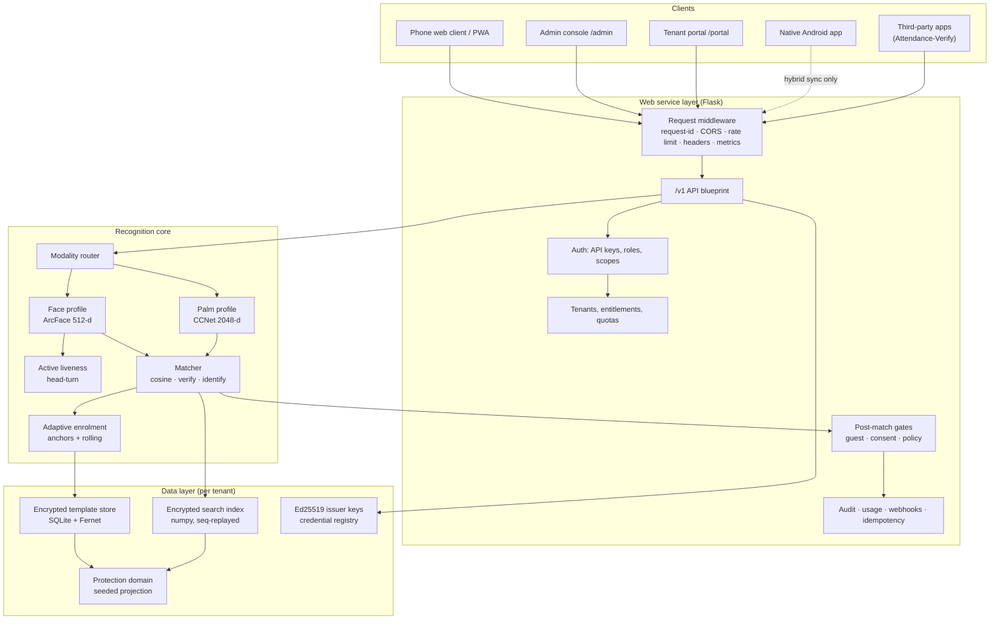

**ASCII equivalent — the two products sharing one core:**

```
                    ┌───────────────────────────────────────────┐
                    │        RECOGNITION CORE                    │
                    │  detect → align → embed → match            │
                    │  + liveness + adaptive + encrypted store   │
                    └───────────────────────────────────────────┘
                       ▲                                   ▲
     reused as library │                                   │ ported to Kotlin
   ┌───────────────────┴────────────────┐      ┌───────────┴──────────────┐
   │  WEB SERVICE (app.py + face_service)│      │ NATIVE ANDROID (android/)│
   │   • phone web client      /         │      │  • 100% on-device        │
   │   • admin console         /admin    │      │  • no INTERNET permission│
   │   • tenant portal         /portal   │      │  • CameraX + ML Kit +ONNX│
   │   • integration API       /v1/*     │      │  • encrypted Room store  │
   │   • embeddable widget  /widget.js   │      │  • Glance 1:N offline    │
   └─────────────────────────────────────┘      └──────────────────────────┘
```

### 3.2.3 The `/v1` integration API surface

| Group                 | Endpoints                                                                                                        | Purpose                                                              |
| --------------------- | ---------------------------------------------------------------------------------------------------------------- | -------------------------------------------------------------------- |
| Recognition           | `GET /v1/challenge`, `POST /v1/verify`, `POST /v1/identify`, `POST /v1/compare`, `POST /v1/embed`      | 1:1, 1:N, stateless compare, embedding extraction                    |
| Enrolment             | `POST /v1/enroll`, `POST /v1/enroll/bulk`, `GET /v1/jobs/{id}`                                             | Managed, bulk (sync and queued)                                      |
| Identity lifecycle    | `GET /v1/users`, `GET /v1/users/{id}`, `POST /v1/users/delete`, `/export`, `/purge`                    | Roster, per-person state, erasure, subject access                    |
| Configuration         | `GET /v1/config`, `GET /v1/health`, `GET /v1/openapi.json`                                                 | Thresholds actually in force; health; machine-readable spec          |
| Credentials           | `POST /v1/credentials`, `/verify`, `/revoke`, `GET /v1/trust-store`                                      | Portable offline QR identity                                         |
| Protection            | `GET /v1/templates/status`, `POST /v1/templates/reissue`                                                     | Cancelable biometrics                                                |
| Sync (Android hybrid) | `GET /v1/sync/pull`, `POST /v1/sync/push`, `GET /v1/sync/index`, `POST /v1/export/glance-index`          | On-device template and index delivery                                |
| Tenant self-service   | `GET/POST /v1/tenant/keys`, `/rotate`                                                                        | Signing-key management                                               |
| Service gates         | `/v1/policies`, `/v1/guests`, `/v1/devices`, `/v1/guardians`, `/v1/consent`, `GET /v1/service-state` | Post-match authorisation, expiry, kiosk fleet, proxy verify, consent |
| Invites               | `POST /v1/invites`                                                                                             | Token-gated self-enrolment links                                     |

Every endpoint except `/v1/health` requires `X-API-Key`. Keys carry a role
(`admin` or `verify`), a `key_id`, an optional expiry and per-key revocation, and are
stored **hashed** (SHA-256) with the raw value shown once at creation.

### 3.2.4 Demonstrator architecture (Attendance-Verify)

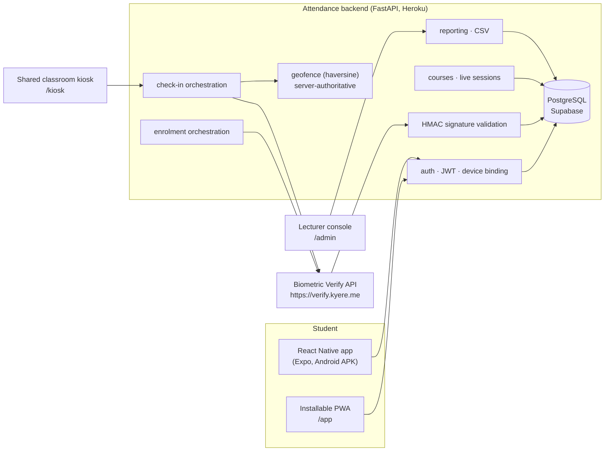

**The critical trust boundary.** The biometric API key and signing secret exist
**only** in the attendance backend's environment. The mobile application holds
neither. The app sends camera frames to *its own* backend; that backend calls the
biometric service server-to-server and **independently validates the HMAC signature
on the returned verdict** before writing an attendance record. A compromised handset
therefore cannot forge attendance, and cannot call the biometric service at all.

### 3.2.5 Deployment architecture

```
   Student phone ──HTTPS──► Heroku (attendance backend, FastAPI/uvicorn)
                                   │
                                   ├── Supabase PostgreSQL (attendance records)
                                   │
                                   └──HTTPS + X-API-Key──►
                                        Azure Container Apps
                                        verify.kyere.me
                                        (2 vCPU / 4 GB, scale-to-zero)
                                          ├── /data   persisted volume
                                          │     encrypted templates + index
                                          │     issuer keys + credential registry
                                          └── image from GitHub Container Registry
```

## 3.3 Requirements Elicitation Process of the Proposed Project

Requirements were obtained through six techniques, applied in the order below. Each
is recorded with what it produced, because a requirement whose provenance is unknown
cannot be re-evaluated when circumstances change.

### 3.3.1 Literature and incident analysis

The primary source of the problem requirements was documented failure in deployed
systems. Published reporting on Aadhaar authentication — a decade-stable ~6.5%
failure rate, ~20.3 million monthly failures, 6–12% failure among manual workers,
2–5% structural exclusion — established **FR-01 (dual modality)** and
**NFR-INC-01 (inclusion)** as hard requirements rather than nice-to-haves. Studies
of biometric template compromise established **FR-19 (cancelable templates)**.

### 3.3.2 Competitive system analysis

The five systems reviewed in Chapter 2 were analysed feature-by-feature. Each
identified weakness was converted into a design principle (Sec.2.7.1) and each design
principle into one or more requirements. The offline-eKYC gap in Aadhaar — a signed
artefact with no biometric binding — produced **FR-22** (credential verification
must require a live capture).

### 3.3.3 Prototyping and experimental measurement

Several requirements could only be discovered by building. The decisive example is
the origin of the project itself: a contactless *fingerprint* prototype was built,
measured against camera capture under realistic lighting, and found unworkable. That
experiment produced the modality requirements. Similarly, the latency budget
(**NFR-PERF-02**) was set only after per-model timing on the actual deployment
target revealed that ArcFace recognition accounts for 72% of a liveness burst, which
in turn produced the requirement that the burst be *subsampled* rather than merely
shortened.

### 3.3.4 Stakeholder scenario analysis

Concrete scenarios were written for each beneficiary class in Sec.1.9 and traced
through the design. Several requirements exist solely because a scenario broke:

| Scenario                                                              | Requirement produced                                                                    |
| --------------------------------------------------------------------- | --------------------------------------------------------------------------------------- |
| A student without a phone borrows a classmate's handset               | **FR-D08** kiosk mode: 1:N identification with nothing typed or spoken            |
| A parent brings an infant to a clinic; the infant cannot be verified  | **FR-27** guardianship / proxy verification                                       |
| A field officer must verify identities in a village with no signal    | **FR-20/21** offline credentials; **FR-30** offline Android flavour         |
| A person believes their biometric data has leaked                     | **FR-19** reissue without re-enrolment                                            |
| A student's face is enrolled, but they try to enrol under a second ID | **FR-11** one biometric, one identity                                             |
| An examiner from another institution presents a partner-issued pass   | **FR-23** cross-organisation trust lists                                          |
| A person withdraws consent                                            | **FR-26** withdrawal blocks verification, revokes credentials, drops from exports |

### 3.3.5 Regulatory requirements analysis

Ghana's **Data Protection Act, 2012 (Act 843)** and the **EU GDPR** were read as
requirement sources, obligation by obligation. Biometric data is special-category
personal data under both, which produced the data-minimisation requirement
(**NFR-PRIV-01**, store no images), the lawful-basis requirement (**FR-26**,
versioned consent pinned to the SHA-256 of the exact text agreed), the subject-rights
requirements (**FR-25**, access/export, erasure, portability) and the security
requirement (**NFR-SEC-01**, encryption at rest with per-tenant keys).

### 3.3.6 Integration-driven elicitation — the most productive technique

The single most effective elicitation method was **building a complete second
product against the platform's own public API, deliberately as an outsider**. The
demonstrator was implemented using only the published documentation and SDKs, with
no privileged access to internals. Eight defects in the public contract surfaced
this way, including one that caused a shipped bug. Each became a requirement:

| Discovered by integrating                                                                                                             | Requirement produced                                                                                                                                         |
| ------------------------------------------------------------------------------------------------------------------------------------- | ------------------------------------------------------------------------------------------------------------------------------------------------------------ |
| An unretryable refusal ("this face belongs to another identity") was indistinguishable from a retryable one ("unusable photo")        | **FR-12**: the enrolment envelope must state its own verdict — `code`, `hint`, `conflict_user_id`, with `duplicate` outranking other failures |
| The cross-user duplicate guard ran on`/v1/enroll` but not by default on `/v1/enroll/bulk` — and bulk is where nobody is watching | **FR-13**: bulk de-duplication defaults to on                                                                                                          |
| Integrators had to mirror enrolment state locally, and the mirror drifted, so genuinely enrolled people were told to enrol again      | **FR-14**: `GET /v1/users/{id}` answers authoritatively for one person; `GET /v1/users` returns the modality map                                   |
| Cohort imports were bounded by gateway timeouts                                                                                       | **FR-15**: queued bulk enrolment with a durable, leased job and progress polling                                                                       |
| Every integrator was reinventing replay protection                                                                                    | **FR-16**: verdict signatures may be bound to their liveness token and request id                                                                      |
| The thresholds deciding every verdict were invisible to the caller                                                                    | **FR-17**: `GET /v1/config` exposes the operating thresholds actually in force                                                                       |
| A palm enrolment replayed the cached verdict of the same user's earlier face enrolment                                                | **FR-18**: idempotency keys must be unique per modality                                                                                                |
| Integrators wrote mocks of the contract instead of testing against it                                                                 | **FR-31**: minting a key returns a sandbox twin                                                                                                        |

This is the methodological finding of Sec.5.2: **the fastest way to elicit the real
requirements of an API is to build a real product against it and treat your own
platform as a vendor.**

## 3.4 Functional Requirements of the Proposed Project

### 3.4.1 Platform functional requirements

| ID    | Requirement                                                                                                                                                                                          | Priority |
| ----- | ---------------------------------------------------------------------------------------------------------------------------------------------------------------------------------------------------- | -------- |
| FR-01 | The system shall enrol a person from face captures, palm captures, or both, under a single`user_id`.                                                                                               | Must     |
| FR-02 | The system shall automatically determine whether a submitted image contains a face, a palm, or both, without the caller declaring a modality.                                                        | Must     |
| FR-03 | The system shall verify a claimed identity (1:1) and return a decision, a score and a reason code.                                                                                                   | Must     |
| FR-04 | The system shall identify an unknown capture (1:N) and shall require the best candidate to exceed the runner-up by a configured margin.                                                              | Must     |
| FR-05 | The system shall issue a single-use, short-lived liveness challenge token and shall validate that a submitted frame burst constitutes a genuine three-dimensional head turn.                         | Must     |
| FR-06 | The system shall verify that the same person appears across the frame burst, defeating a burst that splices an attacker's turn onto a victim's frontal image.                                        | Must     |
| FR-07 | The system shall reject captures failing quality gates (detector confidence, minimum face size, pose limits, multiple faces, palm sharpness, ROI fraction, brightness, finger spread).               | Must     |
| FR-08 | The system shall enrol from existing photographs, from an identity document, and in bulk from a labelled folder.                                                                                     | Should   |
| FR-09 | The system shall support asynchronous bulk enrolment returning a job id with pollable progress, durable across restart.                                                                              | Should   |
| FR-10 | The system shall adapt a person's template from confident live verifications while retaining permanent enrolment anchors.                                                                            | Must     |
| FR-11 | The system shall refuse to enrol a biometric that already belongs to a different`user_id` (one biometric, one identity).                                                                           | Must     |
| FR-12 | The system shall state the verdict of an enrolment on the response envelope (`code`, `hint`, `conflict_user_id`), distinguishing an unretryable duplicate from a retryable quality failure.    | Must     |
| FR-13 | Bulk enrolment shall apply the cross-identity duplicate guard by default.                                                                                                                            | Must     |
| FR-14 | The system shall answer authoritatively for one person's enrolment state, and shall return each person's modalities in the roster.                                                                   | Must     |
| FR-15 | Long-running imports shall not be bounded by request timeouts.                                                                                                                                       | Should   |
| FR-16 | Verdict signatures shall optionally be bound to the liveness token and request id that produced them.                                                                                                | Should   |
| FR-17 | The system shall expose the thresholds actually in force to authenticated callers.                                                                                                                   | Must     |
| FR-18 | Idempotency keys shall distinguish operations by modality.                                                                                                                                           | Must     |
| FR-19 | The system shall hold templates in a protected (cancelable) domain and shall support reissue — organisation-wide or per person — without requiring re-enrolment.                                   | Must     |
| FR-20 | The system shall issue signed, expiring, revocable QR credentials for an enrolled person.                                                                                                            | Must     |
| FR-21 | The system shall verify a credential entirely offline: signature, expiry, revocation and a live biometric match inside the credential's own protection domain.                                       | Must     |
| FR-22 | Credential verification shall require a live capture of the presenter; the credential alone shall never suffice.                                                                                     | Must     |
| FR-23 | An organisation shall be able to accept credentials issued by another named organisation, with no data sharing.                                                                                      | Should   |
| FR-24 | The system shall perform continuous on-device 1:N identification (Glance) against a per-modality index.                                                                                              | Should   |
| FR-25 | The system shall export what is held about a person, delete one or many people, and purge a whole tenant.                                                                                            | Must     |
| FR-26 | The system shall record versioned consent pinned to the hash of the exact statement agreed; withdrawal shall block verification, revoke issued credentials and exclude the person from every export. | Must     |
| FR-27 | The system shall support audited guardian proxy verification (`on_behalf_of`).                                                                                                                     | Could    |
| FR-28 | The system shall apply post-match gates — guest expiry, consent standing, scheduled access policy — strictly after the biometric decision, narrowing but never widening a match.                   | Should   |
| FR-29 | The system shall register kiosk devices with single-use pairing codes, per-device keys, heartbeats and remote disable.                                                                               | Could    |
| FR-30 | A native Android build shall perform enrol, verify, credential check and Glance entirely on-device, with a flavour holding no INTERNET permission.                                                   | Must     |
| FR-31 | Creating an API key shall also return a sandbox key against the same contract.                                                                                                                       | Should   |
| FR-32 | The system shall provide an operator console and a tenant self-service portal covering the full lifecycle.                                                                                           | Must     |
| FR-33 | The system shall emit signed outbound webhooks on data-changing events.                                                                                                                              | Could    |
| FR-34 | The system shall record an audit trail of actions (never biometric data) and per-tenant usage against quotas.                                                                                        | Must     |

### 3.4.2 Demonstrator functional requirements

| ID     | Requirement                                                                                                                                                                                                    | Priority |
| ------ | -------------------------------------------------------------------------------------------------------------------------------------------------------------------------------------------------------------- | -------- |
| FR-D01 | A student shall sign in with their student ID and their programme's shared password, receiving a bearer token.                                                                                                 | Must     |
| FR-D02 | The system shall register the signing-in device and shall bind the device used at enrolment.                                                                                                                   | Must     |
| FR-D03 | The system shall list courses whose session is currently live, with the distance to each and whether the student is inside its geofence.                                                                       | Must     |
| FR-D04 | The system shall evaluate the geofence**server-side** by haversine distance and shall reject a fix whose reported accuracy exceeds the configured limit.                                                 | Must     |
| FR-D05 | The system shall obtain a liveness challenge and submit a frame burst for 1:1 verification against the signed-in student.                                                                                      | Must     |
| FR-D06 | The system shall record an attendance mark**only** when the verdict is granted, the HMAC signature validates, the returned identity equals the claimed student, and the score meets the effective floor. | Must     |
| FR-D07 | Attendance shall require one mark in the START window and one in the END window; either alone is`partial`.                                                                                                   | Must     |
| FR-D08 | A shared classroom device shall mark attendance by 1:N identification under a session-scoped kiosk token, with no student ID typed and no password spoken.                                                     | Must     |
| FR-D09 | A signed verdict shall be counted at most once (replay protection enforced by a unique database index on the signature nonce).                                                                                 | Must     |
| FR-D10 | A student shall enrol their face in-app; face is compulsory before any attendance may be marked, and palm is optional and additional.                                                                          | Must     |
| FR-D11 | Re-enrolment, or enrolment from a different device, shall require a single-use admin-issued code.                                                                                                              | Must     |
| FR-D12 | The system shall reconcile its cached enrolment state against the biometric service, so that a genuinely enrolled student is never told to enrol again.                                                        | Must     |
| FR-D13 | An administrator shall create courses, students and geofenced sessions; open the END window; and extend a running session.                                                                                     | Must     |
| FR-D14 | An administrator shall bulk-import a cohort's biometrics from a folder organised one sub-folder per student ID.                                                                                                | Should   |
| FR-D15 | The system shall produce the end-of-semester record in two shapes — a register and per-mark detail — on screen and as CSV, naming students who never enrolled.                                               | Must     |
| FR-D16 | The system shall record and allow withdrawal of consent, and expose a data-subject page.                                                                                                                       | Must     |
| FR-D17 | Every administrative action altering an academic record shall be written to an audit log with actor, action, target and address.                                                                               | Must     |
| FR-D18 | The system shall read the biometric tenant's configured thresholds and report whether the locally configured floor is a real additional margin or inert configuration.                                         | Should   |
| FR-D19 | Students shall view attendance history grouped by semester, and their registered devices.                                                                                                                      | Should   |
| FR-D20 | The student experience shall be available as an installable PWA and as an Android APK.                                                                                                                         | Must     |

## 3.5 Non-Functional Requirements of the Proposed Project

| ID           | Category            | Requirement                                                                                                              | Target / measure                                                          |
| ------------ | ------------------- | ------------------------------------------------------------------------------------------------------------------------ | ------------------------------------------------------------------------- |
| NFR-INC-01   | **Inclusion** | No person shall be unenrollable because a single trait cannot be read.                                                   | Two independent modalities, either sufficient                             |
| NFR-INC-02   | Inclusion           | The system shall require no biometric hardware beyond a standard phone camera.                                           | Zero specialised devices                                                  |
| NFR-PERF-01  | Performance         | 1:N search shall be fast enough for interactive use at the design scale.                                                 | p50 ≤ 5 ms at 5,000 identities; ~40 ms at 100,000                        |
| NFR-PERF-02  | Performance         | A full active-liveness verification shall complete within an acceptable queue interaction time on the deployment target. | ≤ 6 s on 2 vCPU (measured ~5.0 s)                                        |
| NFR-PERF-03  | Performance         | Service restart shall not require a full index rebuild.                                                                  | Incremental`seq` replay; ~0.3 s reload                                  |
| NFR-PERF-04  | Performance         | Credential verification shall be effectively instantaneous.                                                              | ~1 ms                                                                     |
| NFR-SCAL-01  | Scalability         | The system shall support the design scale per tenant with exact (non-approximate) search.                                | ~100,000 identities/tenant                                                |
| NFR-SCAL-02  | Scalability         | The path beyond the design scale shall be documented and architecturally available.                                      | Pluggable index backend                                                   |
| NFR-SEC-01   | Security            | Templates and search index shall both be encrypted at rest with per-tenant keys.                                         | Fernet server-side; AES-256-GCM + Keystore on Android                     |
| NFR-SEC-02   | Security            | Secrets shall never be stored in recoverable form.                                                                       | API keys and operator passwords hashed; raw key shown once                |
| NFR-SEC-03   | Security            | Verification results shall be tamper-evident to the consuming application.                                               | HMAC-SHA256 over the outcome, optionally token-bound                      |
| NFR-SEC-04   | Security            | A stolen template copy shall be unusable outside its protection domain, and cancelable.                                  | Seeded orthogonal projection + reissue                                    |
| NFR-SEC-05   | Security            | Presentation attacks by photograph or screen replay shall be rejected.                                                   | Active head-turn + anti-splice identity check                             |
| NFR-SEC-06   | Security            | The API shall be protected against brute force and scraping.                                                             | Per-caller rate limiting, quotas,`X-RateLimit-*`, 429 + `Retry-After` |
| NFR-SEC-07   | Security            | Retried writes shall not duplicate effects.                                                                              | Idempotency keys, unique per modality                                     |
| NFR-SEC-08   | Security            | An unset secret shall lock the system, never open it with a published default.                                           | Generated per-process value; startup problems reported by name            |
| NFR-PRIV-01  | Privacy             | No photograph shall ever be persisted.                                                                                   | Embedding only; image discarded                                           |
| NFR-PRIV-02  | Privacy             | Erasure shall be cryptographic, not merely a row deletion.                                                               | Tenant offboarding destroys the keys                                      |
| NFR-PRIV-03  | Privacy             | The audit trail shall record actions, never biometric data.                                                              | Action, tenant, label, outcome, time                                      |
| NFR-PRIV-04  | Privacy             | Data subjects shall self-serve access and withdrawal.                                                                    | `/my-data`, verification-gated                                          |
| NFR-AVAIL-01 | Availability        | Verification shall not require connectivity.                                                                             | Offline Android flavour; offline credential verifier                      |
| NFR-AVAIL-02 | Availability        | State shall survive restarts on ephemeral hosts.                                                                         | Persisted volume / durable sync                                           |
| NFR-AVAIL-03 | Availability        | Health and readiness shall be separately observable.                                                                     | `/healthz`, `/readyz` (503 until warm), `/metrics`                  |
| NFR-USE-01   | Usability           | A person shall be guided through capture without training.                                                               | On-screen head-turn guidance, plain-language outcomes                     |
| NFR-USE-02   | Usability           | Failures shall be explained in terms that imply the correct next action.                                                 | Distinct codes and messages; "already registered" ≠ "poor lighting"      |
| NFR-USE-03   | Usability           | The student experience shall be installable without an app store.                                                        | PWA + direct APK                                                          |
| NFR-MAIN-01  | Maintainability     | Modules shall be small and single-purpose.                                                                               | Typically 200–400 lines; core modules under 800                          |
| NFR-MAIN-02  | Maintainability     | Behaviour shall be defended by automated tests.                                                                          | 1,549 platform tests / 231 files; 196 demonstrator tests                  |
| NFR-MAIN-03  | Maintainability     | Recognition tuning shall live in configuration mirrored across server and device.                                        | `face/config.py` ↔ `Config.kt`                                       |
| NFR-INTEG-01 | Integrability       | An integrator shall integrate without biometric expertise.                                                               | SDKs, OpenAPI, live`/docs`, sandbox key                                 |
| NFR-INTEG-02 | Integrability       | The deciding thresholds shall be visible to the integrator.                                                              | `GET /v1/config`                                                        |
| NFR-PORT-01  | Portability         | The same model weights shall run on server CPU and on Android.                                                           | ONNX Runtime both sides                                                   |
| NFR-PORT-02  | Portability         | Deployment shall not depend on one cloud vendor.                                                                         | Container image; runs on Azure, HF Spaces, any Docker host                |
| NFR-COMP-01  | Compliance          | Each Act 843 / GDPR obligation shall be mapped to the enforcing code path.                                               | `docs/trust/compliance.md`                                              |
| NFR-EVID-01  | Evidence            | No published performance claim shall lack a benchmark that produced it from the real serving path.                       | `bench/` suites + manifest; skips stated                                |

## 3.6 UML Diagrams

### 3.6.1 Use case diagram — front-end models

Actors interacting through the client-facing surfaces (phone client, PWA, Android
app, kiosk, self-enrol page, credential card, `/my-data`).

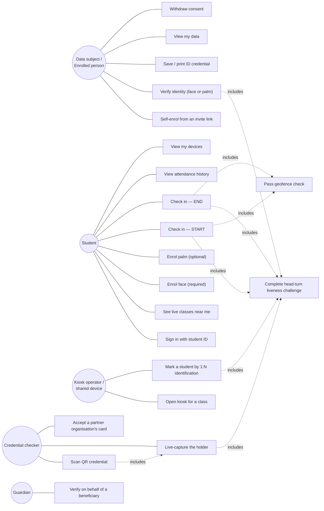

### 3.6.2 Use case diagram — back-end models

Actors interacting through the administrative and machine-facing surfaces.

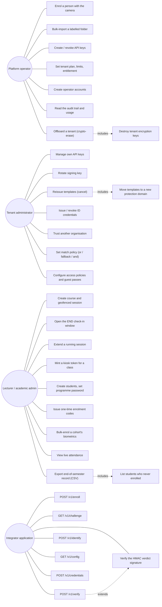

### 3.6.3 Activity diagram — biometric check-in (the core flow)

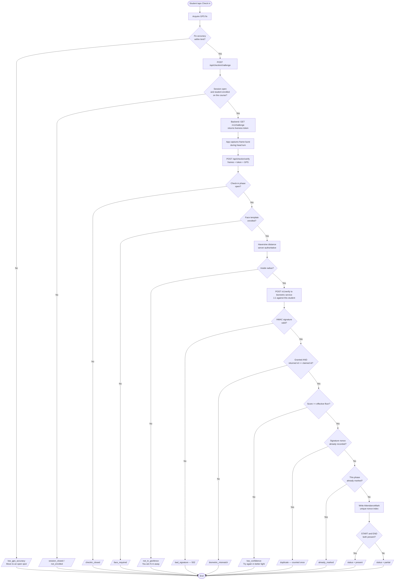

### 3.6.4 Activity diagram — enrolment with the one-biometric-one-identity guard

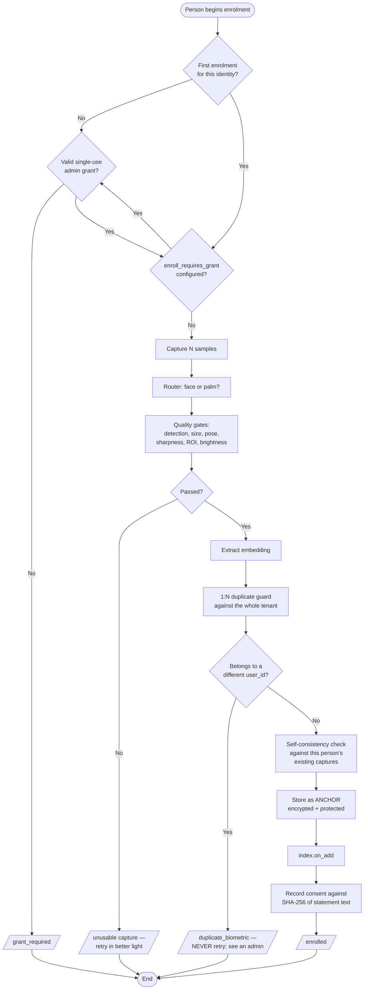

### 3.6.5 Sequence diagram — verification with active liveness and signed verdict

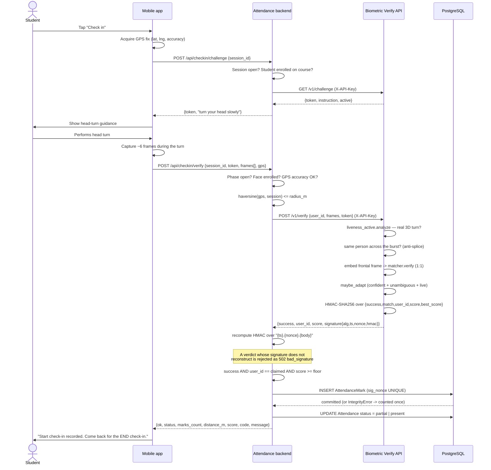

### 3.6.6 Sequence diagram — offline credential verification (no network, no database)

```mermaid
sequenceDiagram
    actor H as Card holder
    actor V as Checker
    participant AND as Android app (offline)
    participant TL as On-device trust list
    participant PE as Recognition engine (on-device)

    Note over AND: Device is in airplane mode
    V->>AND: Open "Check card"
    H->>AND: Present printed / on-screen QR
    AND->>AND: Scan FV1 credential (back camera)
    AND->>AND: Parse envelope: issuer, subject,<br/>protected template, expiry, signature
    AND->>TL: Look up issuer public key (Ed25519)
    TL-->>AND: Key found / issuer not trusted
    AND->>AND: Verify Ed25519 signature
    AND->>AND: Check expiry
    AND->>TL: Check revocation list
    AND->>AND: Flip to front camera
    H->>AND: Live face or palm capture
    AND->>PE: Project capture into the credential's protection domain
    PE->>PE: Cosine match against the credential's template
    PE-->>AND: score
    alt All checks pass
        AND->>V: VERIFIED — holder name + issuing organisation
    else Any check fails
        AND->>V: DENIED — expired / revoked / not the card holder /<br/>tampered / issuer not trusted
    end
```

### 3.6.7 Sequence diagram — template reissue (cancelable biometrics)

```mermaid
sequenceDiagram
    actor OP as Tenant administrator
    participant POR as Portal / Admin console
    participant TS as Template service
    participant ST as Encrypted store
    participant CR as Credential registry
    participant DEV as Hybrid Android device

    OP->>POR: Template protection -> Reissue (type REISSUE)
    POR->>TS: POST /v1/templates/reissue {confirm:true}
    TS->>TS: Generate a NEW protection domain seed
    TS->>ST: Read raw embeddings (encrypted at rest)
    TS->>TS: Re-project every template into the new domain
    TS->>ST: Write protected templates; bump seedref
    TS->>CR: Revoke credentials issued in the old domain
    TS-->>POR: {reissued: N, seedref: new}
    Note over TS: Every previously exported, synced or<br/>stolen copy is now unmatchable.<br/>NOBODY re-enrols.
    DEV->>TS: Next sync: seedref changed?
    TS-->>DEV: Yes — full re-pull in the new domain
    Note over DEV: Air-gapped devices need a fresh<br/>bundle export instead
```

### 3.6.8 Class diagram — recognition core (platform)

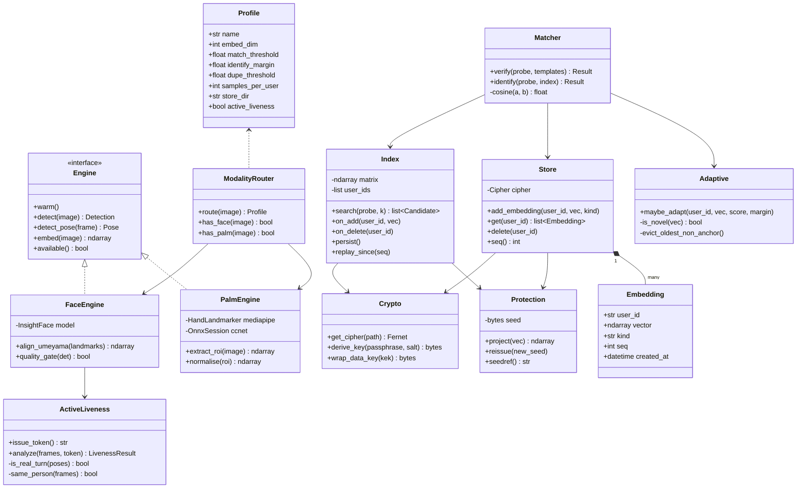

### 3.6.9 Class diagram — service layer (platform)

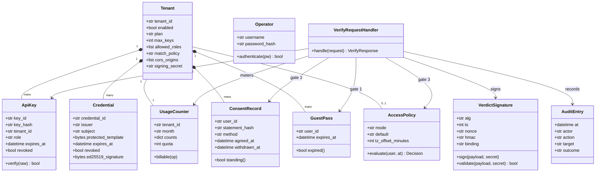

### 3.6.10 Class diagram — demonstrator domain model

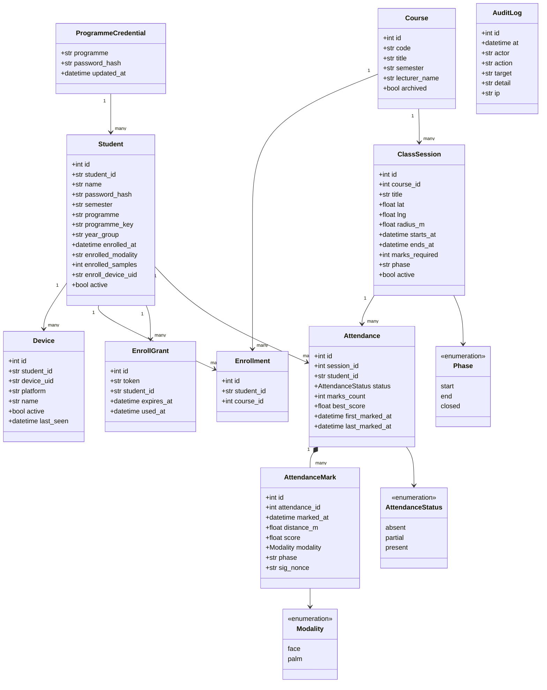

## 3.7 Users of the Proposed Systems and User Characteristics

### 3.7.1 Users

| #   | User                                           | System(s)    | Primary goal                                                            |
| --- | ---------------------------------------------- | ------------ | ----------------------------------------------------------------------- |
| U1  | **Data subject / enrolled person**       | Platform     | Be recognised; control their own data                                   |
| U2  | **Student**                              | Demonstrator | Sign in, enrol, mark attendance, see history                            |
| U3  | **Lecturer / academic administrator**    | Demonstrator | Run classes, manage students, produce the semester record               |
| U4  | **Platform operator**                    | Platform     | Enrol people, issue keys, manage tenants, read the audit trail          |
| U5  | **Tenant administrator**                 | Platform     | Manage their own organisation's keys, credentials, policies, protection |
| U6  | **Field checker / proctor / gate staff** | Platform     | Verify a person or a credential, often offline                          |
| U7  | **Kiosk operator**                       | Both         | Run a shared walk-up device                                             |
| U8  | **Integrator (software team)**           | Platform     | Add identity to their own product                                       |
| U9  | **Guardian**                             | Platform     | Verify on behalf of a linked beneficiary                                |
| U10 | **Auditor / data-protection officer**    | Platform     | Establish what is stored, on what basis, and what happens on compromise |

### 3.7.2 User characteristics

| Characteristic         | U1 Data subject                                                           | U2 Student                                                        | U3 Lecturer                                     | U4/U5 Administrator                         | U6 Field checker                                    | U8 Integrator                                  |
| ---------------------- | ------------------------------------------------------------------------- | ----------------------------------------------------------------- | ----------------------------------------------- | ------------------------------------------- | --------------------------------------------------- | ---------------------------------------------- |
| Technical skill        | None assumed                                                              | Low–moderate                                                     | Low–moderate                                   | Moderate                                    | Low                                                 | High                                           |
| Frequency of use       | Occasional                                                                | Twice per class                                                   | Weekly                                          | Daily–weekly                               | Continuous in bursts                                | One-time integration                           |
| Device                 | Any phone, possibly none                                                  | Own phone or a shared handset                                     | Laptop or phone                                 | Laptop                                      | Any phone, often offline                            | Server                                         |
| Training expected      | None                                                                      | None                                                              | Brief                                           | Documentation                               | Minutes                                             | API docs + SDK                                 |
| Network                | May have none                                                             | Campus Wi-Fi / mobile data                                        | Campus network                                  | Campus network                              | **Frequently none**                           | Server-grade                                   |
| Literacy assumption    | Cannot be assumed — outcomes are colour and icon coded as well as worded | Literate                                                          | Literate                                        | Literate                                    | Literate                                            | Expert                                         |
| Failure tolerance      | Very low — a false rejection may deny a wage or a benefit                | Low — a failed mark is an academic dispute                       | Low                                             | Moderate                                    | Very low                                            | Low                                            |
| Key design consequence | Two modalities; plain-language outcomes; self-service data rights         | Face compulsory but palm available; kiosk path for the phone-less | Bulk tools; one artefact at semester end; audit | Two-plane admin; entitlements; crypto-erase | Full offline operation; unambiguous verdict screens | SDKs, OpenAPI, visible thresholds, sandbox key |

The most important characteristic in the table is the **failure tolerance of U1**.
The entire inclusion argument of this project rests on the observation that in the
target deployments, a false rejection is not a retry — it is a person turned away
from something they are entitled to. That is why two modalities exist, why the
duplicate-versus-quality distinction in enrolment feedback matters, and why the
system prefers to ask for a second capture rather than to lower its threshold.

## 3.8 Security Concepts of the System

### 3.8.1 Security design principles applied

- **Defence in depth.** Identity (biometric) → integrity (HMAC verdict) →
  authorisation (post-match gates) → context (geofence, phase, device) → accounting
  (audit, replay guard). No single control carries the decision.
- **Fail closed.** An unset secret produces a per-process random value, locking the
  console rather than opening it with a published default; the process reports
  exactly which configuration is missing at boot.
- **Least privilege.** `verify`-role keys for browser and kiosk clients; `admin` keys
  kept server-side; kiosk tokens scoped to one session for its duration and able to
  do nothing but mark attendance.
- **Complete mediation.** Every `/v1` request passes the same middleware: request id,
  CORS, rate limit, authentication, entitlement, then the handler.
- **Constraints over conventions.** Invariants that must not be violated are database
  constraints — one attendance row per (session, student), one mark per signed
  verdict, one enrolment row per (student, course) — because a check-then-insert
  loses a race that a unique index cannot.
- **Honest cryptographic claims.** The system states what protection does *not* do
  (raw embeddings persist server-side) alongside what it does.

### 3.8.2 Encryption and key management

| Surface                               | Mechanism                                                                                                                              |
| ------------------------------------- | -------------------------------------------------------------------------------------------------------------------------------------- |
| Server template store                 | Fernet (AES-128-CBC + HMAC-SHA256); key from`FACE_DB_KEY` via PBKDF2, 200,000 iterations, per-database salt, or a generated key file |
| Server search index                   | Same cipher and key as the store — the index matrix and user list are encrypted blobs on disk, not plaintext                          |
| Android embeddings                    | AES-256-GCM with a non-exportable Android Keystore key, hardware-backed where available                                                |
| Per-tenant data keys                  | KEK-wrapped: with a master passphrase set, each tenant's data key is stored encrypted under a key derived from that passphrase         |
| Issued credentials and export bundles | Ed25519 signatures under a per-tenant issuer keypair                                                                                   |
| Verification verdicts                 | HMAC-SHA256 over`"{ts}.{nonce}.{body}"`, keyed by the tenant signing secret, optionally bound to the liveness token and request id   |
| Templates in use and in transit       | Seeded orthogonal projection (protection domain), on by default                                                                        |
| Transport                             | HTTPS everywhere; TLS verification enforced on the demonstrator's calls to the platform                                                |

**Key separation is operationally mandated**: `FACE_DB_KEY` must be backed up
*separately* from the data, because without it an encrypted backup is unrecoverable —
which is also precisely what makes crypto-erase a real erasure.

### 3.8.3 Anti-spoofing (presentation attack detection)

The primary countermeasure is an **active head-turn challenge**:

1. The client requests a challenge; the server mints a **single-use token expiring in
   about two minutes**.
2. The client captures a burst of frames while the subject turns their head.
3. The server subsamples the burst to at most five analysed frames and requires:
   at least three frames with a detected face; at least one frontal frame
   (|yaw| ≤ 16°); at least one genuinely turned frame (|yaw| ≥ 16°); a yaw span
   across the burst of at least 18°; and a same-person cosine of at least 0.45
   across the sequence.
4. **The anti-splice check**: the most-turned frame is independently embedded and
   confirmed to be the same person as the frontal frame — so an attacker cannot pair
   their own live head turn with a victim's frontal photograph. This costs a second
   recognition pass (~1.8 s on the deployment target) and is a deliberate,
   documented security-versus-latency trade that may be disabled only for an attended
   kiosk where an operator can see who is standing there.

A passive single-shot anti-spoof model is integrated as an optional second layer but
ships **disabled**, because it is untuned and the project does not enable defences it
has not measured.

### 3.8.4 Access control and multi-tenancy

- API keys hashed with SHA-256; the raw key is displayed once at creation.
- Roles: `admin` (full) and `verify` (recognition only, cannot write).
- Storage resolves per request to `<db>/tenants/<tenant>/`, giving each tenant its own
  encrypted database, its own index, and its own encryption key derivation.
- Entitlements (`enabled`, `plan`, `max_keys`, `allowed_roles`) gate all `/v1` access;
  a disabled tenant receives `402 payment_required` on every call.
- Operator accounts use PBKDF2-hashed passwords; sessions are signed, time-limited
  cookies.
- The tenant portal is a separate signed session with ownership-checked operations,
  so a tenant can never act on another tenant's resources.

### 3.8.5 Privacy and data protection

- **No image is ever persisted.** The capture becomes an embedding and is discarded.
- **The audit trail records actions, not faces**: action, tenant, user label, outcome
  and time.
- **Consent** is recorded on every enrolment path against the tenant's versioned
  statement, pinned to the SHA-256 of the exact text agreed. Withdrawal blocks
  verification immediately, auto-revokes issued credentials, and removes the person
  from every export — sync pulls, Glance indexes and provisioning bundles.
- **Subject access**: `POST /v1/users/export` returns what is held (counts,
  dimensions, recent audit) and never the raw template. People self-serve at
  `/my-data`, gated by verifying themselves with full liveness.
- **Erasure**: per-person deletion, whole-tenant purge, and crypto-erase offboarding
  that destroys the keys so that leftover copies and backups become permanently
  unreadable.
- **Compliance mapping**: Ghana DPA (Act 843) and GDPR obligations are mapped
  obligation-by-obligation to the enforcing code path in `docs/trust/compliance.md`.

### 3.8.6 Threat model

| Threat                                                   | Mitigation                                                                                                                               |
| -------------------------------------------------------- | ---------------------------------------------------------------------------------------------------------------------------------------- |
| Stolen disk or backup                                    | Templates*and* index encrypted; key held separately                                                                                    |
| Leaked key file                                          | API keys and operator passwords stored hashed; raw values never persisted                                                                |
| Photograph or screen spoof                               | Active head-turn liveness with anti-splice identity check                                                                                |
| Splice attack (attacker's turn + victim's frontal photo) | Second recognition pass on the most-turned frame                                                                                         |
| Enrolment by an unauthorised party                       | Admin login or`admin`-role key required; one-time grants for re-enrolment                                                              |
| Enrolling one's own face under a classmate's ID          | One biometric, one identity — cross-user duplicate guard at`dupe_threshold` 0.55                                                      |
| Look-alike false accept in 1:N                           | Identify requires the top candidate to beat the runner-up by`identify_margin` 0.06                                                     |
| Tampered verdict in transit                              | HMAC-signed results, independently validated by the consuming application                                                                |
| Replayed verdict                                         | Single-use liveness token; optional signature binding; unique nonce index in the consuming application's database                        |
| Stolen template copy (database, sync or export)          | Protected domain makes it unmatchable elsewhere; reissue cancels it                                                                      |
| Brute force or scraping                                  | Per-caller rate limiting and per-tenant quotas                                                                                           |
| Cross-customer data access                               | Per-tenant stores, indexes, keys, CORS, webhooks and audit                                                                               |
| Template drift toward another identity                   | Adaptive enrolment with permanent anchors, confidence and margin gates, and a dedicated anti-drift regression test                       |
| Credential theft                                         | A stolen QR is useless without the live holder; credentials expire and can be revoked                                                    |
| Shared programme password guessed                        | Failure-counted lockout per identity and client address (8 failures / 300 s → 900 s lockout; 5 / 300 s → 1,800 s for the console)      |
| Falsified GPS position                                   | GPS-accuracy floor, server-authoritative evaluation, two-window requirement, biometric bound to the individual (residual risk — see L7) |
| Compromised student handset                              | The handset holds no biometric API key and no signing secret; it cannot call the biometric service or forge a verdict                    |

## 3.9 Project Method Employed

The project used an **incremental, evidence-driven engineering method** with the
following practices, applied consistently across both systems.

- **Measure before deciding.** No architectural claim was accepted without a
  measurement. The fingerprint pivot, the palm normalisation study, the latency
  budget, the exact-versus-approximate index decision and the protection-cost gate
  were all settled by running something, not by argument.
- **Ship each increment to a deployable state.** Every increment in Sec.1.10.1 ended in
  a system that could be run and demonstrated, which is what made the ordering
  flexible.
- **Test-defended change.** Behaviour that matters is covered by an automated test
  before or alongside the change. Regression tests were added for each field defect —
  camera freeze, adaptive drift, concurrent check-in, replay, query cost.
- **Small, single-purpose modules.** Typically 200–400 lines, with the recognition
  core kept free of web concerns so it could be ported.
- **Mirror configuration rather than duplicate logic.** Server and Android
  thresholds are mirrored in matched configuration files, and golden-vector tests
  check the two implementations agree.
- **Document the decision, not just the code.** Non-obvious choices are recorded
  where they are made, including the reasons a setting is *not* the default.
- **Integrate as an outsider.** The demonstrator was built against published
  documentation only. This is the practice that produced Sec.3.3.6.
- **Version control as the project record.** 379 platform commits and 65
  demonstrator commits, with CI on push.

## 3.10 Software Process Models Employed and Justification of the Chosen Model

### 3.10.1 Models considered

| Model                             | Fit for this project                                                                                                                                                                                                                                                                                                           | Verdict                                                                                    |
| --------------------------------- | ------------------------------------------------------------------------------------------------------------------------------------------------------------------------------------------------------------------------------------------------------------------------------------------------------------------------------ | ------------------------------------------------------------------------------------------ |
| **Waterfall**               | Requires requirements to be knowable and stable before design. Here the central requirement —*which modality is even viable on a phone camera* — could only be answered by building and measuring. A Waterfall project would have completed a full design for contactless fingerprint before discovering it does not work. | **Rejected**                                                                         |
| **V-Model**                 | Excellent verification discipline, but inherits Waterfall's assumption of stable up-front requirements.                                                                                                                                                                                                                        | **Rejected as the overall model; its verification discipline was adopted** (Sec.4.5) |
| **Prototyping**             | Well suited to the discovery phase, and in fact used within increments; but as a whole-project model it lacks the delivery and regression discipline needed for a deployed, security-sensitive system.                                                                                                                         | **Adopted as a technique, not as the model**                                         |
| **Scrum**                   | Its ceremonies, velocity tracking and role separation presuppose a team larger than two and a customer available for sprint review. The overhead would exceed the benefit at this size.                                                                                                                                        | **Rejected; its backlog and increment concepts adopted**                             |
| **Spiral**                  | Risk-driven iteration matches the project's risk profile well, and its risk-analysis phase is genuinely reflected in Sec.1.10.3. Its heavyweight documentation cycle per spiral is disproportionate for a two-person project.                                                                                                  | **Partially adopted — the risk-driven ordering**                                    |
| **Incremental development** | Builds and delivers the system in successive working increments, each adding capability, each deployable, with requirements for later increments informed by earlier ones.                                                                                                                                                     | **CHOSEN**                                                                           |

### 3.10.2 Chosen model and justification

The project used **incremental development, ordered by risk, with prototyping inside
increments and V-Model verification discipline applied to each**.

The justification rests on six properties of this specific project.

**1. The riskiest requirement was unknowable in advance.** The project's founding
question — can a commodity phone camera support a biometric modality accurate enough
to carry an identity decision? — is empirical. The first increment answered it for
fingerprint (no) and the second answered it for face (yes). No planning-first model
survives a first increment that invalidates the premise; an incremental model
absorbs it as information. The pivot occurred **within a single day** and the
negative result was preserved rather than discarded.

**2. Each increment had independent value.** Face verification without palm was a
usable system. The API without credentials was a usable system. Adding palm, then
protection, then credentials, then Glance each produced something demonstrable. This
is the defining precondition for incremental delivery, and it held throughout.

**3. Later requirements genuinely depended on earlier results.** The palm
architecture depended on the generic core extracted during the face work. The
latency budget depended on measurements taken on the deployed container. The API
contract fixes in Sec.3.3.6 depended on an integration that could not exist until the
API did. These dependencies are informational, not merely sequential, and only an
incremental model exploits them.

**4. Risk-driven ordering was essential.** The increments were sequenced so that the
highest-risk unknowns were retired first: modality viability, then liveness, then
multi-tenancy, then scale, then the on-device port, then the second modality, then
the trust platform. Every one of the realised risks in Sec.1.10.3 was discovered while
there was still time to respond.

**5. Verification had to be per-increment, not terminal.** Because the system is
security-sensitive and because later increments modify earlier subsystems (the
generic-core extraction touched every face code path; protection touched every
matching path), each increment required its own verification pass against the
requirements it implemented. This is the V-Model's core discipline, applied at
increment granularity rather than project granularity, and it is why the test suite
grew to 1,549 tests rather than being written at the end.

**6. It suited a two-person team with a fixed deadline.** Incremental delivery meant
that at any point the project had a working, demonstrable system. Had the schedule
been cut short at the end of July 2026, the project would still have delivered a
deployed dual-modality verification platform — without the trust layer and without
the demonstrator, but complete and working. No plan-driven model offers that
property.

### 3.10.3 The process, illustrated

```
   ┌──────────────────────────────────────────────────────────────┐
   │  For each increment:                                          │
   │                                                               │
   │   RISK ANALYSIS ──► REQUIREMENTS ──► DESIGN ──► BUILD         │
   │        ▲                                          │           │
   │        │                                          ▼           │
   │   MEASURE  ◄──── DEPLOY  ◄──── VERIFY (tests) ◄───┘           │
   │        │                                                      │
   │        └──► informs the NEXT increment's requirements         │
   └──────────────────────────────────────────────────────────────┘

   Increment 1 measured: camera fingerprint capture unusable
        └──► Increment 2 requirements: face modality
   Increment 5 measured: exact search is 100% accurate at 100k, ~40 ms
        └──► Increment 5 decision: do NOT adopt ANN; document FAISS as the path
   Increment 8 measured: protection TAR delta = 0.0
        └──► Increment 8 decision: protection ON by default
   Increment 11 (integration) discovered: 8 API contract defects
        └──► Increment 12 requirements: FR-12 … FR-18, FR-31
```

## 3.11 Project Design Considerations: Logical Designs

### 3.11.1 Layering and dependency direction

Dependencies point strictly inward. The recognition core knows nothing of HTTP,
tenants or authentication; the service layer depends on the core; the web surfaces
depend on the service layer. Nothing depends outward. This is what made both the
Kotlin port and the extraction of the generic `biometric/` core from `face/`
tractable, and it is why the face module could be reduced to a thin shim over the
generic core with byte-for-byte unchanged behaviour.

### 3.11.2 Key logical design decisions and their justification

| Decision                                                          | Alternative rejected                       | Justification                                                                                                                                                                                                                                                 |
| ----------------------------------------------------------------- | ------------------------------------------ | ------------------------------------------------------------------------------------------------------------------------------------------------------------------------------------------------------------------------------------------------------------- |
| Exact (brute-force vectorised) search by default                  | Approximate nearest neighbour (HNSW/FAISS) | At the 100,000-identity design scale, exact search is 100% accurate at ~40 ms. ANN's build cost and recall tuning bought nothing. The ANN backend exists behind the same interface for scale beyond the target.                                               |
| Encrypt the**index** as well as the store                   | Encrypt only the template store            | An unencrypted index is a plaintext copy of every embedding. Encrypting only the store would have been security theatre.                                                                                                                                      |
| Adaptive enrolment with**permanent anchors**                | Pure rolling window                        | A rolling window drifts; anchors alone go stale as a person ages. Anchors are permanent and adaptive samples rotate around them.                                                                                                                              |
| **No anchor tether for face; a 0.75 tether for palm**       | One rule for both                          | A face legitimately drifts over months and years, and tracking that is what adaptation is*for*; tethering it to day-zero anchors locks the real person out, which the anti-drift test demonstrates. Palm does not drift the same way, so it keeps a tether. |
| Active liveness as the**default**                           | Passive single-shot only                   | Active is stronger, needs no additional model, and is a protocol an integrator can reason about. Passive is available as an optional second layer but disabled because untuned.                                                                               |
| Modality**auto-routing**                                    | Caller declares the modality               | Every integrator would otherwise have to implement modality detection, and every one would get it slightly wrong. Routing it once, correctly, in the platform is the whole value proposition.                                                                 |
| Separate vector spaces per modality,**never cross-matched** | One shared space                           | A face embedding and a palm embedding are not comparable quantities; mixing them would produce meaningless scores.                                                                                                                                            |
| **Protection on by default**                                | Opt-in                                     | A security property that must be switched on is a security property most deployments will not have. Measured cost is 0.0 TAR delta, so there is no reason to charge for it.                                                                                   |
| Retain raw embeddings server-side under encryption                | Discard them after projection              | Discarding them would make reissue require re-enrolment of every person — the single most expensive operation in a biometric system. The trade is disclosed rather than hidden.                                                                              |
| Verdicts**HMAC-signed**                                     | Plain JSON response                        | The consuming application must be able to trust a result it did not compute. This is the mechanism the demonstrator's entire attendance integrity rests on.                                                                                                   |
| **Per-tenant directories** for isolation                    | A`tenant_id` column with query filtering | A forgotten`WHERE` clause is a cross-tenant breach. A wrong directory is a missing file.                                                                                                                                                                    |
| Post-match gates strictly**after** the biometric decision   | Gates woven into matching                  | A gate can then only narrow a granted match, never widen one, so the recognition pipeline's security properties are provably untouched by authorisation logic.                                                                                                |
| Invariants as**database constraints**                       | Application-level checks                   | Application code loses races with itself; a unique index does not. The demonstrator's replay guard, one-attendance-row-per-student and one-enrolment-per-course rules are all constraints.                                                                    |
| Face**compulsory** in the demonstrator before any mark      | Either modality sufficient                 | Palm alone is not yet accurate enough to carry an academic record unaided; face is required and palm is an additional convenience. Enforced server-side so it holds outside the app.                                                                          |
| The demonstrator reads the platform's**live thresholds**    | A locally configured floor alone           | Two systems were making one decision with no way to know whether they agreed. Reading`GET /v1/config` lets the console state whether the local floor is a real additional margin or inert configuration.                                                    |

## 3.12 UI Design (Wireframes)

The design system is a single shared stylesheet (deep ink and iris violet, Inter
typography) across every surface, so the phone client, admin console, portal, docs
and Trust Center are visibly one system.

### 3.12.1 Platform — phone verification client (`/`)

```
┌──────────────────────────────┐   ┌──────────────────────────────┐
│  Biometric Verify        ⚙︎  │   │  Biometric Verify        ⚙︎  │
├──────────────────────────────┤   ├──────────────────────────────┤
│                              │   │                              │
│    ┌────────────────────┐    │   │    ┌────────────────────┐    │
│    │                    │    │   │    │      ✓             │    │
│    │   live camera      │    │   │    │                    │    │
│    │   preview          │    │   │    │   GRANTED          │    │
│    │                    │    │   │    │                    │    │
│    │   ( face oval )    │    │   │    │   Ama Mensah       │    │
│    │                    │    │   │    │   score 0.71       │    │
│    └────────────────────┘    │   │    └────────────────────┘    │
│                              │   │                              │
│  ↻  Turn your head slowly    │   │      [  Check another  ]     │
│     to the left, then right  │   │                              │
│                              │   │                              │
│  [ Verify ]   [ Enrol 🔒 ]   │   │                              │
│                              │   │  Denied screens name the     │
│  ⟳ swap camera               │   │  exact reason in plain words │
└──────────────────────────────┘   └──────────────────────────────┘
```

### 3.12.2 Platform — admin console (`/admin`)

```
┌───────────────────────────────────────────────────────────────────────┐
│  Biometric Verify — Admin                        operator: alice  ⏻   │
├───────────────────────────────────────────────────────────────────────┤
│ Overview │ Enrol │ People │ Invites │ Keys │ Access │ Security │ Audit │
├───────────────────────────────────────────────────────────────────────┤
│  ┌─────────────┐ ┌─────────────┐ ┌─────────────┐ ┌─────────────┐      │
│  │ Enrolled    │ │ Verifies    │ │ This month  │ │ Tenants     │      │
│  │    1,284    │ │   18,402    │ │   4,110     │ │      7      │      │
│  └─────────────┘ └─────────────┘ └─────────────┘ └─────────────┘      │
│                                                                       │
│  Template protection                                                  │
│  ┌──────────────────────────────────────────────────────────────┐     │
│  │ Domain seedref: 7f2a…c19    Protected: 1,284 / 1,284         │     │
│  │ [ Reissue everyone ]  [ Reissue one person: ______ ]         │     │
│  │ Cancels every exported copy. Nobody re-enrols.               │     │
│  └──────────────────────────────────────────────────────────────┘     │
│                                                                       │
│  ID credentials                                                       │
│  ┌──────────────────────────────────────────────────────────────┐     │
│  │ Person ______  Display name ______  Valid for [ 90 ] days    │     │
│  │ [ Issue credential ]   → [Download PNG] [Open card] [Copy]   │     │
│  └──────────────────────────────────────────────────────────────┘     │
└───────────────────────────────────────────────────────────────────────┘
```

### 3.12.3 Demonstrator — student mobile application

```
  LOGIN                      HOME (live near me)         CHECK-IN
┌──────────────────┐      ┌──────────────────────┐    ┌──────────────────┐
│                  │      │  Hi, Ama        ⚙︎   │    │   ← CS101        │
│   Attendance     │      ├──────────────────────┤    ├──────────────────┤
│    Verify        │      │ ┌──────────────────┐ │    │                  │
│                  │      │ │ CS101            │ │    │  ┌────────────┐  │
│ Student ID       │      │ │ Intro to Comp.   │ │    │  │            │  │
│ ┌──────────────┐ │      │ │ Dr. Osei         │ │    │  │  camera    │  │
│ │ 20512345     │ │      │ │ ● 24 m away  ✓   │ │    │  │  preview   │  │
│ └──────────────┘ │      │ │ START open       │ │    │  │            │  │
│                  │      │ │ [ Start face ]   │ │    │  └────────────┘  │
│ Password         │      │ └──────────────────┘ │    │                  │
│ ┌──────────────┐ │      │ ┌──────────────────┐ │    │ ↻ Turn your head │
│ │ ••••••••     │ │      │ │ MATH151          │ │    │   slowly         │
│ └──────────────┘ │      │ │ ○ 310 m away  ✗  │ │    │                  │
│                  │      │ │ Move closer      │ │    │  ( ● ● ● ○ ○ ○ ) │
│ [   Sign in    ] │      │ └──────────────────┘ │    │                  │
│                  │      ├──────────────────────┤    │  [ ] use palm    │
└──────────────────┘      │ 🏠  📋  👤  ⚙︎       │    └──────────────────┘
                          └──────────────────────┘

  RESULT — PARTIAL              RESULT — PRESENT            ENROL
┌──────────────────┐      ┌──────────────────────┐    ┌──────────────────┐
│                  │      │                      │    │  Enrol your face │
│       ✓          │      │        ✓✓            │    │                  │
│                  │      │                      │    │  ┌────────────┐  │
│  Start check-in  │      │  Attendance complete │    │  │  camera    │  │
│  recorded        │      │  PRESENT             │    │  └────────────┘  │
│                  │      │                      │    │                  │
│  Come back for   │      │  Marked at start     │    │  Capture 1 of 3  │
│  the END check-in│      │  and at end          │    │  ● ○ ○           │
│                  │      │                      │    │                  │
│  score 0.68      │      │  best score 0.71     │    │  [  Capture  ]   │
│  24 m from class │      │                      │    │                  │
│                  │      │                      │    │  Palm (optional) │
│  [    Done    ]  │      │  [     Done      ]   │    │  [ Add palm  ]   │
└──────────────────┘      └──────────────────────┘    └──────────────────┘
```

### 3.12.4 Demonstrator — kiosk (shared classroom device)

```
┌───────────────────────────────────────────────────────────┐
│              CS101 — Intro to Computing                   │
│              START check-in is open                       │
├───────────────────────────────────────────────────────────┤
│                                                           │
│              ┌───────────────────────────┐                │
│              │                           │                │
│              │      live camera          │                │
│              │                           │                │
│              │    Look at the screen     │                │
│              │                           │                │
│              └───────────────────────────┘                │
│                                                           │
│         Nothing to type. Nothing to say.                  │
│         Step up and look at the camera.                   │
│                                                           │
│   ┌─────────────────────────────────────────────────┐     │
│   │  ✓  AMA MENSAH — start recorded                 │     │
│   │     20512345 · score 0.69 · 12 m                │     │
│   └─────────────────────────────────────────────────┘     │
└───────────────────────────────────────────────────────────┘
```

### 3.12.5 Demonstrator — lecturer console (`/admin`)

```
┌──────────────────────────────────────────────────────────────────────────┐
│  Attendance Verify — Console                                    admin ⏻  │
├──────────────────────────────────────────────────────────────────────────┤
│ Sessions │ Courses │ Students │ Attendance │ End of semester │ Verification│
├──────────────────────────────────────────────────────────────────────────┤
│  Open a class                                                            │
│  ┌────────────────────────────────────────────────────────────────────┐  │
│  │ Course [CS101 ▾]  Title [Lecture 5]                                │  │
│  │ Location: ⌖ pin on map        lat 6.6745  lng -1.5716              │  │
│  │ Radius [70] m   Starts [09:00]  Ends [11:00]                       │  │
│  │                              [ Open session ]  [ Mint kiosk token ] │  │
│  └────────────────────────────────────────────────────────────────────┘  │
│                                                                          │
│  Running now                                                             │
│  ┌────────────────────────────────────────────────────────────────────┐  │
│  │ CS101 Lecture 5    phase: START    32 marked / 48 enrolled         │  │
│  │        [ Open END window ]   [ Extend +15 min ]   [ Close ]        │  │
│  └────────────────────────────────────────────────────────────────────┘  │
│                                                                          │
│  End of semester — CS101                     [ Download register CSV ]   │
│  ┌────────────────────────────────────────────────────────────────────┐  │
│  │ Student        │L1 │L2 │L3 │L4 │L5 │ Present │ Rate               │  │
│  │ Ama Mensah     │ ✓ │ ✓ │ ~ │ ✓ │ ✓ │  4/5    │ 80%                │  │
│  │ Kofi Boateng   │ ✓ │ ✗ │ ✓ │ ✓ │ ~ │  3/5    │ 60%                │  │
│  │ Yaa Asantewaa  │ — never enrolled — flagged separately             │  │
│  └────────────────────────────────────────────────────────────────────┘  │
└──────────────────────────────────────────────────────────────────────────┘
```

### 3.12.6 Interaction design rules applied

- **Every failure states its own remedy.** `not_in_geofence` reports the actual
  distance and the required radius; `low_confidence` says "try again in better
  light"; `duplicate_biometric` says the biometric is already registered and to see
  an administrator — and deliberately **never names the other student**.
- **A refusal that must not be retried never looks like one that should.** This is a
  UI rule with a security origin (Sec.3.3.6).
- **Progress is visible during capture.** Frame counters and head-turn guidance,
  because an unexplained three-second wait reads as a broken application.
- **Outcomes are colour-, icon- and word-coded**, so a verdict does not depend on
  reading a sentence.
- **The kiosk removes credentials from the room.** Nothing is typed and nothing is
  spoken, because a password read aloud in a lecture hall is not a password.

## 3.13 DB Design (Database Schemas)

### 3.13.1 Platform storage design

The platform deliberately does **not** use a conventional relational database for
biometric material. Its storage is:

| Store               | Form                                                                                          | Contents                                                                                                                         |
| ------------------- | --------------------------------------------------------------------------------------------- | -------------------------------------------------------------------------------------------------------------------------------- |
| Template store      | Encrypted SQLite, one per tenant at`<db>/tenants/<tenant>/faces.db` (and `palm/palms.db`) | `(user_id, embedding, kind, seq, created_at)` in a compact binary format, Fernet-encrypted, with a monotonic `seq` watermark |
| Search index        | Encrypted files at`<db>/tenants/<tenant>/index/`                                            | `mat.npy` (the stacked matrix), `users.json`, metadata — all encrypted blobs                                                |
| API keys            | `apikeys.json`                                                                              | `key_id`, SHA-256 key hash, tenant, role, expiry, revoked                                                                      |
| Operators           | `admins.json`                                                                               | username, PBKDF2 password hash                                                                                                   |
| Tenants             | `tenants.json`                                                                              | entitlements, match policy, CORS origins, webhooks, signing secret                                                               |
| Usage               | `usage.json`                                                                                | per-tenant, per-month operation counts against quota                                                                             |
| Audit               | `audit_logs/`                                                                               | append-only action records                                                                                                       |
| Issuer keys         | `secrets/issuer/`                                                                           | per-tenant Ed25519 keypairs                                                                                                      |
| Credential registry | `secrets/credentials/`                                                                      | issued credentials and the revocation list                                                                                       |

**Why a file/SQLite design rather than PostgreSQL.** Three reasons. First,
isolation: per-tenant directories make cross-tenant access a filesystem impossibility
rather than a query-correctness obligation. Second, encryption: the whole store and
the whole index are encrypted as opaque blobs, which is straightforward with files
and awkward with a server-side relational engine that wants to index plaintext.
Third, portability: the same store format is exported to, and imported by, air-gapped
Android devices.

**Logical schema of the template store:**

```
Embedding
├── user_id     TEXT     the identity this template belongs to
├── vector      BLOB     512-d (face) or 2048-d (palm), L2-normalised, encrypted
├── kind        TEXT     'anchor' (permanent) | 'adaptive' (rotating)
├── seq         INTEGER  monotonic watermark; drives incremental index replay
├── provenance  TEXT     'live' | 'photo' | 'id' | 'import'
└── created_at  INTEGER

Constraints / invariants
• anchors are never evicted
• total embeddings per user <= adaptive_max_samples (8)
• adaptive inserts require score >= 0.55, margin >= 0.10, novelty < 0.92
• a template is stored in its protection domain; seedref recorded alongside
```

### 3.13.2 Demonstrator database schema (PostgreSQL / SQLite)

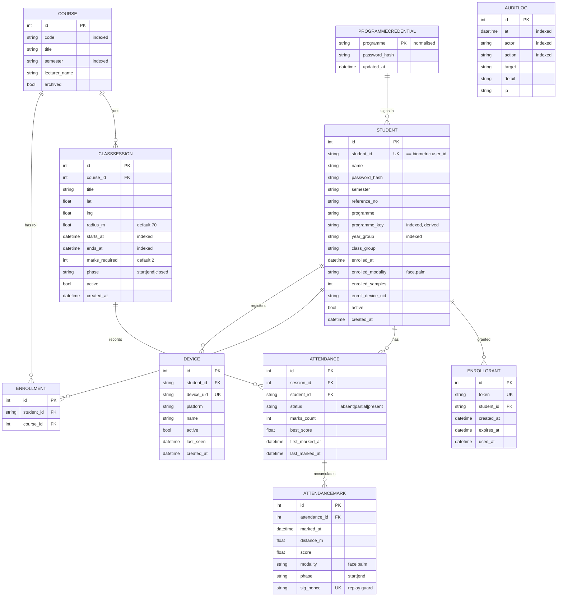

### 3.13.3 Constraints — the invariants that are enforced by the database

The schema's most important property is that the rules which must not be violated
are **database constraints, not application conventions**, because application code
can lose a race with itself while a unique index cannot.

| Constraint                         | Table              | What it prevents                                                                                                                                                                                             |
| ---------------------------------- | ------------------ | ------------------------------------------------------------------------------------------------------------------------------------------------------------------------------------------------------------ |
| `UNIQUE(student_id)`             | `Student`        | Two records for one student ID; also guarantees the 1:1 mapping onto the biometric`user_id`                                                                                                                |
| `UNIQUE(device_uid)`             | `Device`         | One physical device claimed by two students                                                                                                                                                                  |
| `UNIQUE(code, semester)`         | `Course`         | The same course entered twice for one semester, while allowing a legitimate re-offering in another                                                                                                           |
| `UNIQUE(student_id, course_id)`  | `Enrollment`     | Duplicate roll entries when the console is double-clicked                                                                                                                                                    |
| `UNIQUE(session_id, student_id)` | `Attendance`     | Two attendance rows for one student in one class — and the losing request of a concurrent pair reads the winner's row instead of returning a 500                                                            |
| **`UNIQUE(sig_nonce)`**    | `AttendanceMark` | **Replay.** A signed verdict submitted twice — fast enough to clear an application-level check — is refused by the database and counted once. This constraint is the entire reason the table exists. |
| `UNIQUE(token)`                  | `EnrollGrant`    | Token collision on one-time enrolment codes                                                                                                                                                                  |

Two further design notes:

- **`programme_key` is derived on every write** by a database event listener rather
  than maintained by call sites. A normalised copy that callers are trusted to
  maintain goes stale the first time a row is written by a script, a seed or a test —
  and a stale key means a cohort lookup silently returns nobody.
- **`AttendanceMark` is append-only.** It is the audit trail behind every figure in
  the end-of-semester register: each row carries the time, the score, the distance,
  the modality and the phase, so a disputed mark can be examined rather than merely
  asserted.

---

---

# CHAPTER 4 — IMPLEMENTATION, TESTING AND RESULTS

## 4.1 Introduction

This chapter records what was actually built, where it runs, how it was tested, and
what was measured. It maps the logical design of Chapter 3 onto real infrastructure,
describes each implemented module, explains how the modules integrate — including the
end-to-end integration of the demonstrator against the platform's public API — and
then presents the test plan, the verification, validation and security testing
performed, the recommendations testers made and the responses to them, and finally
the measured results.

Two commitments govern the chapter. First, **every claim is traceable to something
that ran**: a test suite, a benchmark, a deployed endpoint or a log line. Second,
**results that weaken the project's own narrative are reported**, because a chapter
that only contains favourable measurements is not evidence.

Scale of the delivered artefacts:

| Artefact                              | Measure                                                                                    |
| ------------------------------------- | ------------------------------------------------------------------------------------------ |
| Platform recognition + service Python | ~30,262 lines across`face/`, `biometric/`, `palm/`, `face_service/`, `sdk/`      |
| Platform Flask host                   | 2,206 lines (`app.py`)                                                                   |
| Native Android (Kotlin)               | ~7,089 lines                                                                               |
| Platform test suite                   | 17,074 lines ·**231 test files** · **1,549 test functions**                  |
| Demonstrator backend (Python)         | ~5,041 lines across`app/` and `app/routers/`                                           |
| Demonstrator test suite               | 23 test files · 191 test functions ·**196 tests collected, 196 passed, 1 skipped** |
| Version-control history               | 379 platform commits · 65 demonstrator commits                                            |
| Android APK produced                  | `attendance-verify.apk`, 81 MB, release build                                            |

## 4.2 Mapping Logical Design onto Physical Platform

### 4.2.1 Physical deployment topology

```
  ┌────────────────────────────────────────────────────────────────────┐
  │ STUDENT / OPERATOR DEVICES                                         │
  │  • Android APK (React Native / Expo, release-signed)               │
  │  • Installable PWA at /app  (service worker, offline shell)        │
  │  • Any browser for /admin and /kiosk                               │
  └────────────────────────────────────────────────────────────────────┘
              │ HTTPS
              ▼
  ┌────────────────────────────────────────────────────────────────────┐
  │ ATTENDANCE BACKEND — Heroku                                        │
  │  app: attendance-verify-api                                        │
  │  https://attendance-verify-api-fd04b68b7941.herokuapp.com          │
  │  FastAPI + uvicorn, Python 3.12, deployed as a git subtree         │
  │  ENVIRONMENT=production · LOG_JSON=true                            │
  └────────────────────────────────────────────────────────────────────┘
        │                                        │
        │ PostgreSQL (TLS)                       │ HTTPS + X-API-Key
        ▼                                        ▼
  ┌──────────────────────────┐   ┌────────────────────────────────────┐
  │ SUPABASE POSTGRESQL      │   │ VERIFICATION PLATFORM              │
  │ aws-0-eu-central-1       │   │ Azure Container Apps               │
  │ pooled connection        │   │ resource group: verify-rg          │
  │ attendance records only  │   │ app: verify                        │
  │ NO biometric data        │   │ https://verify.kyere.me            │
  └──────────────────────────┘   │ 2 vCPU / 4 GB · scale-to-zero      │
                                 │ image from GitHub Container Registry│
                                 │  /data     persisted volume:       │
                                 │            encrypted templates,    │
                                 │            index, issuer keys,     │
                                 │            credential registry     │
                                 │  /snapshot field data + snapshots  │
                                 └────────────────────────────────────┘
```

### 4.2.2 Logical component → physical realisation

| Logical component (Ch. 3) | Physical realisation                                                                                                                                                                             |
| ------------------------- | ------------------------------------------------------------------------------------------------------------------------------------------------------------------------------------------------ |
| Recognition core          | Python 3.12 package`face/` + generic `biometric/core/`, ONNX Runtime CPU execution provider                                                                                                  |
| Face profile              | InsightFace model pack —`buffalo_l` locally, **`buffalo_s`** on the deployed container (`FACE_MODEL_NAME=buffalo_s`), modules limited to detection, 3D-68 landmarks and recognition |
| Palm profile              | MediaPipe`hand_landmarker.task` + `palm_ccnet.onnx`, `PALM_MATCH_THRESHOLD=0.625`, `PALM_INPUT_NORM=roi` on the deployment                                                               |
| Encrypted template store  | Fernet-encrypted SQLite per tenant under the persisted`/data` volume; `BIO_SQLITE_JOURNAL=DELETE` for volume compatibility                                                                   |
| Encrypted search index    | Encrypted numpy artefacts under`<tenant>/index/`, replayed from the `seq` watermark on restart                                                                                               |
| Protection domain         | `BIO_DB_KEY` master passphrase (Azure secret `bio-db-key`), `BIO_DB_KEY_STATELESS=1`                                                                                                       |
| Verdict signing           | `FACE_SIGNING_SECRET` (Azure secret `signing`)                                                                                                                                               |
| Session signing           | `FACE_SECRET_KEY` (Azure secret `flask-key`)                                                                                                                                                 |
| Operator bootstrap        | `FACE_ADMIN_PASSWORD` (Azure secret `admin-pw`)                                                                                                                                              |
| Web service host          | Flask served in the container on port 7860 behind Azure's HTTPS ingress with a managed certificate for`verify.kyere.me`                                                                        |
| Rate limiting             | `FACE_RATE_LIMIT=600` per window, per caller                                                                                                                                                   |
| Attendance backend        | FastAPI + SQLModel on Heroku;`Procfile`: `uvicorn app.main:app --app-dir backend`                                                                                                            |
| Attendance database       | Supabase PostgreSQL (pooled,`sslmode=require`); SQLite for local development and tests                                                                                                         |
| Attendance mobile client  | React Native / Expo,`com.kyere.attendanceverify`, Gradle release assembly                                                                                                                      |
| Attendance PWA            | Static assets served from the backend at`/app` with a versioned service worker                                                                                                                 |
| Container image supply    | GitHub Container Registry, pulled by Azure with a`read:packages` token                                                                                                                         |
| Source of truth           | GitHub —`cLLeB/verification-system`, `cLLeB/attendance-verify`                                                                                                                              |

### 4.2.3 Deployment decisions and why they changed

The deployment path is itself a result. Three hosts were used in sequence:

1. **Hugging Face Spaces (free).** Gave public HTTPS with no card, but the 512 MB
   memory ceiling forced a smaller face model and required stripping the ONNX
   passive-liveness binaries from the pushed tree, the disk was ephemeral (requiring
   a 60-second state-sync loop to a private dataset), and the embedded iframe on the
   Space page caused desktop browsers to block the admin session cookie — so
   enrolment failed unless the direct host URL was used.
2. **Oracle Cloud Always Free** was evaluated and documented as a container path. The
   ARM (Ampere) architecture exposed a real dependency problem: MediaPipe publishes
   no `linux-aarch64` wheel after 0.10.18 and no source distribution, so without a
   per-architecture pin the build fails **and the palm modality disappears with it**.
3. **Azure Container Apps (chosen).** 2 vCPU / 4 GB removes the memory ceiling,
   restores full-accuracy configuration, and gives dedicated CPU — which matters
   because verification is CPU-bound and the throttled shared cores of the free tier
   were the direct cause of slow enrol and verify. Scale-to-zero keeps pilot cost near
   zero, at the price of a ~15 s cold-start wake covered by a loading screen.

A production lesson was learned the hard way and is now a checklist item: on an
ephemeral host, `BIO_ISSUER_KEY_DIR` and `BIO_CREDENTIALS_DIR` **must** point at the
persisted volume. If they do not, a restart regenerates the issuer keys and empties
the revocation list, and **every previously issued credential fails with
`unknown_issuer`**. The container image now sets both to paths under `/data`.

## 4.3 System Modules Implementation

### 4.3.1 Recognition core and the face profile

The core is pure Python with no web concerns, returning plain dictionaries.

| Module                 | Implementation                                                                                                                                           |
| ---------------------- | -------------------------------------------------------------------------------------------------------------------------------------------------------- |
| `config.py`          | All tunables as an immutable dataclass with environment overrides: thresholds, sample caps, liveness angles, quality gates                               |
| `engine.py`          | InsightFace/ONNX wrapper:`warm()`, `detect()` (box, pose, embedding), `detect_pose()` (fast path for liveness frames), `embed()` (frontal-gated) |
| `matcher.py`         | Cosine scoring;`verify()` (1:1) and `identify()` (1:N with margin)                                                                                   |
| `liveness_active.py` | Head-turn challenge: token issuance and burst validation                                                                                                 |
| `liveness.py`        | Passive single-shot anti-spoof (MiniFASNet ONNX), disabled by default                                                                                    |
| `storage.py`         | Encrypted SQLite template store, compact binary format, monotonic`seq`                                                                                 |
| `index.py`           | Build-once cached match index, encrypted on disk, replaying only changes on restart                                                                      |
| `crypto.py`          | Fernet encryption at rest; key from passphrase via PBKDF2 or a generated key file                                                                        |
| `api.py`             | High-level orchestration:`enroll` / `verify` / `identify` / `verify_live` plus adaptation and rich feedback                                      |

**Operating parameters in force** (readable at `GET /v1/config`, and confirmed live
on the deployment):

| Parameter                           | Value           | Meaning                                                           |
| ----------------------------------- | --------------- | ----------------------------------------------------------------- |
| `match_threshold`                 | **0.40**  | Accept if best cosine ≥ this                                     |
| `identify_margin`                 | **0.06**  | 1:N: the best must beat the runner-up by this                     |
| `dupe_threshold`                  | **0.55**  | Cross-user score meaning "this biometric belongs to someone else" |
| `samples_per_user`                | **3**     | Anchors stored at enrolment                                       |
| `adaptive_max_samples`            | 8               | Ceiling on anchors plus adaptive                                  |
| `min_det_score` / `min_face_px` | 0.60 / 80 px    | Quality gates                                                     |
| `max_yaw` / `max_pitch`         | 35° / 30°     | Pose gates                                                        |
| `palm_match_threshold`            | **0.625** | Palm accept threshold                                             |

The face `dupe_threshold` of 0.55 was not chosen by intuition. On the live pilot
store, **the highest observed cross-identity face score was 0.263** while **the
loosest genuine template still held together at 0.693** — so 0.55 sits in open space
between the two populations.

### 4.3.2 Palm profile

Palm is a second profile over the same core: MediaPipe Hands locates the hand and
yields a normalised square ROI (128 px), which a CCNet-family ONNX encoder maps to a
**2048-dimensional** embedding matched by the shared cosine matcher against a
separate per-tenant store. Palm-specific capture gates deployed in production are
tighter than face's, because a poor palm capture is far more damaging:
`PALM_ENROLL_MIN_SHARPNESS=8`, `PALM_MIN_SHARPNESS=6`,
`PALM_ENROLL_MIN_ROI_FRAC=0.18`, `PALM_ENROLL_MIN_BRIGHTNESS=35`,
`PALM_MIN_FINGER_SPREAD=0.40`.

When either model asset is absent, `PalmEngine.available()` returns false and the
system runs face-only rather than failing — which is why the ARM wheel problem in
Sec.4.2.3 mattered: without the pin, palm would have silently disappeared.

### 4.3.3 Modality router

The router runs a face-first short-circuit: if a face is detected with sufficient
confidence, the image is routed to the face profile; otherwise a hand-landmark pass
determines whether a palm is present. Both may be present, and both may be enrolled
under one `user_id`, held in **separate vector spaces that are never cross-matched**.
Which of the two suffices at verification time is the tenant's `match_policy`
(`or` / `fallback` / `and`). The same router logic is ported to Android as
`ModalityRouter`.

### 4.3.4 Active liveness

Implemented exactly as specified in Sec.3.8.3. The burst is subsampled to at most five
analysed frames — a decision driven by measurement rather than convention. Per-model
timings on the 2-vCPU deployment target are: **detector 198 ms, 3D-landmark 75 ms,
ArcFace r50 recognition 1,799 ms**. A default burst therefore costs
5 × (198 + 75) + 2 × 1,799 ≈ **5.0 s**, and **recognition is 72% of it**. The
consequence — recorded in the code where the constant is set — is that trimming
frames barely helps while halving the recognition count does, which is why exactly
two recognition passes are performed: the frontal frame, and the most-turned frame
for the anti-splice check.

### 4.3.5 Adaptive enrolment

Confident live verifications are folded into the person's template. Adaptation
requires a score of at least 0.55 (well above the 0.40 accept threshold), a 1:N
margin of at least 0.10 over the runner-up, and novelty — a capture with cosine ≥
0.92 against an existing sample is skipped as a near-duplicate. Anchors are permanent
and never evicted; the total is capped at eight embeddings per identity.

A deliberate asymmetry between the modalities is documented at the point of
definition: **the anchor tether is OFF for face and 0.75 for palm**. A face
legitimately drifts away from its enrolment anchors over months and years, and
tracking that drift is precisely what adaptation is for; tethering face to its day-zero
anchors locks the real person out, which `tests/test_adaptive_drift.py` demonstrates.

### 4.3.6 Protected (cancelable) templates

Everything used for matching or export is held under a seeded orthogonal projection
whose seed derives from a per-store secret. Reissue generates a new seed, re-projects
every template from the encrypted raw embeddings, bumps the `seedref`, and revokes
credentials issued in the old domain. Hybrid Android devices detect the changed
`seedref` on their next sync and re-pull automatically; air-gapped devices require a
fresh bundle export. **On by default** (`BIO_PROTECT_TEMPLATES=1`), because a
security property that must be switched on is one most deployments will not have.

### 4.3.7 Credentials and offline verification

An FV1 credential is a signed envelope containing the issuer identity, the subject,
a protected template, an expiry and an Ed25519 signature, encoded as a QR of
**1,202 characters** — small enough for QR version 25. Offline verification checks
the signature against a trust list (root key pinned on first use and refreshed from
`/v1/trust-store`), checks expiry, checks the revocation list, then live-captures the
holder and matches **inside the credential's own protection domain**. On Android this
is the "Check card" mode: the back camera scans the QR, the app flips to the front
camera for the live check, and the whole flow is demonstrable in airplane mode.

### 4.3.8 Service layer

| Concern                      | Implementation                                                                                                                      |
| ---------------------------- | ----------------------------------------------------------------------------------------------------------------------------------- |
| API keys, roles, scopes      | `face_service/keys.py`, `auth.py` — SHA-256 hashed, `key_id`, expiry, per-key revoke                                         |
| Operator accounts, sessions  | `face_service/admins.py`, `admin.py` — PBKDF2 hashes, signed time-limited cookies                                              |
| Audit                        | `face_service/audit.py` — actions, never biometrics                                                                              |
| Usage and quotas             | `face_service/usage.py` — per-tenant, per-month, `@billable` decorator                                                         |
| Rate limiting, headers, CORS | `face_service/security.py` — `X-RateLimit-*`, 429 with `Retry-After`, CSP `frame-ancestors`, `Permissions-Policy` camera |
| Per-tenant settings          | `face_service/tenants.py` — entitlements, match policy, origins, webhooks                                                        |
| Webhooks                     | `face_service/webhooks.py` — signed outbound events                                                                              |
| Idempotency                  | `face_service/idempotency.py`                                                                                                     |
| Metrics and health           | `/metrics` (Prometheus), `/healthz`, `/readyz` (503 until the model is warm)                                                  |
| Post-match gates             | `policies.py`, `guests.py`, `consent.py` — applied strictly after the biometric decision                                     |
| Device registry              | `devices.py` — single-use 15-minute pairing codes stored hashed, per-device keys, heartbeats, disable-revokes-the-key            |
| Guardianship                 | `guardians.py` — audited proxy verification via `on_behalf_of`                                                                 |

Every API request passes the same middleware: `before_request` assigns a request id,
answers CORS preflight and applies the rate limit; `after_request` adds security
headers, `X-Request-ID` and `X-RateLimit-*`, applies per-tenant CORS, records metrics
and writes a structured log line. Errors on API paths return JSON, never HTML.

### 4.3.9 Web surfaces

Phone client and installable PWA (`/`), admin console (`/admin`), tenant portal
(`/portal`), invite self-enrolment (`/enroll?token=…`), printable credential card
(`/card?d=…`), offline credential checker (`/verify-credential`), Glance (`/glance`),
public Trust Center (`/trust`), interactive API docs (`/docs`), and an embeddable
`<face-verify>` web component (`/widget.js`). All share one stylesheet.

### 4.3.10 Native Android

```
CameraX → ML Kit detection (bundled) → 5-point ArcFace alignment (Umeyama)
        → ONNX Runtime embedding → cosine identify/verify + adaptive
        → Room store, every embedding AES-256-GCM encrypted via Keystore
```

Four flavours are produced and published on the platform repository's Releases page
as `Verify-{offline,hybrid}-{fp16,fp32}.apk` (latest release v1.2, 14 August 2026),
alongside a thin `Verify-online.apk`. The
**offline** flavour holds **no INTERNET permission at all**, so it is offline by
construction rather than by policy. The **hybrid** flavour adds a PIN-gated sync
section: pull downloads the tenant's templates incrementally by `seq` and applies
deletions so the phone matches offline; push uploads on-device enrolments with
skip/merge/force handling for cross-identity duplicates. On-device features mirror
the server and are golden-vector tested against it: protected templates, the offline
credential verifier, Glance, and ID-document detection during enrolment.

### 4.3.11 Privacy and compliance implementation

Consent is recorded automatically on every enrolment path, pinned to the SHA-256 of
the exact statement text agreed. Withdrawal blocks verification immediately
(`consent_withdrawn`), auto-revokes issued credentials, and drops the person from
every export — sync pulls, Glance indexes and provisioning bundles. `/my-data` lets a
person verify themselves with full liveness, view their record, download a report and
withdraw. Deletion erases a person and cancels their credentials in one operation;
tenant offboarding destroys the store **and its keys**.

### 4.3.12 Demonstrator implementation

| Module                         | Responsibility                                                                                                                                                                                                                   |
| ------------------------------ | -------------------------------------------------------------------------------------------------------------------------------------------------------------------------------------------------------------------------------- |
| `config.py`                  | Pydantic settings with a`startup_problems()` audit that names unusable configuration **at boot** — an unset signing secret means every check-in is refused, and nobody should discover that when a lecture hall is full |
| `models.py`                  | SQLModel tables; rules expressed as database constraints (Sec.3.13.3)                                                                                                                                                            |
| `bioclient.py`               | HTTP transport to the platform: pooling, retries, idempotency-key generation                                                                                                                                                     |
| `biometric.py`               | The integration core: challenge, 1:1 verify, bulk enrol, roster, tenant config — and HMAC signature reconstruction                                                                                                              |
| `policy.py`                  | Reads the platform's live thresholds, caches for 300 s, survives an outage on the last known answer, and reports whether the local floor is a real margin or inert                                                               |
| `enrolment.py`               | Reconciles cached enrolment state against the service so a genuinely enrolled student is never told to enrol again                                                                                                               |
| `geo.py`                     | Haversine distance and geofence evaluation, server-authoritative                                                                                                                                                                 |
| `routers/checkin.py`         | The substituted mechanism: phase → face-enrolled → GPS accuracy → geofence → biometric verify → signature → identity → score → record                                                                                    |
| `routers/kiosk.py`           | Shared-device marking by 1:N identification under a session-scoped token                                                                                                                                                         |
| `routers/enroll.py`          | In-app enrolment with the grant gate and the duplicate-biometric distinction                                                                                                                                                     |
| `routers/admin.py`           | 30 administrative endpoints: sessions, courses, students, bulk enrol, grants, consent, audit, reporting                                                                                                                          |
| `reporting.py`               | The end-of-semester record in two shapes — register and per-mark detail — assembled once and served as both JSON and CSV so the two always agree                                                                               |
| `guard.py`, `ratelimit.py` | Failure-counted login lockout per identity and client address                                                                                                                                                                    |
| `audit.py`                   | Every administrative action that alters an academic record                                                                                                                                                                       |

**The signature validation**, which is the security heart of the demonstrator, is
reconstructed byte-for-byte against the platform's own signer:

```
body = json.dumps({success, match, user_id, score, best_score},
                  sort_keys=True, separators=(",", ":"))
msg  = f"{ts}.{nonce}.{body}"
hmac = HMAC-SHA256(signing_secret, msg).hexdigest()
```

A verdict whose signature does not reconstruct is rejected with `502 bad_signature`
and **no attendance record is written**.

## 4.4 System Modules Integration

### 4.4.1 Internal integration within the platform

Integration is by direct function call across package boundaries with a strict inward
dependency direction (Sec.3.11.1). The most demanding internal integration was the
**extraction of the generic `biometric/` core from `face/`**: the store, index,
matcher and crypto were generalised to operate on `(user_id, embedding)` plus a
`Profile`, and `face/` was reduced to a thin shim over them. The requirement was that
face behaviour be **byte-for-byte unchanged**, and the existing face test suite was
the instrument that proved it.

The second demanding integration was the **Android port**, where the same recognition
logic exists in two languages. Consistency is maintained by mirrored configuration
(`face/config.py` ↔ `Config.kt`, `palm/config.py` ↔ `PalmConfig`) and by
**golden-vector tests** that check the Kotlin implementation reproduces the Python
implementation's outputs for the trust-platform features.

### 4.4.2 The third-party integration — Attendance-Verify against `/v1`

This is the project's integration proof, and it was performed **as an outsider**:
using only the published documentation, the OpenAPI specification and the SDKs, with
no privileged access to platform internals.

**The integration surface actually used:**

| Platform endpoint                         | Used by the demonstrator for                                                                                                                                                                                      |
| ----------------------------------------- | ----------------------------------------------------------------------------------------------------------------------------------------------------------------------------------------------------------------- |
| `GET /v1/health`                        | The demonstrator's own readiness probe — deliberately**not** `GET /v1/challenge`, because minting a liveness token bills a call, and a probe running every thirty seconds should cost the tenant nothing |
| `GET /v1/config`                        | Reading the thresholds actually in force, to report whether the local floor is a real margin                                                                                                                      |
| `GET /v1/challenge`                     | Obtaining a liveness token per check-in attempt                                                                                                                                                                   |
| `POST /v1/verify`                       | 1:1 verification of the claimed student                                                                                                                                                                           |
| `POST /v1/identify`                     | Kiosk 1:N identification                                                                                                                                                                                          |
| `POST /v1/enroll`                       | In-app enrolment, per modality                                                                                                                                                                                    |
| `POST /v1/enroll/bulk`                  | Cohort import from a labelled folder, synchronous and queued                                                                                                                                                      |
| `GET /v1/jobs/{id}`                     | Polling a queued cohort import                                                                                                                                                                                    |
| `GET /v1/users`, `GET /v1/users/{id}` | Reconciling cached enrolment state and modalities                                                                                                                                                                 |
| `POST /v1/users/delete`                 | Erasing a student's biometrics from the console                                                                                                                                                                   |

**The trust boundary in practice.** The mobile application holds **no** biometric API
key and **no** signing secret; it talks only to the attendance backend. The backend
calls the platform server-to-server, then independently validates the HMAC on the
returned verdict before writing anything. This means a fully compromised student
handset cannot forge attendance and cannot reach the biometric service at all.

**End-to-end integration flow, as deployed:**

```
Student phone ──► Heroku attendance backend ──► Azure verification platform
   frames                  X-API-Key                  HMAC-signed verdict
                              │
                              ▼
                    signature reconstructed and checked
                              │
                              ▼
                    Supabase PostgreSQL: AttendanceMark
                    (sig_nonce UNIQUE → counted exactly once)
```

**Live integration state at the time of writing**, read from the deployed systems:

| Reading                                             | Value                                                                                                                                      |
| --------------------------------------------------- | ------------------------------------------------------------------------------------------------------------------------------------------ |
| Platform health                                     | `{"status":"ok","success":true,"version":"v1","active_liveness":true}`                                                                   |
| Attendance backend health                           | `{"ok":true,"service":"attendance-verify","version":"0.2.0"}`                                                                            |
| Tenant                                              | `t_2c8123c2c109`                                                                                                                         |
| Thresholds read live from the platform              | `match_threshold 0.40 · identify_margin 0.06 · dupe_threshold 0.55 · samples_per_user 3 · palm_enabled true · active_liveness true` |
| Platform usage recorded for the tenant, August 2026 | `enroll 4 · verify 14 · total 18`                                                                                                      |
| Attendance records held                             | 4 students · 4 courses · 23 sessions · 10 attendance records                                                                            |
| Score-floor reconciliation                          | `score_source: service`, `local_floor: 0.40`, **`local_floor_is_inert: true`**                                                 |

That last row is the integration working as designed. The demonstrator is reporting,
in its own console, that its locally configured floor of 0.40 is **inert** — every
verdict reaching it has already cleared the service's identical 0.40 threshold, so
the local setting never rejects anything. Before `GET /v1/config` existed, two
systems were making one decision with no way to tell whether they agreed, and a local
floor that did nothing looked in the console exactly like a working safety setting.

### 4.4.3 Integration testing across the boundary

Cross-boundary behaviour is tested without depending on a live service, by
substituting the biometric client at the seam:

- `test_biometric_signature.py` — signature reconstruction, including **forged and
  tampered signatures**, which must be rejected.
- `test_bioclient.py` — transport behaviour: retries, idempotency-key generation,
  queued bulk enrolment.
- `test_checkin.py`, `test_concurrent_checkin.py` — the full check-in path with a
  substituted service, including two simultaneous check-ins racing for one attendance
  row.
- `test_one_biometric_one_identity.py` — the platform's duplicate refusal propagating
  correctly through the demonstrator's user-facing messages.
- `test_frontend_contract.py` — the PWA's expectations of the API held to the API's
  actual shape.

### 4.4.4 Continuous integration and deployment

The platform runs model-free unit tests on every push via GitHub Actions; engine-
dependent tests skip automatically when the model pack is unavailable, so CI without
a 90 MB model still exercises the pure-logic suite. The platform deploys as a
container image through GitHub Container Registry to Azure Container Apps. The
demonstrator deploys to Heroku as a **git subtree** of the repository, because
Heroku's application root is `backend/`:

```sh
git push origin main
git push --force heroku "$(git subtree split --prefix backend main)":refs/heads/main
```

The force push is expected and documented: `subtree split` builds a fresh
backend-only history each time, so its commit ids never fast-forward. Heroku is a
deploy target, not a source of truth.

The Android APK is produced by `build_apk.sh`, which runs an Expo prebuild when no
`android/` directory exists and then a Gradle release assembly.

## 4.5 Testing

### 4.5.1 Testing plan

**Objectives.** Establish that (a) the recognition pipeline decides correctly,
(b) security controls cannot be bypassed, (c) the two systems integrate correctly
across the API boundary, (d) data-protection guarantees hold, and (e) performance
meets the non-functional targets.

**Levels and techniques.**

| Level                 | Technique                                                                                          | Coverage in this project                                          |
| --------------------- | -------------------------------------------------------------------------------------------------- | ----------------------------------------------------------------- |
| Unit                  | Isolated function tests, no I/O                                                                    | Matcher, geofence, signature, policy, schema rules, time handling |
| Integration           | API tests against a test client with state isolated per session                                    | `/v1` endpoints; all demonstrator routers                       |
| Contract              | Client-side expectations pinned to the served API shape                                            | `test_frontend_contract.py`                                     |
| Concurrency           | Simultaneous requests racing for one row                                                           | `test_concurrent_checkin.py`                                    |
| Security              | Adversarial inputs: forged signatures, replay, duplicate enrolment, grant abuse, login brute force | Dedicated suites, Sec.4.5.4                                       |
| Performance / scale   | Synthetic-population benchmarks over the**real** store, index and matcher                    | `bench/speed.py`, `_scale_test.py`                            |
| Property / regression | A test written for every field defect                                                              | Camera freeze, adaptive drift, query cost                         |
| Acceptance            | End-to-end use on deployed infrastructure with real people                                         | Pilot enrolments and verifications                                |

**Environment isolation.** `tests/conftest.py` redirects all state — keys, audit,
usage, database — into a per-session scratch directory that is wiped between runs, so
results are deterministic and no test can contaminate real data.

**Entry and exit criteria.** A change is complete when the full suite passes, any
defect it fixes has a regression test, and no performance gate has regressed.

### 4.5.2 Verification testing — "are we building the product right?"

Verification confirms each implemented unit satisfies its specification.

**Platform: 1,549 test functions across 231 test files (17,074 lines).**
Representative areas:

| Area              | What is verified                                                                                                                 |
| ----------------- | -------------------------------------------------------------------------------------------------------------------------------- |
| Matcher           | Cosine correctness; verify accepts at and above threshold and rejects below; identify requires the runner-up margin              |
| Liveness          | A burst without a genuine yaw span is rejected; too few detected frames is rejected; a spliced burst fails the same-person check |
| Storage and index | Encryption round-trip;`seq` monotonicity; incremental replay after restart reproduces a full rebuild exactly                   |
| Protection        | A template projected under one domain does not match under another; reissue preserves genuine matching                           |
| Credentials       | Signature verification; expiry; revocation; tampered payload rejected; unknown issuer rejected                                   |
| `/v1` API       | Every endpoint's success and failure envelopes, status codes and error codes                                                     |
| Adaptive          | Novelty gating; the sample cap; anchors never evicted                                                                            |
| Android parity    | Golden vectors: Kotlin reproduces Python outputs for the trust-platform features                                                 |

**Demonstrator: 196 tests, all passing.** Verified as the final run for this report:

```
$ ./venv/Scripts/python.exe -m pytest tests -q
........................................................................ [ 36%]
........................................s............................... [ 73%]
.....................................................                    [100%]
196 passed, 1 skipped in 197.63s (0:03:17)
```

| Suite                                                | What it verifies                                                                                                                                                                                 |
| ---------------------------------------------------- | ------------------------------------------------------------------------------------------------------------------------------------------------------------------------------------------------ |
| `test_geo.py`                                      | Haversine distance; boundary conditions exactly at the radius                                                                                                                                    |
| `test_biometric_signature.py`                      | Signature reconstruction;**forged and tampered signatures rejected**                                                                                                                       |
| `test_checkin.py`                                  | The full check-in decision path and every failure code                                                                                                                                           |
| `test_concurrent_checkin.py`                       | Two simultaneous check-ins produce one attendance row, not a 500                                                                                                                                 |
| `test_enroll.py`, `test_enroll_gate.py`          | Enrolment; grant single-use and expiry; first-enrolment policy                                                                                                                                   |
| `test_one_biometric_one_identity.py`               | A face already on another ID is refused; the refusal does not read as a lighting problem;**it never names the other student**; an admin grant cannot buy past it; palm behaves identically |
| `test_shared_device.py`, `test_kiosk.py`         | Shared-handset behaviour; kiosk token scope                                                                                                                                                      |
| `test_login_guard.py`, `test_programme_login.py` | Lockout counting failures, not requests                                                                                                                                                          |
| `test_schema_rules.py`                             | Every database constraint of Sec.3.13.3 actually refuses its violation                                                                                                                           |
| `test_query_cost.py`                               | Query-count regression: reporting must not become N+1                                                                                                                                            |
| `test_course_report.py`                            | Register and per-mark detail agree; never-enrolled students are listed                                                                                                                           |
| `test_consent.py`                                  | Consent recording, withdrawal, and the data-subject page                                                                                                                                         |
| `test_audit.py`                                    | Every administrative mutation writes an audit row                                                                                                                                                |
| `test_edge.py`                                     | Timezone-aware boundaries, empty cohorts, archived courses                                                                                                                                       |

**A verification finding recorded honestly.** The first full run for this report
produced **17 failures**. All 17 were traced to a single cause: an earlier fix that
added a per-modality `modality` keyword to the enrolment call — the correct fix for a
real production defect (Sec.4.6, R7) — had left four test doubles with the **old**
signature, so they raised `TypeError` when the router passed the new argument. The
production code was correct; the mocks were stale. The mocks were updated to the
current signature and the suite returned to **196 passed, 1 skipped**. This is
recorded rather than quietly repaired because it is a genuine finding about test
doubles: **a hand-written mock is a second, unversioned copy of a signature, and it
does not fail when the real signature changes — it fails later, and blames the wrong
component.**

### 4.5.3 Validation testing — "are we building the right product?"

Validation confirms the system satisfies the user needs of Sec.3.7 and the requirements
of Sec.3.4, exercised end to end on deployed infrastructure with real people.

| Validation scenario                                                       | Outcome                                                                                                            |
| ------------------------------------------------------------------------- | ------------------------------------------------------------------------------------------------------------------ |
| A person enrols with face and is subsequently recognised                  | Passed — 4 enrolments and 14 verifications recorded against the live tenant                                       |
| A person whose face is enrolled adds a palm and can verify with either    | Passed after the defect in Sec.4.6 R7 was fixed; before the fix, palm enrolment silently replayed the face verdict |
| A student marks START, leaves, returns, marks END, and is`present`      | Passed                                                                                                             |
| A student marks START only and is`partial`, not `present`             | Passed                                                                                                             |
| A student outside the geofence is refused with the actual distance stated | Passed — message names the distance and the required radius                                                       |
| A student who has never enrolled is told to enrol, not merely refused     | Passed —`face_required`                                                                                         |
| A student tries to enrol their face under a second student ID             | Passed — refused as`duplicate_biometric`, and the message does **not** name the other student             |
| A student without a phone marks at a shared kiosk                         | Passed — 1:N identification, nothing typed, nothing spoken                                                        |
| A held-up photograph is presented instead of a live face                  | Rejected by the head-turn challenge                                                                                |
| A lecturer produces the semester record at the end of a course            | Passed — register and detail, on screen and as CSV, with never-enrolled students listed                           |
| A credential is verified in airplane mode                                 | Passed — signature, expiry, revocation and live match, no network                                                 |
| A person withdraws consent and can no longer be verified                  | Passed — verification blocked, credentials revoked, excluded from exports                                         |
| An integrator implements check-in from published documentation alone      | Passed, with eight contract defects found — see Sec.4.6                                                           |

**Acceptance criteria.** Each of FR-01 … FR-34 and FR-D01 … FR-D20 was checked
against a corresponding automated test or a deployed demonstration. The requirements
not fully satisfied are stated in Sec.5.2.

### 4.5.4 System security testing

Security testing was adversarial: each control was attacked with the specific
technique it exists to stop.

| Attack attempted                                                                    | Control tested                                                                 | Result                                                                                                                    |
| ----------------------------------------------------------------------------------- | ------------------------------------------------------------------------------ | ------------------------------------------------------------------------------------------------------------------------- |
| Submit a verdict with a**forged HMAC**                                        | Signature validation                                                           | **Rejected** — `502 bad_signature`; no attendance record written                                                 |
| Submit a verdict with a**modified score** but the original signature          | Signature covers the score                                                     | **Rejected** — the HMAC does not reconstruct                                                                       |
| **Replay** a genuine signed verdict a second time                             | `UNIQUE(sig_nonce)`                                                          | **Counted once** — the second insert is refused by the database and reported as `duplicate`                      |
| Replay two identical verdicts**simultaneously**, racing the application check | Database constraint rather than check-then-insert                              | **Counted once** — the losing request lands on `IntegrityError` and reports state rather than failing            |
| Present a**printed photograph** to the camera                                 | Active head-turn liveness                                                      | **Rejected** — no genuine yaw span                                                                                 |
| Present a**screen replay** of a face                                          | Active head-turn liveness                                                      | **Rejected**                                                                                                        |
| **Splice** an attacker's head turn onto a victim's frontal photo              | Anti-splice second recognition pass                                            | **Rejected** — the turned frame is not the same person as the frontal frame                                        |
| Enrol**one's own face under another student's ID**                            | Cross-user duplicate guard at 0.55                                             | **Refused** as `duplicate_biometric`                                                                              |
| Use an**admin grant** to force through a duplicate biometric                  | Grant authorises re-enrolment of*your own* biometric, never another identity | **Refused** — the guard is not purchasable                                                                         |
| Reuse a**one-time enrolment grant**                                           | Single-use, expiring                                                           | **Refused** on second use and after expiry                                                                          |
| **Brute-force** the shared programme password                                 | Failure-counted lockout (8 / 300 s → 900 s; console 5 / 300 s → 1,800 s)     | **Locked out**; a student who mistypes twice is unaffected because failures, not requests, are counted              |
| Mark attendance**from an unregistered device**                                | Device binding                                                                 | **Refused**                                                                                                         |
| Check in with a**deliberately inaccurate GPS fix**                            | Accuracy floor (±120 m on the live deployment)                                | **Refused** — `low_gps_accuracy`                                                                                 |
| Check in**outside the geofence** with a client-supplied "in range" flag       | Geofence evaluated**server-side**; the client value is advisory          | **Refused**                                                                                                         |
| Call the biometric service**directly from the mobile application**            | The app holds no API key                                                       | **Impossible** — no credential exists on the device                                                                |
| Read another tenant's templates through the API                                     | Per-tenant directories, keys, indexes                                          | **Impossible** — storage resolves per tenant, not by query filter                                                  |
| Retrieve a raw template through the subject-access export                           | Export returns metadata only                                                   | **Not exposed** — counts, dimensions and recent audit, never the template                                          |
| Use a**revoked or expired credential** offline                                | Trust list and expiry checked before the live match                            | **Rejected** with the specific reason                                                                               |
| Present a**credential belonging to someone else**                             | The live capture must match the credential's own protected template            | **Rejected** — `not the card holder`                                                                             |
| Present a credential from an**untrusted issuer**                              | Trust list                                                                     | **Rejected** — `issuer not trusted`                                                                              |
| Boot the service with**no signing secret configured**                         | `startup_problems()` fail-closed audit                                       | **Named at boot**; a generated per-process secret locks the console rather than opening it with a published default |

**Static and configuration review.** No secret is committed to version control;
production secrets are held as Heroku config vars and Azure Container Apps secrets.
API keys and operator passwords are stored hashed. Security headers
(`X-Content-Type-Options`, `Referrer-Policy`, `Permissions-Policy: camera`, CSP
`frame-ancestors`) are applied on every response. TLS verification is enforced on the
demonstrator's calls to the platform, and disabling it is reported as a startup
problem.

**Residual risk accepted and documented:** GPS falsification on a rooted device
(L7), and host trust in a managed deployment (L1).

## 4.6 Recommendations Made by Testers and Responses to Recommendations

The most valuable "tester" of the platform was the demonstrator integration itself,
which used the API as an outsider and found what documentation could not. Eight
findings were raised and all eight were fixed **at the source** rather than
documented as gotchas — one of them only after it had already caused a shipped bug.
Further recommendations came from field use during the pilot.

| #             | Recommendation from testing                                                                                                                                                                                                                                                                                                                                                                      | Response implemented                                                                                                                                                                                                                                                                                                                                                                                                                                                                                                                  |
| ------------- | ------------------------------------------------------------------------------------------------------------------------------------------------------------------------------------------------------------------------------------------------------------------------------------------------------------------------------------------------------------------------------------------------ | ------------------------------------------------------------------------------------------------------------------------------------------------------------------------------------------------------------------------------------------------------------------------------------------------------------------------------------------------------------------------------------------------------------------------------------------------------------------------------------------------------------------------------------- |
| **R1**  | *"The enrolment envelope must say what happened."* A face already enrolled under another name and an unusable photograph were **both** `success:false, enrolled:0`, with the difference buried inside `results[]` — so the refusal that must **never** be retried was indistinguishable from the one that **should** be. The integrator shipped a bug because of this.  | `code`, `hint` and `conflict_user_id` moved onto the response envelope, with `duplicate` outranking other failures. The demonstrator now shows "already registered — see an administrator" for one and "try again in better light" for the other, and a test asserts the two messages differ.                                                                                                                                                                                                                                |
| **R2**  | *"Bulk enrolment must de-duplicate by default."* `/v1/enroll` always ran the cross-user guard; `/v1/enroll/bulk` ran it only when asked — and bulk is precisely where nobody is watching each face go by.                                                                                                                                                                                 | `dedupe` now defaults to true on bulk. `dedupe:false` remains available for a migration the operator already trusts.                                                                                                                                                                                                                                                                                                                                                                                                              |
| **R3**  | *"Give me an authoritative answer for one person."* Integrators were mirroring enrolment state locally, and the mirror drifted — which reaches the person as being asked to enrol again for a template the platform still holds.                                                                                                                                                              | `GET /v1/users/{user_id}` answers for one person (enrolled, modalities, samples, consent, guest expiry), and `GET /v1/users` now returns the modality map it had already computed. The demonstrator's `enrolment.sync()` uses both.                                                                                                                                                                                                                                                                                             |
| **R4**  | *"A cohort import must not be bounded by a gateway timeout."*                                                                                                                                                                                                                                                                                                                                  | Queued bulk enrolment:`"async": true` returns `202 {job_id}`, with `GET /v1/jobs/{id}` for live progress and per-person results. Durable and leased, so a restart resumes rather than loses a cohort; spooled images are deleted the moment the job ends.                                                                                                                                                                                                                                                                       |
| **R5**  | *"Every integrator is reinventing replay protection."*                                                                                                                                                                                                                                                                                                                                         | `signature.binding` now covers the liveness token and the request id, chained onto the original `hmac` — which is unchanged, so existing verifiers keep working. SDK: `verify_signature(r, expect_token=...)`.                                                                                                                                                                                                                                                                                                                 |
| **R6**  | *"I cannot see the numbers that decide."* The demonstrator was applying its own score floor to a score the service had already judged, with no way to know whether the two agreed.                                                                                                                                                                                                             | `GET /v1/config` exposes the operating thresholds, including the `dupe_threshold` that "one biometric, one identity" rests on. The demonstrator now reads them, caches for 300 s, survives an outage on the last known answer, and reports in its console whether the local floor is a real additional margin or **inert configuration**.                                                                                                                                                                                   |
| **R7**  | *"Palm enrolment silently replays the face verdict."* Found during pilot use: a student enrolled a face successfully, then enrolled a palm and received the face enrolment's cached result — so the palm appeared enrolled but no palm template existed, and palm verification then failed. Root cause: the idempotency key was derived per user and per attempt, not **per modality**. | The idempotency key now separates a palm enrolment from the same user's face enrolment, and separates a fresh enrolment from an earlier cached one. A diagnostic log line was added naming the modality, the enrolled count and the raw service result, because the only visible symptom had been "not counted".                                                                                                                                                                                                                      |
| **R8**  | *"Test against the contract, not against a mock of it."* Integrators were hand-writing mocks of the API and testing against their own assumptions.                                                                                                                                                                                                                                             | `/openapi.json` now serves the spec where generators look, `/v1/health` points at it, and **minting a key returns a sandbox twin** so an integrator can test against the real contract.                                                                                                                                                                                                                                                                                                                                     |
| **R9**  | *"The enrolment camera freezes and records the same frame three times."* Reported from field use on iOS Safari: the preview froze on the just-captured frame and never resumed, so the same image was recorded as samples 2/3 and 3/3; only a full page refresh recovered it, in roughly 15 of 20 attempts on phones.                                                                          | Root-caused: a paused`<video>` keeps re-drawing its last decoded frame, so `drawImage()` returned byte-identical images. Fixed on the main client, the invite self-enrol page and the admin console with a resume-on-pause watchdog plus a fresh-frame gate before every capture. The cache-first service worker was bumped and every script's cache-busting version incremented, so the fix reaches returning devices instead of being stranded behind a stale cache. Regression-guarded by `tests/test_camera_freeze_fix.py`. |
| **R10** | *"A recognised person who is blocked must not be told they were not recognised."* Raised when the post-match gates were added: a person whose consent had been withdrawn, or whose guest pass had expired, saw the same "not recognised" screen as a genuine non-match.                                                                                                                        | Honest kiosk and client result screens for the new codes:`identity_expired`, `consent_withdrawn`, `consent_missing` and `access_denied` are each surfaced distinctly from a biometric non-match.                                                                                                                                                                                                                                                                                                                              |
| **R11** | *"The refusal must not tell a student who else owns that face."* Raised in review of R1's messaging: naming the conflicting identity would leak one student's biometric association to another.                                                                                                                                                                                                | The user-facing message states that the biometric is already registered and to see an administrator, and**never names the other student**; the `conflict_user_id` is available only to administrators. `test_one_biometric_one_identity.py::test_it_never_names_the_other_student_to_a_student` enforces this.                                                                                                                                                                                                              |
| **R12** | *"Reporting must not degrade as a course grows."* Raised on review of the end-of-semester record, which reads every session and every mark.                                                                                                                                                                                                                                                    | Queries scoped to the course and batched by identifier rather than iterated per student, with`test_query_cost.py` asserting the query count so an N+1 regression fails the build rather than the semester.                                                                                                                                                                                                                                                                                                                          |
| **R13** | *"A restart must not invalidate every credential ever issued."* Found in production: after a container restart, issued credentials failed with `unknown_issuer`.                                                                                                                                                                                                                             | Root-caused to`BIO_ISSUER_KEY_DIR` and `BIO_CREDENTIALS_DIR` living on ephemeral disk, so a restart regenerated the issuer keys and emptied the revocation list. Both now default to paths under the persisted volume in the container image, and it is a documented production-checklist item.                                                                                                                                                                                                                                   |
| **R14** | *"A student who marks the same window twice should not become present."* Raised in review of the two-mark rule: counting marks rather than distinct windows would let a student complete attendance from the START window alone.                                                                                                                                                               | Attendance status is computed from the set of**distinct phases** marked, not from a mark counter, and marking an already-marked phase returns `already_marked` with an explanatory message.                                                                                                                                                                                                                                                                                                                                   |

## 4.7 Results

All figures below were produced by benchmark suites that exercise the **real serving
code paths** and write versioned JSON reports with a manifest, or read from the live
deployment. Suites without a dataset or model **skip with a stated reason** rather
than producing an estimate.

### 4.7.1 Scale, speed and accuracy of search

Measured on a **5,000-identity encrypted and protected store** through the production
store, index and matcher:

| Metric                        | Result                                     |
| ----------------------------- | ------------------------------------------ |
| 1:N search latency, p50       | **0.66 ms**                          |
| 1:N search latency, p95       | reported alongside p50 in the suite output |
| Top-1 identification accuracy | **100 / 100**                        |
| Gate                          | **PASS**                             |

Extrapolated and separately measured at the design scale:

| Metric                                | Result                                                                                                   |
| ------------------------------------- | -------------------------------------------------------------------------------------------------------- |
| Identities per tenant (design target) | **~100,000**                                                                                       |
| 1:N search at 100,000 identities      | **~40 ms**, exact (not approximate)                                                                |
| Accuracy of the exact backend         | **100%** — it is a brute-force maximum, not an approximation                                      |
| Index reload after restart            | **~0.3 s** — the saved index loads and only rows changed since the `seq` watermark are replayed |

**Interpretation.** The exact backend was retained rather than replaced with
approximate nearest-neighbour search precisely *because* of this measurement: at the
design scale it is both fully accurate and fast enough, so ANN's build cost and
recall tuning would have bought nothing. The pluggable backend for scale beyond the
target exists behind the same interface.

### 4.7.2 Cost of template protection (cancelable biometrics)

| Metric                                           | Result               |
| ------------------------------------------------ | -------------------- |
| Absolute TAR delta, protected versus unprotected | **0.0**        |
| Operating point                                  | 1% false-accept rate |
| Gate requirement                                 | < 0.01 absolute      |
| Gate                                             | **PASS**       |

**Interpretation.** This is the result that justifies shipping protection **on by
default**. Cancelable biometrics are frequently discussed as an accuracy trade;
measured here, at the gate's operating point, the trade is **zero**. There is
therefore no reason to make the security property optional.

**Stated honestly:** raw embeddings still exist, encrypted at rest on the server
only, solely so that a reissue never requires re-enrolment. Protection guarantees
that copies taken from the database, from a device sync, or from an export bundle
cannot be matched anywhere else — not that no raw embedding exists anywhere. The
behaviour can be disabled entirely with `BIO_PROTECT_TEMPLATES=0`.

### 4.7.3 Portable offline credentials

| Metric                   | Result                      |
| ------------------------ | --------------------------- |
| Credential size          | **~1,202 characters** |
| QR capacity required     | Fits**QR version 25** |
| Verification time        | **~1 ms**             |
| Network required         | **None**              |
| Database access required | **None**              |
| Gate                     | **PASS**              |

**Interpretation.** Size was the binding constraint: a credential that does not fit a
scannable QR code cannot be printed on a card, and a printed card is the only form
that works for a person with no phone at all. At 1,202 characters the credential
fits, prints, and verifies in about a millisecond on the device doing the checking.

### 4.7.4 Palm input-normalisation study — including a negative result

The CCNet palm encoder is **trained** through `NormSingleROI`, which standardises each
region of interest to zero mean and unit standard deviation over its non-zero pixels.
The implementation had been feeding it `unit` normalisation (ROI ÷ 255) instead — a
different input distribution from the one the weights were trained on. With no
per-image standardisation, the embedding retains the frame's absolute brightness and
contrast, so captures taken under one lighting condition stay close together and
captures under another drift apart.

Measured on **191 real pilot frames**:

| Metric                                                                                                     | `unit` (default) | `roi` (matching training)       |
| ---------------------------------------------------------------------------------------------------------- | ------------------ | --------------------------------- |
| Acceptance of**hard** genuine pairs (different capture session) at a 1% false-accept operating point | **25.5%**    | **52.4%**                   |
| Impostor score ceiling                                                                                     | 0.759              | **0.742** (lower is better) |

Acceptance of the hard pairs **doubled**, and the impostor ceiling moved slightly in
the right direction at the same time.

**The negative result, stated plainly.** Those hard pairs are **not** evidence that
palm-prints age. In this dataset **every long-gap pair is also a different-device
pair**, so elapsed time and capture device are perfectly confounded. Within
different-device pairs, more elapsed time does **not** lower the score — 0.600 under
an hour versus 0.651 over a day. The data must not be described as palm decay, and it
is not.

**The decision taken, and why it is conservative.** `unit` remains the **default**,
despite `roi` measuring better, because the two are **different embedding spaces**:
switching invalidates every stored palm template and the calibrated threshold with
it. Adopting `roi` requires re-enrolling every palm and recalibrating. The mode is
therefore available behind `PALM_INPUT_NORM=roi` — and is in fact set on the live
deployment, whose palm population was enrolled under it — while the library default
stays conservative for existing installations.

### 4.7.5 Face threshold calibration from pilot data

| Measurement on the live pilot store                 | Value           |
| --------------------------------------------------- | --------------- |
| Highest observed**cross-identity** face score | **0.263** |
| Loosest**genuine** template score             | **0.693** |
| Duplicate-detection threshold chosen                | **0.55**  |
| Accept threshold                                    | **0.40**  |

**Interpretation.** The two populations are cleanly separated on this data, with a
wide empty band between 0.263 and 0.693. The duplicate threshold of 0.55 sits inside
that band, which is what makes the one-biometric-one-identity guard safe: it is high
enough that no genuine person is falsely accused of being a duplicate, and low enough
that a real duplicate is caught. This also quantifies Sec.1.7 L3 — face separates far
more cleanly than palm, which is why palm is positioned as the inclusion fallback
rather than the primary modality.

### 4.7.6 Latency on the deployment target

Per-model timings measured on the 2-vCPU container (ONNX Runtime, two intra-op
threads):

| Model call                            | Time                                           |
| ------------------------------------- | ---------------------------------------------- |
| Detector                              | **198 ms**                               |
| 3D-landmark (head pose)               | **75 ms**                                |
| ArcFace r50 recognition               | **1,799 ms**                             |
| **Full default liveness burst** | 5 × (198 + 75) + 2 × 1,799 ≈**5.0 s** |
| Recognition share of that total       | **72%**                                  |

**Interpretation and the design consequence.** Because recognition dominates,
trimming analysed frames barely helps while halving the number of recognition passes
does. The burst is therefore subsampled to at most five analysed frames but performs
exactly **two** recognition passes — the frontal frame and the most-turned frame. The
second pass costs ~1.8 s and buys the anti-splice guarantee; it is a real, documented
security-versus-latency trade, and disabling it is only reasonable at an attended
kiosk where an operator can see who is standing there. Against **NFR-PERF-02
(≤ 6 s)**, the measured 5.0 s **passes**, and it is acceptable for an attendance or
welfare queue while remaining unsuitable for a turnstile (L6).

### 4.7.7 Test results

| System           | Result                                                                                    |
| ---------------- | ----------------------------------------------------------------------------------------- |
| Platform         | **1,549 test functions across 231 test files** (17,074 lines of test code)          |
| Demonstrator     | **196 passed, 1 skipped**, in 197.63 s                                              |
| Concurrency      | Two simultaneous check-ins produce one attendance row                                     |
| Replay           | A signed verdict submitted twice is counted once, including when submitted simultaneously |
| Forged signature | Rejected; no record written                                                               |
| Adaptive drift   | Anti-drift property demonstrated by dedicated test                                        |
| Query cost       | Reporting query count pinned against N+1 regression                                       |

The single skipped test requires a live biometric service and is skipped by design in
an offline test environment.

### 4.7.8 Deployment and live-system results

| Result                                            | Evidence                                                                                                              |
| ------------------------------------------------- | --------------------------------------------------------------------------------------------------------------------- |
| Verification platform reachable over public HTTPS | `GET https://verify.kyere.me/v1/health` → `{"status":"ok","success":true,"version":"v1","active_liveness":true}` |
| Attendance backend reachable over public HTTPS    | `GET .../health` → `{"ok":true,"service":"attendance-verify","version":"0.2.0"}`                                 |
| Both modalities enabled in production             | `palm_enabled: true`, `active_liveness: true`                                                                     |
| Cross-system integration functioning              | Demonstrator reads the platform's live thresholds and reports its own floor as inert                                  |
| Real usage recorded                               | 4 enrolments, 14 verifications against tenant`t_2c8123c2c109` in August 2026                                        |
| Attendance data held                              | 4 students, 4 courses, 23 sessions, 10 attendance records                                                             |
| Android artefact produced                         | `attendance-verify.apk`, **81 MB**, release assembly, `BUILD SUCCESSFUL in 3m 22s`                          |
| Installable PWA served                            | `/app` with a versioned service worker                                                                              |

### 4.7.9 Results against the non-functional targets

| Requirement  | Target                                                          | Measured                                                                      | Verdict        |
| ------------ | --------------------------------------------------------------- | ----------------------------------------------------------------------------- | -------------- |
| NFR-PERF-01  | p50 ≤ 5 ms at 5,000 identities                                 | **0.66 ms**                                                             | **Pass** |
| NFR-PERF-01  | ~40 ms at 100,000 identities                                    | ~40 ms, exact                                                                 | **Pass** |
| NFR-PERF-02  | Verification ≤ 6 s on 2 vCPU                                   | **~5.0 s**                                                              | **Pass** |
| NFR-PERF-03  | No full index rebuild on restart                                | **~0.3 s** incremental replay                                           | **Pass** |
| NFR-PERF-04  | Credential verification effectively instantaneous               | **~1 ms**                                                               | **Pass** |
| NFR-SCAL-01  | ~100,000 identities per tenant with exact search                | Achieved, 100% top-1                                                          | **Pass** |
| NFR-SEC-04   | Stolen template unusable elsewhere, at negligible accuracy cost | **0.0 TAR delta**                                                       | **Pass** |
| NFR-SEC-05   | Photograph and replay attacks rejected                          | Rejected, including splice                                                    | **Pass** |
| NFR-MAIN-02  | Behaviour defended by automated tests                           | 1,549 + 196 tests                                                             | **Pass** |
| NFR-AVAIL-01 | Verification without connectivity                               | Offline flavour and offline credential verifier demonstrated in airplane mode | **Pass** |
| NFR-EVID-01  | No published claim without a benchmark that produced it         | Benchmark harness with manifest; PAD suite**honestly skipped**          | **Pass** |
| NFR-INC-01   | No person unenrollable because one trait cannot be read         | Two modalities, either sufficient, auto-routed                                | **Pass** |

### 4.7.10 What was measured and deliberately not claimed

| Not claimed                                                             | Why                                                                                                                                                                                                                                                     |
| ----------------------------------------------------------------------- | ------------------------------------------------------------------------------------------------------------------------------------------------------------------------------------------------------------------------------------------------------- |
| APCER / BPCER presentation-attack rates                                 | No physical attack set (printed masks, replay devices) was assembled. The PAD benchmark suite is published as**skipped, with the reason stated**, rather than estimated.                                                                          |
| Population-level FAR / FRR                                              | The pilot population is small. The 5,000- and 100,000-identity figures are measurements of the**system** on synthetic embeddings through the real code paths, and are labelled as such — not measurements of biometric accuracy on a population. |
| Demographic differential performance                                    | Upstream training-set demographics are not fully documented for the pre-trained weights used, and the pilot population is too small to characterise it independently.                                                                                   |
| That palm-prints degrade over time                                      | The data that might suggest it is**confounded** — every long-gap pair is also a different-device pair (Sec.4.7.4).                                                                                                                               |
| Passive-liveness effectiveness                                          | The model ships**disabled** because it is untuned; the project does not enable or claim defences it has not measured.                                                                                                                             |
| Resistance to injected deepfake video streams or sophisticated 3D masks | Not tested. The active head-turn challenge is validated against printed photographs, screen replays and splice attacks only.                                                                                                                            |

---

---

# CHAPTER 5 — FINDINGS, CONCLUSIONS AND RECOMMENDATIONS

## 5.1 Introduction

This chapter states what the project found, concludes against the objectives set out
in Sec.1.5, records the challenges encountered and the lessons learnt, recommends future
work, and lists the references. Findings are separated from conclusions deliberately:
a finding is something the work revealed, whereas a conclusion is a judgement about
whether the project achieved what it set out to achieve.

## 5.2 Findings

### 5.2.1 Technical findings

**F1 — Camera-based fingerprint capture is not viable; camera-based face and palm
capture are.** The project's first increment built and proved a fingerprint minutiae
matcher, then failed to feed it usable input from a phone camera: ridge contrast at
phone-camera resolution under uncontrolled lighting is insufficient for reliable
minutiae extraction. The same camera, however, resolves facial landmarks and palm
creases well enough to support identity decisions at the thresholds measured in
Sec.4.7.5. **The choice of modality, not the choice of algorithm, is what makes
camera-only biometrics work.** This finding is preserved rather than discarded, and
it redirected the entire project within a single day.

**F2 — A modality-agnostic core makes a second modality a profile, not a subsystem.**
Extracting the generic machinery — store, index, matcher, crypto, protection — to
operate on `(user_id, embedding)` plus cosine similarity, parameterised by a
`Profile`, reduced the addition of palm from "build a second system" to "add an
encoder and a set of thresholds". The face module became a thin shim over the generic
core with **byte-for-byte unchanged behaviour**, and the existing face test suite was
the instrument that proved it. A third modality would now cost an encoder and a
profile.

**F3 — Cancelable biometric templates cost nothing measurable in accuracy.** A seeded
orthogonal projection produced **0.0 absolute TAR delta** at the benchmark gate's 1%
false-accept operating point (Sec.4.7.2). Cancelable biometrics are commonly framed as
an accuracy trade; on this system, at this operating point, there is no trade. The
practical consequence is that the security property can be — and is — **on by
default**, which matters because a protection that must be switched on is a protection
most deployments will not have.

**F4 — Recognition dominates verification latency, which changes how you optimise.**
On the 2-vCPU deployment target, ArcFace recognition costs 1,799 ms against 198 ms for
detection and 75 ms for landmarks, making recognition **72%** of a five-frame liveness
burst (Sec.4.7.6). The intuitive optimisation — analyse fewer frames — barely helps; the
effective one is to reduce the number of recognition passes. The system therefore
performs exactly two, and the second one exists to buy a specific security property
(anti-splice), not for accuracy.

**F5 — Exact search beats approximate search at this scale, and the measurement is
what settled it.** At 5,000 identities the encrypted, protected store searches at a
**p50 of 0.66 ms with 100/100 top-1 accuracy**, and at 100,000 identities in ~40 ms —
fully accurate, because a brute-force maximum is not an approximation. Approximate
nearest-neighbour search would have added build cost and recall tuning for no benefit
below the design scale. **The right architectural decision here was to not adopt the
more sophisticated technique**, and only a measurement could establish that.

**F6 — Feeding a network a different input distribution from the one it was trained on
silently degrades the embedding space.** The palm encoder is trained through
per-image standardisation; it had been receiving simple `[0,1]` scaling. Correcting
this **doubled** acceptance of hard cross-session genuine pairs, from 25.5% to 52.4%,
while slightly *lowering* the impostor ceiling (Sec.4.7.4). There was no crash and no
error — only quietly worse separation. **A preprocessing mismatch is invisible until
measured.**

**F7 — A negative result about the same data.** The hard pairs in F6 are **not**
evidence that palm-prints age. Every long-gap pair in the dataset is also a
different-device pair, so elapsed time and capture device are perfectly confounded,
and within different-device pairs more elapsed time does not lower the score (0.600
under an hour versus 0.651 over a day). The appealing narrative — "palms drift, so
adaptation is needed" — is not supported, and is not claimed.

**F8 — Correctness properties that must not be violated belong in the database, not
in application code.** The demonstrator's replay guard is a unique index on the
signature nonce because a check-then-insert loses the race against a request arriving
in the gap between the check and the insert. The same applies to one attendance row
per (session, student) and one enrolment row per (student, course). Under concurrent
load, the constraint holds and the losing request reads the winner's row rather than
turning a successful verification into a 500 (Sec.4.5.4).

**F9 — Ephemeral disk is more dangerous for keys than for data.** Losing enrolments to
an ephemeral filesystem is recoverable by re-enrolling. Losing the **issuer signing
keys** silently invalidates **every credential ever issued** (`unknown_issuer`) and
empties the revocation list, which is unrecoverable for the holders. Key directories
must be on the persisted volume, and this is now enforced in the container image
rather than left to a deployment note.

**F10 — Dependency availability is a modality-availability risk.** On ARM hosts,
MediaPipe publishes no `linux-aarch64` wheel after 0.10.18 and no source
distribution. Without a per-architecture pin, the build does not fail loudly — the
palm modality simply **disappears**, because the engine correctly reports itself
unavailable. A graceful degradation path can mask a deployment defect.

### 5.2.2 Findings about biometric system design

**F11 — Inclusion has to be architectural, not compensatory.** Aadhaar added face
authentication *after* a decade of ~6.5% fingerprint failure concentrated at 6–12%
among manual workers. Treating the excluded population as an exception to be handled
later produces exactly the outcome observed: the mitigation arrives after the harm.
Building two modalities into the core from the start, auto-routed so that callers
never choose, is what converts "we support a fallback" into "no single trait can
exclude anyone".

**F12 — Face separates far more cleanly than palm, and the honest response is
asymmetric roles.** On the pilot store the highest cross-identity face score was
0.263 against a loosest genuine score of 0.693 — a wide empty band that makes the 0.55
duplicate threshold safe. Palm requires a tighter threshold (0.625) and considerably
stricter capture gates. The correct design response is not to pretend parity but to
make **face compulsory and palm additional** in a high-stakes application, while
keeping palm a genuine primary path where faces cannot be imaged.

**F13 — A refusal's category matters more than its message.** The most damaging API
defect found was not a wrong answer but an **undifferentiated** one: "this face
already belongs to another identity" and "this photograph is unusable" were both
`success:false, enrolled:0`. One must never be retried and one always should be, and
conflating them caused a shipped bug. **An error taxonomy is a functional
requirement, not documentation.**

**F14 — The security-relevant failure mode of a good message is what it reveals.**
Distinguishing a duplicate refusal correctly (F13) creates a second problem: naming
the conflicting identity would leak one person's biometric association to another. The
resolution — tell the person it is already registered and to see an administrator,
expose the conflicting identity only to administrators, and enforce that with a test —
is a case where usability and privacy pull in opposite directions and both must be
satisfied.

**F15 — Post-match gates must be strictly post-match.** Placing guest expiry, consent
standing and access policy **after** the biometric decision means a gate can only
narrow a granted match, never widen one. This keeps the recognition pipeline's
security properties provably untouched by authorisation logic, and it made the same
gates portable to the on-device implementation via a mirrored service-state document.

**F16 — A recognised-but-blocked person must not be told they were not recognised.**
When the gates were added, a person whose consent had been withdrawn saw the same
screen as a genuine non-match. That is both a usability failure and a
misrepresentation of what the system knows.

### 5.2.3 Findings about the presence-proof substitution

**F17 — A shared secret cannot prove presence, and no amount of surrounding control
repairs it.** The reviewed incumbent has a well-chosen 70 m geofence, a
two-marks-per-session rule and device binding — and all of it is nullified by a PIN
that can be posted in a group chat. The system records that *someone who knew a number
was somewhere*. Replacing the PIN with a live biometric changes what is recorded to
*this specific person was here*, and it is the only change that does so.

**F18 — Two windows are a better presence model than two marks.** Counting marks lets
a student complete attendance from the START window alone. Computing status from the
set of **distinct phases** marked, with an administrator opening the END window,
converts attendance from an instant into an interval — which is what "attended the
class" actually means.

**F19 — A shared classroom device is better served by 1:N identification than by
sign-in.** The existing workaround for students without phones was: sign out, sign in
as the next student with the programme password everyone knows, mark, hand it on.
Every step of that reads a credential aloud in a lecture hall. Kiosk mode with
identification — where the token can do nothing but mark attendance, for one class,
for as long as that class runs — removes credentials from the room entirely.

**F20 — The consuming application must be able to distrust the biometric service.**
The demonstrator does not accept a verdict because it came from the platform; it
accepts it because the HMAC over `{success, match, user_id, score, best_score}`
reconstructs under a secret only the two backends hold. This is what makes an
attendance record defensible in a dispute, and it is the single largest structural
difference between this design and the commercial attendance products reviewed.

**F21 — Two systems must not make one decision without being able to compare notes.**
The demonstrator applied its own score floor to a score the platform had already
judged against its own threshold, and neither side could see the other's number.
Exposing `GET /v1/config` let the demonstrator report, correctly, that its local floor
of 0.40 is **inert** — every verdict reaching it has already cleared an identical
threshold. Configuration that looks like a safety setting and does nothing is worse
than no setting at all.

### 5.2.4 Methodological findings

**F22 — Building a real product against your own API is the most productive
requirements-elicitation technique available.** Eight defects in the public contract
surfaced from one integration — including one that caused a shipped bug — and none of
them were visible from inside the platform or from reading its own documentation. Each
became a requirement (FR-12 … FR-18, FR-31) and each was fixed at the source. No
amount of internal review substitutes for **using your own interface as an
outsider**.

**F23 — Hand-written test doubles are unversioned copies of a signature.** Seventeen
tests failed during the final verification run for this report, all from one cause: a
correct production fix added a `modality` keyword, and four mock lambdas still had the
old signature. The mocks did not fail when the real signature changed; they failed
later and blamed the wrong component (Sec.4.5.2). A mock that does not track the
interface it stands in for is a latent false failure.

**F24 — Publishing evidence disciplines the engineering, not just the report.**
Requiring every published number to come from a benchmark that ran against the real
serving path meant the presentation-attack suite had to be published as **skipped,
with a stated reason**, because no physical attack set existed. That is a less
impressive Trust Center page and a more honest one — and the discipline is what
prevented the palm study of F6 from being reported as the flattering claim in F7.

**F25 — Incremental delivery kept a wrong premise from becoming a wrong project.** The
founding assumption was falsified in the first increment. Under a plan-driven model
that would have been discovered after a complete design had been produced for a
system that cannot work. Under incremental delivery it was information, absorbed in a
day.

## 5.3 Conclusions

### 5.3.1 Conclusions against the objectives

| Objective                                                                                                                                       | Status                          | Evidence                                                                                                                                                          |
| ----------------------------------------------------------------------------------------------------------------------------------------------- | ------------------------------- | ----------------------------------------------------------------------------------------------------------------------------------------------------------------- |
| **O1** Modality-agnostic core, 1:1 and 1:N, encrypted at rest                                                                             | **Achieved**              | `biometric/core/` generic over `(user_id, embedding)`; store and index both encrypted; matcher tests                                                          |
| **O2** Face recognition from a commodity camera                                                                                           | **Achieved**              | ArcFace via ONNX; detection, Umeyama alignment, quality gates; deployed and in live use                                                                           |
| **O3** Palm recognition from the same camera, calibrated on field captures                                                                | **Achieved**              | MediaPipe ROI + CCNet ONNX at 2048-d; calibrated on 191 pilot frames (Sec.4.7.4);`palm_enabled: true` in production                                             |
| **O4** Automatic modality routing, server and device                                                                                      | **Achieved**              | `biometric/router.py` and Android `ModalityRouter`; callers never declare a modality                                                                          |
| **O5** Active-liveness PAD with anti-splice                                                                                               | **Achieved**              | Head-turn challenge with yaw-span, frontal, turn and same-person gates plus a second recognition pass; photograph, replay and splice attacks rejected (Sec.4.5.4) |
| **O6** Adaptive enrolment resisting drift                                                                                                 | **Achieved**              | Permanent anchors, confidence/margin/novelty gates, per-modality tether policy;`test_adaptive_drift.py`                                                         |
| **O7** Cancelable templates at < 0.01 TAR delta                                                                                           | **Achieved and exceeded** | **0.0** absolute TAR delta; protection on by default                                                                                                        |
| **O8** Portable offline credentials with expiry, revocation and cross-org trust                                                           | **Achieved**              | 1,202-character FV1 QR, ~1 ms verification, trust lists, airplane-mode demonstration                                                                              |
| **O9** Documented multi-tenant API with keys, roles, isolation, signed verdicts, idempotency, rate limiting, audit                        | **Achieved**              | `/v1` with all named controls; OpenAPI; live `/docs`; sandbox key twin                                                                                        |
| **O10** Operator console and tenant portal covering the lifecycle                                                                         | **Achieved**              | `/admin` and `/portal`                                                                                                                                        |
| **O11** Native Android, fully on-device, no-INTERNET flavour, offline credential check, on-device 1:N                                     | **Achieved**              | Four flavours; offline flavour holds no INTERNET permission; Glance at ~50 MB per 100k                                                                            |
| **O12** Privacy and data-protection controls mapped to Act 843 and GDPR                                                                   | **Achieved**              | No image retention; encrypted store and index; versioned consent by statement hash;`/my-data`; crypto-erase; `docs/trust/compliance.md`                       |
| **O13** A complete third-party application proving integrability, and biometric presence-proof as an improvement on shared-PIN attendance | **Achieved**              | Attendance-Verify deployed end to end; 196 tests passing; eight contract defects found and fixed                                                                  |
| **O14** Deploy both systems publicly and produce an Android artefact                                                                      | **Achieved**              | `verify.kyere.me` (Azure) and the Heroku attendance backend both live; `attendance-verify.apk` 81 MB built                                                    |
| **O15** Evaluate by reproducible measurement, publishing honest skips                                                                     | **Achieved**              | Benchmark harness with manifest;`/trust`; PAD suite published as skipped; negative result published (Sec.4.7.4)                                                 |

**All fifteen objectives were achieved.** Three carry explicit qualifications rather
than caveats discovered after the fact: O3 is achieved at palm's measured accuracy,
which trails face (F12); O5 is achieved against printed photographs, screen replays
and splice attacks but is **not** certified against sophisticated masks or injected
video, because no physical attack set was assembled; and O15's evidence includes an
honest skip precisely because that is what the objective required.

### 5.3.2 Conclusions on the problem statement

The eight problems of Sec.1.2 are addressed as follows.

| Problem                                            | Conclusion                                                                                                                                                                                                                                                                        |
| -------------------------------------------------- | --------------------------------------------------------------------------------------------------------------------------------------------------------------------------------------------------------------------------------------------------------------------------------- |
| **P1** Biometric exclusion                   | **Solved architecturally.** Two independent modalities, auto-routed, either sufficient. A person whose palm cannot be read uses their face and vice versa. This is the project's central claim and it is structural, not compensatory.                                      |
| **P2** Hardware dependency                   | **Solved.** No sensor beyond a standard phone camera exists anywhere in the system.                                                                                                                                                                                         |
| **P3** Connectivity dependency               | **Solved.** The offline Android flavour holds no INTERNET permission and performs the entire pipeline on-device; credentials verify with no network and no database.                                                                                                        |
| **P4** Data sovereignty and privacy exposure | **Solved.** Fully self-hostable; no photograph persisted; templates and index encrypted with per-tenant keys; erasure destroys keys. Residual: host trust in a managed deployment (L1).                                                                                     |
| **P5** Irrevocability                        | **Solved, at zero measured accuracy cost.** Reissue cancels every exported copy without anyone re-enrolling. Residual and disclosed: raw embeddings persist server-side under encryption so that reissue never forces re-enrolment (L2).                                    |
| **P6** No portable proof                     | **Solved.** A signed QR, printable for people with no phone at all, verifiable offline by any authorised party, bound to a live capture, expiring and revocable, and acceptable across organisations via trust lists.                                                       |
| **P7** Proxy fraud in presence systems       | **Solved for the substituted mechanism.** The presence token becomes the student's own live face — untransmittable — with a signed verdict the consuming application independently validates and a nonce that can be counted only once. Residual: GPS falsification (L7). |
| **P8** Integration difficulty                | **Solved, and proved by construction.** A complete second product was built against the published contract alone, and the eight defects that surfaced were fixed at the source. Thresholds are visible, verdicts are signed, and a sandbox key ships with every key.        |

### 5.3.3 Overall conclusion

The project set out to determine whether accurate, trustworthy biometric identity can
be delivered **without a scanner, without a network, and without creating a permanent
liability out of the biometric itself** — and to establish that it can be consumed by
ordinary software rather than only by specialists.

It can. The Mobile Contactless Face & Palm Verification System verifies people from
their face or the palm of their hand using only a phone camera; it runs the full
pipeline on-device with no network permission; it holds every template in a
cancelable form at zero measured accuracy cost; it issues portable identity that a
person with no phone can carry on paper and any authorised party can check offline;
it searches 5,000 identities in 0.66 ms with 100% top-1 accuracy through an encrypted,
protected store; and it is deployed, running, and in real use.

The integration claim is not asserted but demonstrated: a complete attendance system
was built against the platform's public contract by treating it as an external vendor,
and in the process the contract itself was improved eight times over. That
demonstrator also settles a narrower institutional question. An attendance system
whose presence proof is a lecturer-generated PIN records that **someone who knew a
number was somewhere**. Substituting a live biometric — and nothing else — changes the
record to **this specific person was here**, with a cryptographically signed verdict
behind it and a nonce ensuring it counts exactly once.

What the project does **not** claim is as much a part of the result as what it does. It
does not claim certified presentation-attack resistance, because no physical attack
set was assembled and the suite is published as skipped. It does not claim
population-level accuracy figures, because the pilot population is small and the scale
measurements are honest measurements of the system rather than of a population. It
does not claim that palm-prints age, because the data that would suggest it is
confounded. Publishing those limits was a design requirement (NFR-EVID-01), and
meeting it produced a less impressive report and a more useful one.

## 5.4 Challenges

**C1 — The founding premise was wrong.** The project began as a contactless
*fingerprint* system. The matcher worked; the capture did not. Discovering this
required building enough of the system to measure it, and then accepting the result
rather than tuning around it.

**C2 — Deployment constraints repeatedly dictated engineering.** The free hosting tier
imposed a 512 MB memory ceiling that forced a smaller face model and the removal of
model binaries the host rejected; its ephemeral disk required a state-sync loop; and
its embedded iframe caused desktop browsers to block the admin session cookie so that
enrolment failed in a way that looked like an application bug. Each of these was
diagnosed and worked around before the migration to Azure Container Apps removed the
underlying cause.

**C3 — The issuer-key incident.** After a container restart in production, every
issued credential began failing with `unknown_issuer`, and the revocation list was
empty. Diagnosing this meant recognising that the failure was not in the credential
format or the verifier but in **where the signing keys lived**. It was the single most
instructive operational failure of the project.

**C4 — A cross-platform camera bug that corrupted enrolment data.** On iOS Safari the
enrolment preview froze on the just-captured frame and never resumed, so the same
image was silently recorded as samples 2/3 and 3/3 — an enrolment that looked
successful and produced a degenerate template. It reproduced in roughly 15 of 20
attempts on phones and required a full page refresh to clear. Root-causing it meant
discovering that a paused `<video>` keeps re-drawing its last decoded frame, so
`drawImage()` legitimately returned byte-identical images. Fixing it required a
resume watchdog, a fresh-frame gate before every capture, **and** a service-worker
cache bump — because otherwise the fix would never reach the returning devices that
had the problem.

**C5 — Palm was substantially harder than face.** Locating a stable region of interest
on a hand held freely at an arbitrary distance, under arbitrary lighting, with
arbitrary finger spread, required a landmark model, five separate capture-quality
gates and a much tighter threshold. The input-normalisation mismatch (F6) was then
found only by systematic measurement, having produced no error of any kind.

**C6 — Confounded evaluation data.** The palm dataset available was small and, worse,
structurally confounded: every long-gap pair was also a different-device pair.
Recognising the confound — rather than reporting the appealing conclusion it appeared
to support — was a discipline problem, not a technical one.

**C7 — Two implementations of one algorithm.** Porting the recognition logic to Kotlin
created two places where thresholds, decision rules, adaptive policy and liveness
rules must agree. Mirrored configuration files and golden-vector tests keep them
aligned, but the risk of divergence is permanent and structural.

**C8 — A latency floor set by CPU inference.** ArcFace recognition at 1,799 ms per
pass on the deployment target sets a ~5 s floor for a liveness burst that cannot be
optimised away in software; only reducing the number of recognition passes moves it,
and each pass removed costs a security property.

**C9 — An ARM dependency that silently removed a modality.** MediaPipe's absent
`linux-aarch64` wheel meant that on an ARM host the palm modality disappeared without
an error, because the engine correctly reported itself unavailable. Graceful
degradation concealed a deployment defect.

**C10 — Integrating with one's own API without privileged knowledge.** Building the
demonstrator required deliberately *not* using internal knowledge of the platform.
This is uncomfortable and slow, and it is exactly what made the exercise valuable
(F22).

**C11 — Scope discipline against a fixed deadline.** The platform accumulated genuine
capability quickly — credentials, Glance, policies, guest passes, device registry,
guardianship, consent. Deciding what **not** to build (FAISS scaling, tuned passive
liveness, an iOS native app, a physical PAD evaluation) and recording those decisions
as documented limitations rather than silent gaps was a continuous effort.

**C12 — Stale test doubles at the worst moment.** The final verification run for this
report produced 17 failures from four out-of-date mock signatures, which had to be
diagnosed and corrected before any test result could be reported honestly (F23).

## 5.5 Lessons Learnt

**L1 — Measure the assumption before designing around it.** The project's most
valuable single action was measuring camera fingerprint capture early enough that
being wrong cost one day instead of one semester.

**L2 — Publish the negative result.** The palm confound (F7) would have gone
unnoticed, and the flattering conclusion would have been easy to state. Writing down
why the data cannot support it is what makes the rest of the numbers trustworthy.

**L3 — Extract the generic core before you need it twice.** Generalising the store,
index and matcher before palm existed is what made palm a profile rather than a
project — and the requirement that face behaviour be byte-for-byte unchanged made the
refactor verifiable.

**L4 — An error taxonomy is a functional requirement.** The most damaging defect found
was an *undifferentiated* failure, not a wrong one. Two failures requiring opposite
responses must never share a code, a message, or a shape.

**L5 — Put invariants in the database.** Every rule that must not be violated became a
constraint, and every one of those constraints subsequently caught something a race
condition would otherwise have produced.

**L6 — Default to the secure configuration when it costs nothing.** Protection is on
by default because it measured at 0.0 TAR delta. Conversely, passive liveness is off
by default because it is untuned. The rule is symmetrical: **measure, then default
accordingly.**

**L7 — Fail closed and say why at boot.** A missing secret should lock the door, not
leave a key under it — and the process should name exactly which configuration is
missing, because "an unset signing secret means every check-in is refused" is
discovered at the worst possible moment otherwise.

**L8 — Keys are more precious than data.** Lost data can be re-collected; lost issuer
keys invalidate every credential ever issued and cannot be recovered by anyone.

**L9 — A fix that cannot reach the affected devices is not a fix.** The camera-freeze
repair needed a service-worker cache bump to reach the returning devices that had the
problem. Cache invalidation is part of the fix, not part of the deployment.

**L10 — Be your own most hostile integrator.** One outsider integration found eight
contract defects that no internal review had surfaced. Consuming your own interface
without privileged knowledge is the cheapest high-yield quality practice available.

**L11 — Do not let two components decide one thing without letting them compare
notes.** Configuration that looks like a safety setting and silently does nothing is
worse than no setting at all.

**L12 — Do not adopt the sophisticated technique until measurement demands it.**
Exact search was retained over approximate search, and no ANN index was built,
because at the design scale the simple approach was both fully accurate and fast
enough.

**L13 — Write the reason next to the decision.** The most useful artefacts in the
codebase are the comments explaining why a setting is *not* the default: why the face
anchor tether is off, why `unit` normalisation stays default despite measuring worse,
why exactly two recognition passes are performed. Those notes are what made this
report possible months later.

**L14 — Mocks must track the interfaces they stand for.** A hand-written double is a
second, unversioned copy of a signature that fails late and blames the wrong
component.

**L15 — Inclusion is a design constraint, not a feature.** Every reviewed system that
treated its excluded population as an exception delivered the mitigation after the
harm. Building the second modality in from the start, auto-routed so no caller has to
choose, is the only version of this that works.

## 5.6 Recommendations for Future Works

### 5.6.1 Immediate and high-value

**FW1 — Conduct a physical presentation-attack evaluation.** Assemble a proper attack
set — printed photographs at multiple qualities, screen replays across device types,
paper and silicone masks, and injected video streams — and report APCER and BPCER
against ISO/IEC 30107-3. This is the single most important outstanding gap, because it
is the only claim in the project currently supported by argument rather than
measurement. It would also allow the passive-liveness layer to be tuned and enabled
with evidence rather than left disabled.

**FW2 — Run a properly designed palm evaluation that decouples time from device.**
Capture the same palms across multiple devices at multiple intervals so that elapsed
time and capture device are not confounded (F7), then decide on the evidence whether
to migrate the default to `roi` normalisation. Because migration invalidates every
stored palm template and its threshold, it must be justified by clean data.

**FW3 — Characterise demographic differential performance.** Evaluate false-accept and
false-reject behaviour across skin tone, age and gender on a locally representative
population. A system whose stated purpose is inclusion has an obligation to measure
whether it is inclusive, and pre-trained weights of undocumented provenance make this
mandatory rather than optional.

**FW4 — Run a real institutional pilot at cohort scale.** Deploy the demonstrator for
a full semester across several courses and hundreds of students. This would yield
genuine field statistics — enrolment success rate, per-modality verification success,
false-rejection rate under real lighting, kiosk throughput per class — that a small
pilot cannot.

### 5.6.2 Engineering extensions

**FW5 — Scale the index to 1–2 million identities per tenant.** Implement a FAISS
backend alongside the existing exact and HNSW backends behind the same interface, and
measure recall against exact search before switching any deployment.

**FW6 — Reduce verification latency.** The ~5 s floor is set by CPU inference (F4).
Options in order of expected value: batched or quantised inference, a GPU or NPU
execution provider, a smaller distilled recognition model evaluated for accuracy cost,
and Android NNAPI or GPU delegation on-device.

**FW7 — Harden the geofence.** GPS remains advisory (L7). Investigate a
server-issued in-hall beacon (BLE or ultrasonic), mock-location and root detection,
velocity and teleport plausibility checks across successive marks, and cross-checking
against a hall's Wi-Fi BSSID set.

**FW8 — Native iOS application.** The PWA covers iOS today, but the on-device offline
guarantee — the project's strongest privacy claim — is currently Android-only.

**FW9 — Formal external evaluation.** Submit the face model configuration to NIST
FRVT and pursue ISO/IEC 30107 PAD evaluation, to replace self-measurement with
independent measurement.

**FW10 — Federated or split matching to reduce host trust.** Investigate architectures
that reduce the managed deployment's inherent host trust (L1) — secure enclaves, or
protocols in which the server never holds a matchable template in the clear.

### 5.6.3 Research directions

**FW11 — Multi-modal score fusion.** The system currently combines face and palm by
policy (`or` / `fallback` / `and`). Learned score-level fusion should raise accuracy
above either modality alone, and would be particularly valuable for palm, which
trails face (F12).

**FW12 — Quantitative evaluation of protection strength.** The 0.0 TAR delta result
establishes that protection is *free in accuracy*; it does not quantify irreversibility
or unlinkability. Evaluate against the established cancelable-biometrics adversary
models and report attack complexity.

**FW13 — Model palm ageing properly.** Once FW2 provides unconfounded data, establish
whether palm-print templates genuinely drift, and if so parameterise the palm anchor
tether from evidence rather than the current conservative 0.75.

**FW14 — Extend to further camera-viable modalities.** Because a modality is now a
profile (F2), periocular and ear recognition are cheap to evaluate and would extend
the inclusion argument to people for whom neither face nor palm can be imaged.

**FW15 — Longitudinal study of adaptive enrolment.** Track real templates over a year
or more to measure how far adaptation tracks genuine appearance change and whether the
anti-drift anchors remain sufficient at that timescale.

### 5.6.4 Deployment and adoption

**FW16 — Complete the entitlement layer into a biller.** The paywall hook exists
(`enabled`, `plan`, `max_keys`, `allowed_roles`); a billing integration would make the
platform commercially operable.

**FW17 — Pursue a welfare or clinic pilot.** The beneficiary group with the most to
gain (Sec.1.9) is not students but people whose fingerprints fail at a payment desk.
A pilot with an NGO or clinic would test the inclusion claim where it matters.

**FW18 — Publish the SDKs and the compliance dossier openly**, so that other
Ghanaian institutions can adopt the platform without repeating the integration work —
and so that the Act 843 mapping can be reviewed by people who are not its authors.

## 5.7 References

### Systems reviewed

1. Unique Identification Authority of India. *Aadhaar Authentication API and
   Developer Documentation.* UIDAI. https://uidai.gov.in
2. Policy Circle. *Aadhaar authentication failures trigger an invisible exclusion
   crisis.* https://www.policycircle.org/opinion/aadhaar-authentication-failures/
3. Biometric Update. *High rates of Aadhaar biometric verification failure leads to
   UIDAI scrutiny*, July 2025.
   https://www.biometricupdate.com/202507/high-rates-of-aadhaar-biometric-verification-failure-leads-to-uidai-scrutiny
4. The Wire. *Digital Exclusion: Poor, Elderly Face the Brunt of Aadhaar-Based
   Authentication Errors.*
   https://m.thewire.in/article/rights/digital-exclusion-poor-elderly-face-the-brunt-of-aadhaar-based-authentication-errors
5. The420.in. *Biometric Blues: Aadhaar's Verification Failure Rate Threatens Welfare
   Schemes.* https://the420.in/aadhaar-biometric-verification-failure-pac-review-government-benefits-exclusion-data-security-india/
6. Nickled and Dimed. *Aadhaar and Algorithmic Exclusion from Welfare: Case Study from
   Jharkhand*, December 2025.
   https://nickledanddimed.com/2025/12/31/aadhar-and-algorithmic-exclusion-from-welfare-case-study-from-jharkhand/
7. About Amazon. *Top 5 facts you may not know about Amazon One, our palm recognition
   service.* https://www.aboutamazon.com/news/retail/5-facts-you-may-not-know-about-amazon-one
8. About Amazon. *How generative AI helped train Amazon One to recognize your palm.*
   https://www.aboutamazon.com/news/retail/generative-ai-trains-amazon-one-palm-scanning-technology
9. About Amazon. *Amazon One launches an app to make sign-up for its palm-recognition
   service even easier.* https://www.aboutamazon.com/news/retail/amazon-one-app
10. Shenzhen ZCS. *Paying With Your Palm: What Happened to Amazon One.*
    https://www.szzcs.com/blog/paying-with-your-palm-amazon-one.html
11. Amazon Web Services. *Amazon Rekognition pricing.*
    https://aws.amazon.com/rekognition/pricing/
12. Amazon Web Services. *Amazon Rekognition launches Face APIs version 7 for improved
    accuracy and lower latency.*
    https://aws.amazon.com/about-aws/whats-new/2023/12/amazon-rekognition-face-apis-7-accuracy-latency/
13. Signisys. *Amazon Rekognition: AWS Computer Vision Guide (2026).*
    https://www.signisys.com/blog/amazon-rekognition-the-complete-guide-to-aws-computer-vision/
14. Truein. *AI Face Recognition Attendance System.*
    https://truein.com/face-recognition-attendance-system
15. Truein. *Geofencing Attendance System — GPS based Attendance App for Field Staff.*
    https://truein.com/geofencing-attendance-system
16. Truein. *Mobile Attendance System with Face Recognition.*
    https://truein.com/mobile-based-attendance-system
17. Truein. *What is geofencing and how does it work.*
    https://truein.com/blogs/what-is-geofencing-and-how-does-it-work
18. Apple App Store. *KNUST Attendance.* Developer: Silvester Kwame Asante.
    https://apps.apple.com/hr/app/knust-attendance/id6741420471

### Biometric recognition and anti-spoofing

19. Deng, J., Guo, J., Xue, N. and Zafeiriou, S. (2019). *ArcFace: Additive Angular
    Margin Loss for Deep Face Recognition.* IEEE/CVF Conference on Computer Vision and
    Pattern Recognition (CVPR).
20. InsightFace. *InsightFace: 2D and 3D Face Analysis Project* (model packs
    `buffalo_l`, `buffalo_s`). https://github.com/deepinsight/insightface
21. Yang, Z., Huangfu, H., Leng, L., Zhang, B., Teoh, A.B.J. and Zhang, Y. (2023).
    *Comprehensive competition mechanism in palmprint recognition* (CCNet family).
    IEEE Transactions on Information Forensics and Security.
22. Zhang, D., Kong, W.-K., You, J. and Wong, M. (2003). *Online palmprint
    identification.* IEEE Transactions on Pattern Analysis and Machine Intelligence,
    25(9).
23. Lugini, L., Marasco, E., Cukic, B. and Gashi, I. (2014). *Interoperability in
    fingerprint recognition: A large-scale empirical study.* IEEE.
24. Daugman, J. (2004). *How iris recognition works.* IEEE Transactions on Circuits and
    Systems for Video Technology, 14(1).
25. Umeyama, S. (1991). *Least-squares estimation of transformation parameters between
    two point patterns.* IEEE Transactions on Pattern Analysis and Machine
    Intelligence, 13(4).
26. Google. *MediaPipe Hands / Hand Landmarker.*
    https://developers.google.com/mediapipe/solutions/vision/hand_landmarker
27. Zhang, Y., Wang, Z. and others. *Silent-Face-Anti-Spoofing (MiniFASNet).*
    https://github.com/minivision-ai/Silent-Face-Anti-Spoofing
28. ISO/IEC 30107-3:2023. *Information technology — Biometric presentation attack
    detection — Part 3: Testing and reporting.*
29. ISO/IEC 19794-2:2011. *Information technology — Biometric data interchange formats
    — Part 2: Finger minutiae data.*
30. National Institute of Standards and Technology. *Face Recognition Vendor Test
    (FRVT) — Ongoing.* https://www.nist.gov/programs-projects/face-recognition-vendor-test-frvt

### Cancelable biometrics and template protection

31. Ratha, N.K., Chikkerur, S., Connell, J.H. and Bolle, R.M. (2007). *Generating
    cancelable fingerprint templates.* IEEE Transactions on Pattern Analysis and
    Machine Intelligence, 29(4).
32. Patel, V.M., Ratha, N.K. and Chellappa, R. (2015). *Cancelable biometrics: A
    review.* IEEE Signal Processing Magazine, 32(5).
33. Jain, A.K., Nandakumar, K. and Nagar, A. (2008). *Biometric template security.*
    EURASIP Journal on Advances in Signal Processing.
34. Teoh, A.B.J., Goh, A. and Ngo, D.C.L. (2006). *Random multispace quantization as an
    analytic mechanism for BioHashing of biometric and random identity inputs.* IEEE
    Transactions on Pattern Analysis and Machine Intelligence, 28(12).
35. ISO/IEC 24745:2022. *Information security, cybersecurity and privacy protection —
    Biometric information protection.*

### Cryptography, standards and platform

36. Bernstein, D.J., Duif, N., Lange, T., Schwabe, P. and Yang, B.-Y. (2012).
    *High-speed high-security signatures* (Ed25519). Journal of Cryptographic
    Engineering, 2(2).
37. Krawczyk, H., Bellare, M. and Canetti, R. (1997). *HMAC: Keyed-Hashing for Message
    Authentication.* RFC 2104, IETF.
38. Moriarty, K., Kaliski, B. and Rusch, A. (2017). *PKCS #5: Password-Based
    Cryptography Specification Version 2.1* (PBKDF2). RFC 8018, IETF.
39. Python Cryptographic Authority. *Fernet (symmetric encryption) specification.*
    https://cryptography.io/en/latest/fernet/
40. Jones, M., Bradley, J. and Sakimura, N. (2015). *JSON Web Token (JWT).* RFC 7519,
    IETF.
41. ONNX Runtime. *ONNX Runtime documentation.* https://onnxruntime.ai
42. Android Developers. *Android Keystore system.*
    https://developer.android.com/privacy-and-security/keystore
43. OWASP Foundation. *OWASP Application Security Verification Standard (ASVS).*
    https://owasp.org/www-project-application-security-verification-standard/
44. OWASP Foundation. *OWASP API Security Top 10.*
    https://owasp.org/www-project-api-security/
45. Johnson, J., Douze, M. and Jégou, H. (2019). *Billion-scale similarity search with
    GPUs* (FAISS). IEEE Transactions on Big Data.
46. Malkov, Y.A. and Yashunin, D.A. (2018). *Efficient and robust approximate nearest
    neighbor search using Hierarchical Navigable Small World graphs.* IEEE
    Transactions on Pattern Analysis and Machine Intelligence.

### Law, privacy and ethics

47. Republic of Ghana. *Data Protection Act, 2012 (Act 843).* Parliament of Ghana.
48. European Union. *Regulation (EU) 2016/679 — General Data Protection Regulation
    (GDPR).* Official Journal of the European Union.
49. Data Protection Commission, Ghana. *Guidelines and Compliance Requirements.*
    https://www.dataprotection.org.gh
50. World Bank Group. *Identification for Development (ID4D) — Practitioner's Guide.*
    https://id4d.worldbank.org

### Software engineering method

51. Sommerville, I. (2016). *Software Engineering*, 10th edition. Pearson. (Incremental
    development, Sec.2.1.2; V-Model verification.)
52. Pressman, R.S. and Maxim, B.R. (2020). *Software Engineering: A Practitioner's
    Approach*, 9th edition. McGraw-Hill.
53. Boehm, B.W. (1988). *A spiral model of software development and enhancement.* IEEE
    Computer, 21(5).
54. Fowler, M. (2018). *Refactoring: Improving the Design of Existing Code*, 2nd
    edition. Addison-Wesley.
55. Nygard, M.T. (2018). *Release It! Design and Deploy Production-Ready Software*, 2nd
    edition. Pragmatic Bookshelf.
56. Object Management Group. *Unified Modeling Language (UML) Specification, Version
    2.5.1.* https://www.omg.org/spec/UML/

### Frameworks and tools used

57. Pallets Projects. *Flask documentation.* https://flask.palletsprojects.com
58. Ramírez, S. *FastAPI documentation.* https://fastapi.tiangolo.com
59. Ramírez, S. *SQLModel documentation.* https://sqlmodel.tiangolo.com
60. Meta Open Source. *React Native documentation.* https://reactnative.dev
61. Expo. *Expo documentation.* https://docs.expo.dev
62. Google. *Jetpack Compose · CameraX · ML Kit Face Detection.*
    https://developer.android.com
63. Microsoft. *Azure Container Apps documentation.*
    https://learn.microsoft.com/azure/container-apps/
64. Salesforce. *Heroku Dev Center.* https://devcenter.heroku.com
65. Supabase. *Supabase documentation.* https://supabase.com/docs
66. OpenAPI Initiative. *OpenAPI Specification 3.1.0.* https://spec.openapis.org/oas/latest.html

### Project artefacts

67. Kyere Boateng, C.K. and Mensah, E.F.K. (2026). *Mobile Contactless Face & Palm
    Verification System — source repository.*
    https://github.com/cLLeB/verification-system
68. Kyere Boateng, C.K. and Mensah, E.F.K. (2026). *Attendance-Verify — demonstrator
    application source repository.* https://github.com/cLLeB/attendance-verify
69. *System guide — architecture, security, operations, deployment, development.*
    `docs/GUIDE.md`, project repository.
70. *Integration & API reference.* `docs/API.md` and `openapi.yaml`, project
    repository.
71. *Compliance mapping — Ghana DPA (Act 843) and GDPR, obligation to code path.*
    `docs/trust/compliance.md`, project repository.
72. *Trust Center — published measured evidence.* https://verify.kyere.me/trust
73. *Benchmark harness and reports.* `bench/` and `docs/trust/reports/`, project
    repository.

---

---

## APPENDIX A — Deliverables Accompanying This Report

| Deliverable                              | Location                                                     |
| ---------------------------------------- | ------------------------------------------------------------ |
| This documentation                       | `docs/PROJECT_DOCUMENTATION.md`                            |
| Supervisor access credentials            | `docs/SUPERVISOR_ACCESS.md`                                |
| Team details                             | `docs/TEAM_DETAILS.txt`                                    |
| Android application (release build)      | `attendance-verify.apk` (81 MB)                            |
| Verification platform (live)             | https://verify.kyere.me                                      |
| Demonstrator backend and consoles (live) | https://attendance-verify-api-fd04b68b7941.herokuapp.com     |
| Installable student PWA                  | https://attendance-verify-api-fd04b68b7941.herokuapp.com/app |
| Platform source                          | https://github.com/cLLeB/verification-system                 |
| Demonstrator source                      | https://github.com/cLLeB/attendance-verify                   |

## APPENDIX B — How to Verify the Claims in This Report

| Claim                                                    | How a reader can check it                                                                                               |
| -------------------------------------------------------- | ----------------------------------------------------------------------------------------------------------------------- |
| Both systems are live                                    | `curl https://verify.kyere.me/v1/health` and `curl https://attendance-verify-api-fd04b68b7941.herokuapp.com/health` |
| The thresholds stated in Sec.4.3.1 are the ones in force | `curl -H "X-API-Key: <key>" https://verify.kyere.me/v1/config`                                                        |
| Measured evidence is published                           | Open https://verify.kyere.me/trust                                                                                      |
| The demonstrator's tests pass                            | `cd backend && ./venv/Scripts/python.exe -m pytest tests -q`                                                          |
| The platform's tests pass                                | `python -m pytest` in the platform repository                                                                         |
| Scale figures are reproducible                           | `python -m bench run --suite all` and `python _scale_test.py 100000`                                                |
| The APK builds from source                               | `bash build_apk.sh` in the demonstrator repository                                                                    |
| Attendance cannot be marked without a valid signature    | `pytest tests/test_biometric_signature.py -v`                                                                         |
| A signed verdict cannot be replayed                      | `pytest tests/test_concurrent_checkin.py -v`                                                                          |
| A biometric cannot be enrolled under two identities      | `pytest tests/test_one_biometric_one_identity.py -v`                                                                  |
| Compliance is mapped to code                             | Read`docs/trust/compliance.md`                                                                                        |

---

*Mobile Contactless Face & Palm Verification System — Computer Science Project
Documentation, 2025/2026. Kwame Nkrumah University of Science and Technology.*

*Built to include everyone: if the palm won't read, the face will. A match is a match —
on any phone, anywhere, online or off.*
